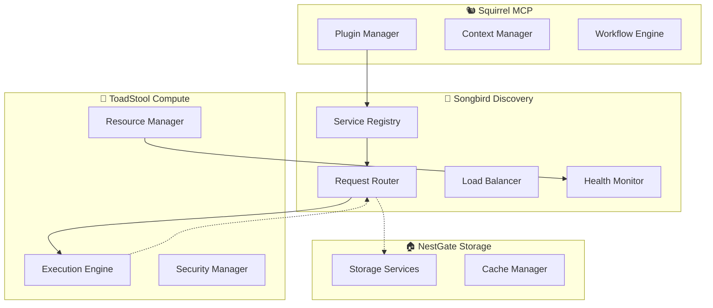

# 🔌 Ecosystem Communication Specification

## Executive Summary

ToadStool integrates with the ecosystem through **Songbird-centric communication**, providing seamless service discovery, intelligent request routing, and coordinated resource sharing while maintaining service autonomy and loose coupling.

---

## 🎯 **Communication Architecture**

### **Songbird-Centric Pattern**


### **Core Communication Principles**
```yaml
communication_principles:
  service_discovery: "All services discovered through Songbird"
  request_routing: "Songbird routes based on capabilities and load"
  no_direct_calls: "Services never communicate directly"
  async_by_default: "All communication is asynchronous unless specified"
  fault_tolerant: "Graceful degradation on service unavailability"
```

---

## 🔗 **Service Integration Interface**

### **ToadStool Service Registration**
```rust
#[derive(Debug, Clone, Serialize, Deserialize)]
pub struct ServiceRegistration {
    /// Service metadata
    pub service_id: String,
    pub service_type: ServiceType,
    pub version: String,
    pub instance_id: String,
    
    /// Service capabilities
    pub capabilities: ServiceCapabilities,
    pub supported_operations: Vec<OperationType>,
    pub resource_capacity: ResourceCapacity,
    
    /// Communication endpoints
    pub endpoints: Vec<ServiceEndpoint>,
    pub protocols: Vec<CommunicationProtocol>,
    
    /// Health and monitoring
    pub health_check_endpoint: Option<String>,
    pub metrics_endpoint: Option<String>,
    
    /// Service configuration
    pub configuration: ServiceConfiguration,
    pub feature_flags: Vec<String>,
    pub platform_info: PlatformInfo,
}

#[async_trait::async_trait]
pub trait ServiceIntegration: Send + Sync {
    /// Register with Songbird service discovery
    async fn register_with_songbird(&self) -> Result<RegistrationToken>;
    
    /// Update service capabilities and status
    async fn update_service_status(&self, status: ServiceStatus) -> Result<()>;
    
    /// Handle incoming requests from other services
    async fn handle_service_request(&self, request: ServiceRequest) -> Result<ServiceResponse>;
    
    /// Deregister from service discovery
    async fn deregister(&self, token: RegistrationToken) -> Result<()>;
}
```

### **Request/Response Protocol**
```rust
#[derive(Debug, Clone, Serialize, Deserialize)]
pub struct ServiceRequest {
    /// Request metadata
    pub request_id: Uuid,
    pub source_service: String,
    pub target_service: String,
    pub operation: String,
    
    /// Request context
    pub execution_context: ExecutionContext,
    pub priority: RequestPriority,
    pub timeout: Option<Duration>,
    
    /// Request payload
    pub payload: RequestPayload,
    pub headers: HashMap<String, String>,
    
    /// Callback configuration
    pub callback_config: Option<CallbackConfig>,
    pub correlation_id: Option<String>,
}

#[derive(Debug, Clone, Serialize, Deserialize)]
pub enum RequestPayload {
    /// Compute execution request
    ExecuteWorkload {
        workload_spec: WorkloadSpec,
        resource_requirements: ResourceRequirements,
        security_policy: SecurityPolicy,
        execution_config: ExecutionConfig,
    },
    
    /// Resource allocation request
    AllocateResources {
        resource_requirements: ResourceRequirements,
        allocation_strategy: AllocationStrategy,
        duration: Option<Duration>,
    },
    
    /// Status and health queries
    GetStatus { include_details: bool },
    GetMetrics { metric_types: Vec<MetricType> },
    GetCapabilities,
    
    /// Configuration updates
    UpdateConfiguration { config_updates: ConfigurationUpdates },
    
    /// Custom service-specific requests
    Custom {
        operation_name: String,
        parameters: HashMap<String, Value>,
    },
}
```

---

## 🌐 **Multi-Protocol Communication**

### **Protocol Support Matrix**
```rust
#[derive(Debug, Clone, Serialize, Deserialize)]
pub enum CommunicationProtocol {
    /// HTTP/REST API
    Http {
        version: HttpVersion,
        endpoint: String,
        authentication: Option<AuthenticationConfig>,
        compression: Option<CompressionType>,
    },
    
    /// gRPC for high-performance communication
    Grpc {
        service_definition: String,
        endpoint: String,
        tls_config: Option<TlsConfig>,
        streaming_support: bool,
    },
    
    /// WebSocket for real-time communication
    WebSocket {
        endpoint: String,
        subprotocols: Vec<String>,
        heartbeat_interval: Duration,
    },
    
    /// Message queue integration
    MessageQueue {
        queue_type: QueueType,
        connection_config: QueueConnectionConfig,
        topics: Vec<String>,
    },
    
    /// Custom protocol implementations
    Custom {
        protocol_name: String,
        configuration: ProtocolConfiguration,
    },
}

#[derive(Debug)]
pub struct CommunicationHandler {
    protocol_handlers: HashMap<CommunicationProtocol, Box<dyn ProtocolHandler>>,
    message_serializer: Box<dyn MessageSerializer>,
    authentication_manager: Box<dyn AuthenticationManager>,
    rate_limiter: Box<dyn RateLimiter>,
}

#[async_trait::async_trait]
pub trait ProtocolHandler: Send + Sync {
    async fn send_request(&self, request: ServiceRequest) -> Result<ServiceResponse>;
    async fn receive_request(&self) -> Result<ServiceRequest>;
    fn get_protocol_info(&self) -> ProtocolInfo;
    async fn configure(&mut self, config: ProtocolConfig) -> Result<()>;
}
```

---

## 🔄 **Request Routing and Load Balancing**

### **Intelligent Request Routing**
```rust
#[derive(Debug, Clone, Serialize, Deserialize)]
pub struct RoutingStrategy {
    /// Primary routing algorithm
    pub algorithm: RoutingAlgorithm,
    /// Fallback strategies
    pub fallback_strategies: Vec<RoutingAlgorithm>,
    /// Routing preferences
    pub preferences: RoutingPreferences,
    /// Health check requirements
    pub health_requirements: HealthRequirements,
}

#[derive(Debug, Clone, Serialize, Deserialize)]
pub enum RoutingAlgorithm {
    /// Route to least loaded instance
    LeastLoaded {
        load_metric: LoadMetric,
        weight_factors: HashMap<String, f64>,
    },
    
    /// Route based on resource availability
    ResourceBased {
        resource_priorities: Vec<ResourceType>,
        minimum_thresholds: HashMap<ResourceType, f64>,
    },
    
    /// Route based on geographic proximity
    GeographicProximity {
        location_preference: LocationPreference,
        latency_threshold: Duration,
    },
    
    /// Round-robin with health checks
    RoundRobin {
        health_check_enabled: bool,
        sticky_sessions: bool,
    },
    
    /// AI-powered routing decisions
    MachineLearning {
        model_name: String,
        feature_extraction: FeatureExtractionConfig,
    },
    
    /// Custom routing logic
    Custom {
        strategy_name: String,
        configuration: RoutingConfiguration,
    },
}

impl RoutingStrategy {
    /// Select optimal service instance for request
    pub async fn select_instance(
        &self,
        request: &ServiceRequest,
        available_instances: &[ServiceInstance],
        routing_context: &RoutingContext
    ) -> Result<ServiceInstance> {
        match &self.algorithm {
            RoutingAlgorithm::LeastLoaded { load_metric, weight_factors } => {
                self.select_least_loaded(available_instances, load_metric, weight_factors).await
            }
            RoutingAlgorithm::ResourceBased { resource_priorities, minimum_thresholds } => {
                self.select_by_resources(request, available_instances, resource_priorities, minimum_thresholds).await
            }
            // ... other algorithms
        }
    }
}
```

### **Service Discovery Integration**
```rust
#[derive(Debug)]
pub struct ServiceDiscovery {
    registry_client: Box<dyn RegistryClient>,
    service_cache: Arc<RwLock<ServiceCache>>,
    health_monitor: Box<dyn HealthMonitor>,
    update_notifier: broadcast::Sender<ServiceUpdate>,
}

impl ServiceDiscovery {
    /// Discover services by type and capabilities
    pub async fn discover_services(
        &self,
        service_type: ServiceType,
        required_capabilities: &[Capability],
        filters: &ServiceFilters
    ) -> Result<Vec<ServiceInstance>> {
        // Check cache first
        if let Some(cached_services) = self.service_cache.read().await.get(service_type) {
            if !cached_services.is_expired() {
                return Ok(cached_services.filter_by_capabilities(required_capabilities));
            }
        }
        
        // Query registry
        let services = self.registry_client
            .query_services(service_type, required_capabilities, filters)
            .await?;
        
        // Update cache
        self.service_cache.write().await.update(service_type, services.clone());
        
        // Filter by health status
        let healthy_services = self.filter_healthy_services(services).await?;
        
        Ok(healthy_services)
    }
}
```

---

## 📊 **Health Monitoring and Circuit Breaking**

### **Service Health Management**
```rust
#[derive(Debug, Clone, Serialize, Deserialize)]
pub struct HealthStatus {
    pub service_id: String,
    pub timestamp: chrono::DateTime<chrono::Utc>,
    pub status: ServiceHealthStatus,
    pub metrics: HealthMetrics,
    pub dependencies: Vec<DependencyHealth>,
    pub alerts: Vec<HealthAlert>,
}

#[derive(Debug, Clone, Serialize, Deserialize)]
pub enum ServiceHealthStatus {
    Healthy,
    Degraded { reason: String, severity: u8 },
    Unhealthy { reason: String, estimated_recovery: Option<Duration> },
    Unknown,
}

#[async_trait::async_trait]
pub trait HealthMonitor: Send + Sync {
    /// Check health of specific service instance
    async fn check_health(&self, service_instance: &ServiceInstance) -> Result<HealthStatus>;
    
    /// Start continuous health monitoring
    async fn start_monitoring(&self, interval: Duration) -> Result<()>;
    
    /// Get current health status
    async fn get_current_status(&self, service_id: &str) -> Result<HealthStatus>;
    
    /// Configure health check parameters
    async fn configure_health_checks(&mut self, config: HealthCheckConfig) -> Result<()>;
}
```

### **Circuit Breaker Pattern**
```rust
#[derive(Debug)]
pub struct CircuitBreaker {
    state: Arc<RwLock<CircuitState>>,
    failure_threshold: u32,
    recovery_timeout: Duration,
    half_open_max_calls: u32,
    metrics: Arc<CircuitBreakerMetrics>,
}

#[derive(Debug, Clone)]
pub enum CircuitState {
    Closed,
    Open { opened_at: Instant },
    HalfOpen { success_count: u32, failure_count: u32 },
}

impl CircuitBreaker {
    /// Execute request with circuit breaker protection
    pub async fn execute<F, T>(&self, operation: F) -> Result<T>
    where
        F: Future<Output = Result<T>> + Send,
        T: Send,
    {
        match *self.state.read().await {
            CircuitState::Closed => {
                match operation.await {
                    Ok(result) => {
                        self.record_success().await;
                        Ok(result)
                    }
                    Err(e) => {
                        self.record_failure().await;
                        Err(e)
                    }
                }
            }
            CircuitState::Open { opened_at } => {
                if opened_at.elapsed() > self.recovery_timeout {
                    self.transition_to_half_open().await;
                    self.execute(operation).await
                } else {
                    Err(CommunicationError::CircuitBreakerOpen)
                }
            }
            CircuitState::HalfOpen { .. } => {
                match operation.await {
                    Ok(result) => {
                        self.record_half_open_success().await;
                        Ok(result)
                    }
                    Err(e) => {
                        self.transition_to_open().await;
                        Err(e)
                    }
                }
            }
        }
    }
}
```

---

## 🔧 **Configuration and Deployment**

### **Communication Configuration**
```rust
#[derive(Debug, Clone, Serialize, Deserialize)]
pub struct CommunicationConfiguration {
    /// Service discovery settings
    pub discovery_config: ServiceDiscoveryConfig,
    /// Protocol configurations
    pub protocol_configs: HashMap<CommunicationProtocol, ProtocolConfig>,
    /// Routing and load balancing
    pub routing_config: RoutingConfiguration,
    /// Health monitoring settings
    pub health_config: HealthMonitoringConfig,
    /// Security and authentication
    pub security_config: CommunicationSecurityConfig,
    /// Feature flags
    pub feature_flags: CommunicationFeatureFlags,
}

impl CommunicationConfiguration {
    /// Load configuration with environment overrides
    pub async fn load_for_environment(env: &str) -> Result<Self> {
        let mut config = Self::load_base_config().await?;
        
        // Apply environment-specific settings
        config.apply_environment_overrides(env).await?;
        
        // Validate configuration
        config.validate_communication_settings()?;
        
        Ok(config)
    }
    
    /// Create communication handler from configuration
    pub fn create_communication_handler(&self) -> Result<CommunicationHandler> {
        let handler = CommunicationHandler::new();
        
        // Configure protocols
        for (protocol, config) in &self.protocol_configs {
            handler.add_protocol_handler(protocol.clone(), config)?;
        }
        
        // Configure routing
        handler.configure_routing(&self.routing_config)?;
        
        // Configure health monitoring
        handler.configure_health_monitoring(&self.health_config)?;
        
        Ok(handler)
    }
}
```

This specification establishes ToadStool as a well-integrated ecosystem citizen that communicates effectively through Songbird while maintaining service autonomy and providing robust, fault-tolerant inter-service communication. 