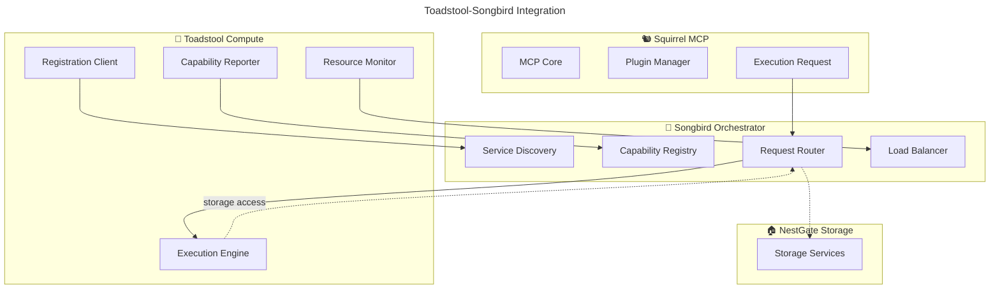

# 🎼 Toadstool-Compute ↔ Songbird Integration

## Executive Summary

This specification defines how **Toadstool-Compute** integrates with **Songbird** as the central discovery and orchestration hub. Toadstool registers its compute capabilities with Songbird and receives execution requests through Songbird's routing system.

---

## 🔌 **Integration Architecture**

### **Songbird-Centric Communication**



### **Communication Principles**
```yaml
integration_principles:
  songbird_centric: "All ecosystem communication flows through Songbird"
  no_direct_communication: "Toadstool never communicates directly with other services"
  capability_driven: "Songbird routes based on Toadstool's advertised capabilities"
  stateless_requests: "Each execution request is independent"
```

---

## 🔧 **Capability Registration**

### **Toadstool Capabilities Structure**
```rust
#[derive(Debug, Clone, Serialize, Deserialize)]
pub struct ToadstoolCapabilities {
    /// Available execution environments
    pub execution_environments: Vec<ExecutionEnvironment>,
    /// Current resource capacity
    pub resource_capacity: ResourceCapacity,
    /// Supported runtime technologies
    pub supported_runtimes: Vec<Runtime>,
    /// Security and sandboxing features
    pub security_features: Vec<SecurityFeature>,
    /// Performance characteristics
    pub performance_metrics: PerformanceMetrics,
    /// Platform-specific capabilities
    pub platform_capabilities: PlatformCapabilities,
}

#[derive(Debug, Clone, Serialize, Deserialize)]
pub enum ExecutionEnvironment {
    Container { runtime: ContainerRuntime },
    Wasm { runtime: WasmRuntime },
    Native { isolation: IsolationLevel },
    Gpu { compute_type: GpuComputeType },
}

#[derive(Debug, Clone, Serialize, Deserialize)]
pub struct ResourceCapacity {
    /// Total CPU cores available
    pub cpu_cores: u32,
    /// Total memory in GB
    pub memory_gb: f64,
    /// Available GPU memory in GB
    pub gpu_memory_gb: Option<f64>,
    /// Available disk space in GB
    pub disk_space_gb: f64,
    /// Current utilization percentage
    pub current_utilization: f64,
}

#[derive(Debug, Clone, Serialize, Deserialize)]
pub struct PerformanceMetrics {
    /// Average execution startup time in ms
    pub avg_startup_time_ms: f64,
    /// Average request processing time in ms
    pub avg_processing_time_ms: f64,
    /// Current requests per second
    pub current_rps: f64,
    /// Maximum supported concurrent executions
    pub max_concurrent_executions: u32,
}
```

### **Registration Process**
```rust
pub struct SongbirdIntegration {
    client: SongbirdClient,
    capabilities: ToadstoolCapabilities,
    instance_id: String,
}

impl SongbirdIntegration {
    pub async fn register_with_songbird(&self) -> Result<()> {
        let service_registration = ServiceRegistration {
            service_id: format!("toadstool-compute-{}", self.instance_id),
            service_type: "compute-platform".to_string(),
            capabilities: self.capabilities.clone(),
            endpoints: vec![
                format!("http://{}:8082", self.get_local_ip()),
                format!("grpc://{}:8083", self.get_local_ip()),
            ],
            metadata: {
                let mut metadata = HashMap::new();
                metadata.insert("platform".to_string(), std::env::consts::OS.to_string());
                metadata.insert("architecture".to_string(), std::env::consts::ARCH.to_string());
                metadata.insert("version".to_string(), env!("CARGO_PKG_VERSION").to_string());
                metadata.insert("startup_time".to_string(), self.get_startup_time().to_string());
                metadata
            },
            health_check_endpoint: Some(format!("http://{}:8082/health", self.get_local_ip())),
            tags: vec![
                "compute".to_string(),
                "execution".to_string(),
                "sandboxing".to_string(),
                format!("platform-{}", std::env::consts::OS),
            ],
        };
        
        // Register with Songbird
        self.client.register_service(service_registration).await?;
        
        // Start capability broadcasting
        self.start_capability_updates().await?;
        
        info!("Successfully registered Toadstool-Compute with Songbird");
        Ok(())
    }
    
    async fn start_capability_updates(&self) -> Result<()> {
        let client = self.client.clone();
        let instance_id = self.instance_id.clone();
        
        tokio::spawn(async move {
            let mut interval = tokio::time::interval(Duration::from_secs(30));
            
            loop {
                interval.tick().await;
                
                // Update capabilities based on current system state
                let updated_capabilities = Self::get_current_capabilities().await;
                
                if let Err(e) = client.update_service_capabilities(
                    &instance_id,
                    updated_capabilities
                ).await {
                    warn!("Failed to update capabilities: {}", e);
                }
            }
        });
        
        Ok(())
    }
}
```

---

## 📨 **Request Handling**

### **Execution Request Structure**
```rust
#[derive(Debug, Clone, Serialize, Deserialize)]
pub struct ExecutionRequest {
    /// Unique request identifier
    pub request_id: String,
    /// Originating service (e.g., "squirrel-mcp")
    pub origin_service: String,
    /// Execution environment requirements
    pub environment: ExecutionEnvironmentSpec,
    /// Resource requirements
    pub resource_requirements: ResourceRequirements,
    /// Security context and permissions
    pub security_context: SecurityContext,
    /// Workload to execute
    pub workload: WorkloadSpec,
    /// MCP context (if from Squirrel)
    pub mcp_context: Option<McpContext>,
    /// Priority level
    pub priority: ExecutionPriority,
    /// Timeout configuration
    pub timeout: TimeoutConfig,
}

#[derive(Debug, Clone, Serialize, Deserialize)]
pub struct ExecutionEnvironmentSpec {
    /// Preferred environment type
    pub environment_type: ExecutionEnvironment,
    /// Fallback environment types
    pub fallback_types: Vec<ExecutionEnvironment>,
    /// Environment-specific configuration
    pub configuration: EnvironmentConfig,
}

#[derive(Debug, Clone, Serialize, Deserialize)]
pub struct ResourceRequirements {
    /// CPU requirements
    pub cpu: CpuRequirements,
    /// Memory requirements
    pub memory: MemoryRequirements,
    /// GPU requirements (optional)
    pub gpu: Option<GpuRequirements>,
    /// Storage requirements
    pub storage: StorageRequirements,
    /// Network requirements
    pub network: NetworkRequirements,
}

#[derive(Debug, Clone, Serialize, Deserialize)]
pub struct WorkloadSpec {
    /// Workload type
    pub workload_type: WorkloadType,
    /// Execution payload
    pub payload: WorkloadPayload,
    /// Input data
    pub input_data: Vec<DataSpec>,
    /// Output requirements
    pub output_requirements: OutputSpec,
}
```

### **Request Processing Pipeline**
```rust
pub struct RequestProcessor {
    scheduler: WorkloadScheduler,
    resource_manager: ResourceManager,
    security_manager: SecurityManager,
    execution_engine: ExecutionEngine,
}

impl RequestProcessor {
    pub async fn process_execution_request(
        &self,
        request: ExecutionRequest
    ) -> Result<ExecutionResponse> {
        let span = tracing::info_span!("process_execution_request", 
            request_id = %request.request_id,
            origin = %request.origin_service
        );
        let _enter = span.enter();
        
        // 1. Validate request
        self.validate_request(&request).await?;
        
        // 2. Check resource availability
        let resource_allocation = self.resource_manager
            .allocate_resources(&request.resource_requirements).await?;
        
        // 3. Create security context
        let security_context = self.security_manager
            .create_execution_context(&request.security_context).await?;
        
        // 4. Schedule execution
        let execution_plan = self.scheduler
            .schedule_workload(&request, &resource_allocation).await?;
        
        // 5. Execute workload
        let result = self.execution_engine
            .execute_workload(execution_plan, security_context).await?;
        
        // 6. Cleanup resources
        self.resource_manager.release_resources(resource_allocation).await?;
        
        // 7. Return response
        Ok(ExecutionResponse {
            request_id: request.request_id,
            status: ExecutionStatus::Completed,
            result: Some(result),
            error: None,
            execution_time_ms: result.execution_time_ms,
            resource_usage: result.resource_usage,
            metadata: result.metadata,
        })
    }
    
    async fn validate_request(&self, request: &ExecutionRequest) -> Result<()> {
        // Validate request structure
        if request.request_id.is_empty() {
            return Err(ToadstoolError::InvalidRequest("Missing request ID".to_string()));
        }
        
        // Validate security context
        self.security_manager.validate_security_context(&request.security_context).await?;
        
        // Validate resource requirements
        self.resource_manager.validate_requirements(&request.resource_requirements).await?;
        
        // Validate workload specification
        self.validate_workload_spec(&request.workload).await?;
        
        Ok(())
    }
}
```

---

## 🔄 **Health Monitoring & Load Balancing**

### **Health Reporting**
```rust
#[derive(Debug, Clone, Serialize, Deserialize)]
pub struct ToadstoolHealthStatus {
    /// Overall health status
    pub status: HealthStatus,
    /// Current resource utilization
    pub resource_utilization: ResourceUtilization,
    /// Active executions count
    pub active_executions: u32,
    /// Performance metrics
    pub performance: PerformanceSnapshot,
    /// Error rates
    pub error_rates: ErrorRates,
    /// System information
    pub system_info: SystemInfo,
}

pub struct HealthMonitor {
    songbird_client: SongbirdClient,
    instance_id: String,
}

impl HealthMonitor {
    pub async fn start_health_reporting(&self) -> Result<()> {
        let client = self.songbird_client.clone();
        let instance_id = self.instance_id.clone();
        
        tokio::spawn(async move {
            let mut interval = tokio::time::interval(Duration::from_secs(10));
            
            loop {
                interval.tick().await;
                
                let health_status = Self::collect_health_status().await;
                
                if let Err(e) = client.report_health(&instance_id, health_status).await {
                    warn!("Failed to report health status: {}", e);
                }
            }
        });
        
        Ok(())
    }
    
    async fn collect_health_status() -> ToadstoolHealthStatus {
        ToadstoolHealthStatus {
            status: Self::determine_overall_health().await,
            resource_utilization: Self::get_resource_utilization().await,
            active_executions: Self::get_active_execution_count().await,
            performance: Self::get_performance_snapshot().await,
            error_rates: Self::get_error_rates().await,
            system_info: Self::get_system_info().await,
        }
    }
}
```

### **Load Balancing Integration**
```rust
// Songbird uses health and capacity information for load balancing
impl SongbirdOrchestrator {
    async fn select_optimal_toadstool(
        &self,
        request: &ExecutionRequest
    ) -> Result<ToadstoolInstance> {
        let available_instances = self.capability_registry
            .get_compute_providers_for_request(request)?;
        
        // Score instances based on multiple factors
        let mut scored_instances = Vec::new();
        for instance in available_instances {
            let score = self.calculate_instance_score(&instance, request).await?;
            scored_instances.push((instance, score));
        }
        
        // Sort by score (highest first)
        scored_instances.sort_by(|a, b| b.1.partial_cmp(&a.1).unwrap());
        
        // Return best instance
        scored_instances.into_iter()
            .next()
            .map(|(instance, _)| instance)
            .ok_or_else(|| SongbirdError::NoAvailableInstances)
    }
    
    async fn calculate_instance_score(
        &self,
        instance: &ToadstoolInstance,
        request: &ExecutionRequest
    ) -> Result<f64> {
        let health = instance.health_status.as_ref()
            .ok_or_else(|| SongbirdError::MissingHealthStatus)?;
        
        let mut score = 100.0;
        
        // Factor in resource utilization (lower is better)
        score -= health.resource_utilization.cpu_percent * 0.5;
        score -= health.resource_utilization.memory_percent * 0.3;
        
        // Factor in current load (lower is better)
        let load_factor = health.active_executions as f64 / instance.max_concurrent_executions as f64;
        score -= load_factor * 30.0;
        
        // Factor in performance metrics (better performance = higher score)
        score += (1000.0 / health.performance.avg_processing_time_ms) * 10.0;
        
        // Factor in error rates (lower is better)
        score -= health.error_rates.execution_error_rate * 20.0;
        
        // Factor in capability match (perfect match = bonus)
        if Self::is_perfect_capability_match(&instance.capabilities, request) {
            score += 25.0;
        }
        
        Ok(score.max(0.0))
    }
}
```

---

## 🔐 **Security Integration**

### **Security Context Propagation**
```rust
#[derive(Debug, Clone, Serialize, Deserialize)]
pub struct SecurityContext {
    /// Authentication information
    pub auth_context: AuthContext,
    /// Authorization permissions
    pub permissions: Vec<Permission>,
    /// Execution isolation level
    pub isolation_level: IsolationLevel,
    /// Security constraints
    pub constraints: SecurityConstraints,
    /// Audit requirements
    pub audit_requirements: AuditRequirements,
}

pub struct SecurityManager {
    policy_engine: PolicyEngine,
    audit_logger: AuditLogger,
}

impl SecurityManager {
    pub async fn validate_security_context(
        &self,
        context: &SecurityContext
    ) -> Result<()> {
        // Validate authentication
        self.validate_auth_context(&context.auth_context).await?;
        
        // Check permissions
        for permission in &context.permissions {
            self.policy_engine.check_permission(permission).await?;
        }
        
        // Validate isolation requirements
        self.validate_isolation_level(&context.isolation_level).await?;
        
        // Log security validation
        self.audit_logger.log_security_validation(context).await?;
        
        Ok(())
    }
    
    pub async fn create_execution_context(
        &self,
        security_context: &SecurityContext
    ) -> Result<ExecutionSecurityContext> {
        // Create isolated execution environment
        let sandbox = self.create_security_sandbox(security_context).await?;
        
        // Set up permission enforcement
        let permission_enforcer = self.create_permission_enforcer(
            &security_context.permissions
        ).await?;
        
        // Set up audit logging
        let audit_context = self.create_audit_context(
            &security_context.audit_requirements
        ).await?;
        
        Ok(ExecutionSecurityContext {
            sandbox,
            permission_enforcer,
            audit_context,
        })
    }
}
```

---

## 📊 **Monitoring & Observability**

### **Metrics Collection**
```rust
pub struct MetricsCollector {
    songbird_client: SongbirdClient,
    metrics_registry: MetricsRegistry,
}

impl MetricsCollector {
    pub async fn start_metrics_collection(&self) -> Result<()> {
        // Collect and report metrics every 15 seconds
        let mut interval = tokio::time::interval(Duration::from_secs(15));
        
        loop {
            interval.tick().await;
            
            let metrics = self.collect_comprehensive_metrics().await;
            
            // Report to Songbird for ecosystem-wide monitoring
            if let Err(e) = self.songbird_client
                .report_metrics(&self.instance_id, metrics).await {
                warn!("Failed to report metrics: {}", e);
            }
        }
    }
    
    async fn collect_comprehensive_metrics(&self) -> ToadstoolMetrics {
        ToadstoolMetrics {
            execution_metrics: self.collect_execution_metrics().await,
            resource_metrics: self.collect_resource_metrics().await,
            performance_metrics: self.collect_performance_metrics().await,
            security_metrics: self.collect_security_metrics().await,
            error_metrics: self.collect_error_metrics().await,
        }
    }
}
```

---

## 🎯 **Integration Success Criteria**

### **Technical Integration**
- [ ] **Service Registration**: Toadstool successfully registers with Songbird
- [ ] **Capability Broadcasting**: Capabilities accurately reported and updated
- [ ] **Request Routing**: Execution requests properly routed from Songbird
- [ ] **Health Monitoring**: Health status accurately reported
- [ ] **Load Balancing**: Optimal instance selection working

### **Performance Integration**
- [ ] **Low Latency**: < 5ms request routing overhead
- [ ] **High Throughput**: > 10,000 requests/second routing capacity
- [ ] **Efficient Load Balancing**: Even distribution across instances
- [ ] **Dynamic Scaling**: Automatic scaling based on load

### **Security Integration**
- [ ] **Secure Communication**: All communication encrypted and authenticated
- [ ] **Permission Enforcement**: Security contexts properly enforced
- [ ] **Audit Trail**: Complete audit logging across ecosystem
- [ ] **Isolation**: Proper execution environment isolation

---

**This integration specification ensures Toadstool-Compute seamlessly integrates with Songbird while maintaining the focused, distributed architecture of our ecosystem.** 🚀
