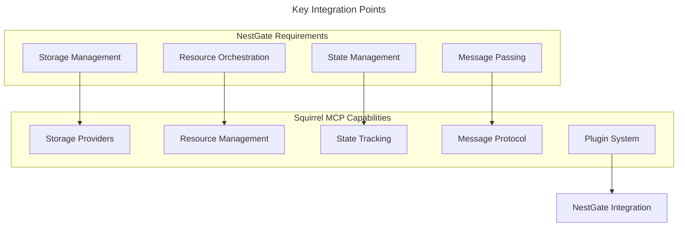

# Squirrel MCP Compatibility Requirements for NestGate

## Overview

This document outlines the requirements and expectations for Squirrel MCP to support future integration with NestGate. While NestGate will implement a modular adapter architecture that allows for independent development, Squirrel MCP should consider these requirements to ensure smooth integration when needed.

## Key Integration Points



## Squirrel MCP Requirements

### 1. Storage Provider Interface

Squirrel MCP should expose interfaces for storage management compatible with NestGate's needs:

```rust
// Required storage operations
pub trait StorageOperations {
    // Volume operations
    async fn create_volume(&self, config: VolumeConfig) -> Result<Volume>;
    async fn delete_volume(&self, id: &str) -> Result<()>;
    async fn list_volumes(&self) -> Result<Vec<Volume>>;
    async fn get_volume(&self, id: &str) -> Result<Volume>;
    async fn resize_volume(&self, id: &str, new_size: u64) -> Result<Volume>;
    
    // Snapshot operations
    async fn create_snapshot(&self, volume_id: &str, name: &str) -> Result<Snapshot>;
    async fn delete_snapshot(&self, id: &str) -> Result<()>;
    async fn list_snapshots(&self, volume_id: &str) -> Result<Vec<Snapshot>>;
    async fn restore_snapshot(&self, snapshot_id: &str) -> Result<Volume>;
    
    // Backup operations
    async fn create_backup(&self, volume_id: &str, name: &str) -> Result<Backup>;
    async fn delete_backup(&self, id: &str) -> Result<()>;
    async fn list_backups(&self, volume_id: &str) -> Result<Vec<Backup>>;
    async fn restore_backup(&self, backup_id: &str, target_path: &str) -> Result<Volume>;
}
```

### 2. Resource Management Interface

Squirrel MCP should provide resource management capabilities:

```rust
// Required resource operations
pub trait ResourceOperations {
    // Resource allocation
    async fn allocate_resources(&self, request: ResourceRequest) -> Result<ResourceAllocation>;
    async fn deallocate_resources(&self, allocation_id: &str) -> Result<()>;
    async fn update_allocation(&self, allocation_id: &str, request: ResourceRequest) -> Result<ResourceAllocation>;
    
    // Resource monitoring
    async fn get_resource_usage(&self) -> Result<ResourceUsage>;
    async fn get_allocation_usage(&self, allocation_id: &str) -> Result<ResourceUsage>;
    async fn set_resource_limits(&self, limits: ResourceLimits) -> Result<()>;
    
    // Resource reservation
    async fn reserve_resources(&self, request: ResourceReservation) -> Result<ReservationToken>;
    async fn release_reservation(&self, token: &ReservationToken) -> Result<()>;
}
```

### 3. State Management Interface

Squirrel MCP should provide state management capabilities:

```rust
// Required state operations
pub trait StateOperations {
    // State access
    async fn get_state(&self, key: &str) -> Result<Option<State>>;
    async fn set_state(&self, key: &str, state: State) -> Result<()>;
    async fn delete_state(&self, key: &str) -> Result<()>;
    
    // Batch operations
    async fn get_states(&self, keys: &[&str]) -> Result<HashMap<String, State>>;
    async fn set_states(&self, states: HashMap<String, State>) -> Result<()>;
    
    // Pattern matching
    async fn get_state_by_pattern(&self, pattern: &str) -> Result<HashMap<String, State>>;
    
    // Watch operations
    async fn watch_state(&self, key: &str) -> Result<StateWatcher>;
    async fn watch_pattern(&self, pattern: &str) -> Result<StateWatcher>;
}
```

### 4. Message Passing Interface

Squirrel MCP should provide message passing capabilities:

```rust
// Required messaging operations
pub trait MessagingOperations {
    // Basic messaging
    async fn send_message(&self, message: Message) -> Result<MessageId>;
    async fn receive_messages(&self) -> Result<MessageReceiver>;
    
    // Pub/Sub
    async fn publish(&self, topic: &str, message: Message) -> Result<MessageId>;
    async fn subscribe(&self, topic: &str) -> Result<Subscription>;
    async fn unsubscribe(&self, subscription: &Subscription) -> Result<()>;
    
    // Message handling
    async fn acknowledge(&self, message_id: &MessageId) -> Result<()>;
    async fn reject(&self, message_id: &MessageId, requeue: bool) -> Result<()>;
}
```

### 5. Plugin System Compatibility

Squirrel MCP should provide a plugin system that allows NestGate to integrate as a plugin:

```rust
// Plugin interface requirements
pub trait PluginInterface {
    // Registration
    fn register(&self, registry: &mut Registry) -> Result<()>;
    
    // Lifecycle
    async fn initialize(&self) -> Result<()>;
    async fn start(&self) -> Result<()>;
    async fn stop(&self) -> Result<()>;
    async fn shutdown(&self) -> Result<()>;
    
    // Capability advertisement
    fn capabilities(&self) -> Vec<Capability>;
    
    // Command registration
    fn register_commands(&self, registry: &mut CommandRegistry) -> Result<()>;
    
    // Extension points
    fn extend_points(&self) -> Vec<ExtensionPoint>;
}
```

## Protocol Requirements

### 1. Data Types

Squirrel MCP should support the following data types for NestGate integration:

```yaml
required_data_types:
  - Volume:
      properties:
        id: string
        name: string
        size: integer
        status: enum[creating, available, resizing, deleting, error]
        created_at: timestamp
        
  - Snapshot:
      properties:
        id: string
        volume_id: string
        name: string
        created_at: timestamp
        status: enum[creating, available, deleting, error]
        
  - Backup:
      properties:
        id: string
        volume_id: string
        name: string
        created_at: timestamp
        status: enum[creating, available, deleting, error]
        size: integer
        
  - ResourceAllocation:
      properties:
        id: string
        cpu: integer
        memory: integer
        disk: integer
        status: enum[allocating, active, releasing, error]
        
  - Message:
      properties:
        id: string
        sender: string
        recipient: string
        topic: string
        payload: bytes
        timestamp: timestamp
        headers: map<string, string>
```

### 2. Error Handling

Squirrel MCP should provide detailed error information compatible with NestGate's error handling:

```yaml
error_handling:
  - standard_error_codes:
      not_found: "Resource not found"
      access_denied: "Access denied"
      limit_exceeded: "Resource limit exceeded"
      already_exists: "Resource already exists"
      operation_failed: "Operation failed"
      validation_error: "Validation error"
      
  - error_details:
      required_fields:
        - code: string
        - message: string
        - details: map<string, any>
        - correlation_id: string
        - timestamp: timestamp
```

### 3. Authentication & Security

Squirrel MCP should provide authentication and security mechanisms compatible with NestGate:

```yaml
security_requirements:
  - authentication_methods:
      - oauth2:
          grant_types: ["client_credentials", "password", "refresh_token"]
          token_endpoint: "/auth/token"
      - api_key:
          header: "X-API-Key"
      - mutual_tls:
          required: true
          
  - authorization:
      - role_based_access_control:
          roles: ["admin", "user", "service"]
          permissions: ["read", "write", "execute", "create", "delete"]
      - resource_scopes:
          format: "<resource_type>:<resource_id>:<action>"
          examples: ["volume:*:read", "snapshot:123:delete"]
```

## Performance Requirements

### 1. Throughput and Latency

Squirrel MCP should meet the following performance requirements:

```yaml
performance_requirements:
  storage_operations:
    create_volume: 
      success_rate: ">99%"
      p99_latency: "<500ms"
      throughput: ">100 ops/sec"
    
    volume_io:
      read_throughput: ">100MB/s"
      write_throughput: ">50MB/s"
      
  state_operations:
    get_state:
      p99_latency: "<50ms"
      throughput: ">1000 ops/sec"
    
    set_state:
      p99_latency: "<100ms"
      throughput: ">500 ops/sec"
      
  messaging:
    publish_latency: "<20ms"
    message_throughput: ">5000 msgs/sec"
    subscription_latency: "<10ms"
```

### 2. Resource Usage

Squirrel MCP should provide efficient resource usage:

```yaml
resource_usage:
  memory_footprint: "<100MB base + ~1KB per active connection"
  cpu_usage: "<10% of one core at idle, <50% under load"
  connection_overhead: "<1MB per connection"
  scaling_efficiency: "Near-linear scaling with added resources"
```

## Resilience Requirements

### 1. Circuit Breaker Support

Squirrel MCP should implement circuit breaker patterns for resilience:

```yaml
circuit_breaker:
  failure_threshold: "5 failures"
  reset_timeout: "30 seconds"
  half_open_requests: "1 test request"
  failure_types: ["timeout", "connection_error", "server_error"]
```

### 2. Retry Mechanisms

Squirrel MCP should support retry mechanisms:

```yaml
retry_mechanisms:
  max_attempts: 3
  backoff: "exponential with jitter"
  initial_delay: "100ms"
  max_delay: "10s"
  retryable_operations: ["read", "idempotent_write"]
```

### 3. Bulkhead Isolation

Squirrel MCP should implement bulkhead isolation:

```yaml
bulkhead:
  max_concurrent_calls: 100
  max_queue_size: 50
  queue_timeout: "5s"
  isolation_levels: ["service", "operation", "resource"]
```

## API Extension Requirements

### 1. Extension Points

Squirrel MCP should provide extension points for NestGate integration:

```yaml
extension_points:
  - storage_providers:
      purpose: "Allow NestGate to provide storage implementations"
      interface: "StorageProvider"
      
  - resource_providers:
      purpose: "Allow NestGate to provide resource management"
      interface: "ResourceProvider"
      
  - command_extensions:
      purpose: "Allow NestGate to add custom commands"
      interface: "CommandExtension"
      
  - protocol_extensions:
      purpose: "Allow NestGate to extend the MCP protocol"
      interface: "ProtocolExtension"
```

### 2. Custom Command Support

Squirrel MCP should allow NestGate to register custom commands:

```yaml
command_system:
  registration_mechanism: "Runtime registration through plugin interface"
  command_structure:
    name: string
    description: string
    usage: string
    examples: array<string>
    arguments: array<argument>
    flags: array<flag>
    handler: function_pointer
  
  validation_support: true
  help_documentation: true
  tab_completion: true
```

## Integration Testing Support

Squirrel MCP should provide testing support for NestGate integration:

```yaml
testing_support:
  - mock_implementations:
      interfaces: ["StorageProvider", "ResourceProvider", "StateManager", "MessageHandler"]
      configurability: "High (success/failure, latency, etc.)"
      
  - integration_test_harness:
      purpose: "Test NestGate integration with Squirrel MCP"
      capabilities:
        - "Simulated load testing"
        - "Fault injection"
        - "Performance measurement"
        - "Protocol compliance verification"
        
  - observability:
      metrics: ["operation_count", "error_count", "latency", "resource_usage"]
      tracing: true
      logging_levels: ["error", "warn", "info", "debug", "trace"]
```

## Implementation Recommendations

### 1. Priority Features

To best support NestGate integration, Squirrel MCP should prioritize these features:

1. **Storage Provider Interface**: NestGate's primary function is storage management
2. **Plugin System Compatibility**: Allows gradual integration of NestGate features
3. **State Management**: Critical for maintaining system state across components
4. **Resilience Features**: Ensures robust operation in distributed environments
5. **Resource Management**: Enables efficient allocation of system resources

### 2. API Versioning

Squirrel MCP should implement versioned APIs to support compatibility:

```yaml
api_versioning:
  scheme: "Semantic versioning (Major.Minor.Patch)"
  backward_compatibility: "Guaranteed within same Major version"
  deprecation_policy: "Minimum 6 months notice before removing deprecated features"
  version_negotiation: "Client specifies acceptable versions, server selects highest compatible"
```

### 3. Documentation Requirements

Squirrel MCP should provide thorough documentation:

```yaml
documentation_requirements:
  api_reference:
    format: "OpenAPI 3.0"
    completeness: "All endpoints, parameters, responses, and error codes"
    
  integration_guides:
    topics:
      - "Authentication and security"
      - "Plugin development"
      - "Command system integration"
      - "Storage provider implementation"
      - "Resource management"
      - "State synchronization"
      - "Message handling"
      
  examples:
    languages: ["Rust", "Python"]
    coverage: "All major API areas"
    complexity_levels: ["Basic", "Intermediate", "Advanced"]
```

## Technical Metadata
- Category: Compatibility Specification
- Priority: Medium
- Last Updated: 2024-09-26
- Required By: Phase 3 of NestGate development
- Dependencies:
  - Squirrel MCP v1.5.0+
  - NestGate Core v0.1.0+ 