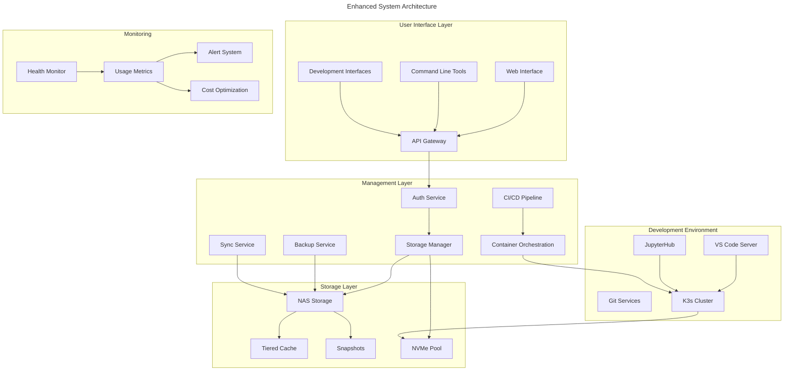
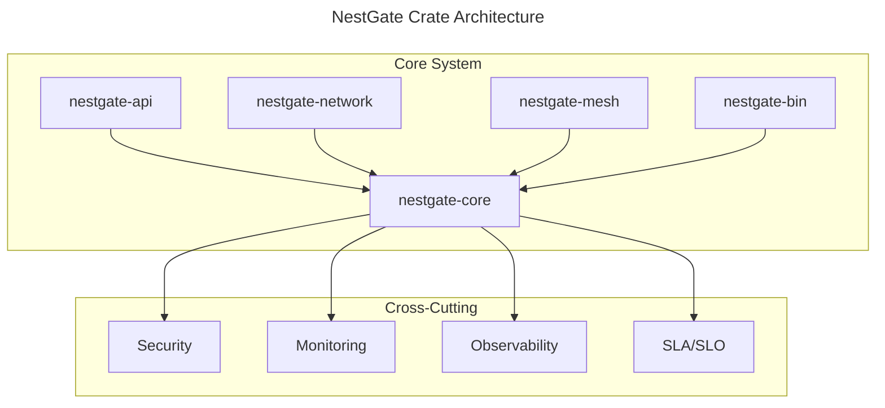

# Specification Directory Structure

```yaml
specs:
  core:
    path: specs/core/architecture.md
    content: Core system architecture and components
  network:
    path: specs/network/architecture.md
    content: Network configuration and VLAN setup
    protocols:
      mcp_home:
        path: specs/network/protocols/mcp_home.md
        content: MCP home integration specification
  storage:
    path: specs/storage/architecture.md
    content: Storage tiers and performance requirements
  security:
    path: specs/security/architecture.md
    content: Security measures and access control
  monitoring:
    path: specs/monitoring/architecture.md
    content: System monitoring and metrics
  dev:
    path: specs/dev/architecture.md
    content: Development environment setup
```

> 💡 **Note**: Detailed implementation specifications can be found in their respective subdirectories. See [CODEBASE.md](CODEBASE.md) for project structure and organization.

## Specification Format (70/30 Ratio)
```yaml
specification_balance:
  machine_parseable:
    ratio: 70%
    focus:
      - Structured YAML configurations
      - Explicit validation criteria
      - Measurable metrics
      - Testable requirements
      - Error conditions
      - Integration points
    format: "Always in YAML with clear key-value pairs"
  
  technical_context:
    ratio: 30%
    focus:
      - Implementation sequences
      - Critical constraints
      - Technical requirements
      - Integration notes
    format: "Clear, concise technical descriptions without narrative"
  
  rules_adherence:
    base_rules:
      - "@.cursor/rules/400-md-docs.mdc"
      - "@.cursor/rules/003-code-style-guide.mdc"
    validation:
      - "Follow rule-specific validation"
      - "Cross-reference related rules"
      - "Maintain consistent structure"
```

# Specification Style Guide

## Format Requirements
```yaml
specification_format:
  machine_parseable: 70%  # YAML configurations, validation criteria, metrics
  technical_context: 30%  # Implementation sequence, constraints, requirements
  template: "templates/SPECS-template.md"
```

## Implementation Notes
- Focus on machine-parseable YAML configurations
- Include clear validation criteria and metrics
- Provide technical context without narratives
- Follow implementation sequence format
- Reference template for structure

---

# NAS Management System

> 💡 **Purpose**: Define a robust architecture for a NAS system that serves both advanced development workflows and home storage needs with security, scalability, and AI/ML compatibility in mind.

## System Architecture



## Core Components

### Security Service (Rust)
```rust
nas_security/
├── src/
│   ├── main.rs           # Service entry point
│   ├── mount.rs          # Mount management
│   ├── security.rs       # Security operations
│   ├── audit.rs          # Audit logging
│   └── monitor.rs        # System monitoring
├── Cargo.toml
└── config/
    └── security.yaml     # Security configuration
```

### System Integration (PowerShell)
```powershell
integration/
├── SecurityIntegration.psd1  # Module manifest
├── SecurityIntegration.psm1  # Module implementation
├── public/                   # Public functions
└── private/                  # Private functions
```

### Automation Layer (Python)
```python
automation/
├── setup.py
├── requirements.txt
└── nas_automation/
    ├── __init__.py
    ├── environment.py
    ├── monitoring.py
    └── tools/
```

## Hardware Specifications

### Scalable Hardware Tiers

| Component | Minimum Recommended | Optimal | Future-Proof |
|:----------|:-------------------|:--------|:-------------|
| CPU | 6 cores, x86_64 | 12 cores, Ryzen/Xeon | 16+ cores, Thread Ripper |
| RAM | 16GB DDR4 | 64GB DDR4/5 | 128GB+ ECC |
| System Drive | 512GB NVMe | 1TB NVMe | 2TB NVMe |
| Cache Drive | 1TB NVMe | 2x 2TB NVMe RAID1 | 2x 4TB NVMe RAID1 |
| Data Drives | 2x 4TB NAS | 4x 8TB NAS | 8x 16TB NAS |
| Network | 2.5GbE | 10GbE | Dual 10GbE |
| GPU (Optional) | - | RTX 3060 12GB | RTX 4090 24GB |
| PCIe Expansion | 1x16 | 1x16 + 1x8 | 2x16 + 1x8 |

### Growth Planning

```yaml
scalability:
  storage_path:
    initial: 8TB raw (RAID1)
    increment: 8TB
    maximum: 160TB
    expansion_strategy: "Start RAID1, migrate to RAID6 when >4 drives"
  
  compute_path:
    initial: 6-8 cores
    increment: based on build times
    maximum: 64 cores
    strategy: "Upgrade within socket compatibility"
  
  memory_path:
    initial: 32GB DDR4/5
    increment: 32GB
    maximum: 128GB
    strategy: "Matched pairs, ECC optional"
  
  network_path:
    initial: 2.5GbE
    target: 10GbE
    strategy: "Upgrade when storage bandwidth limited"
```

## Storage Architecture

### Enhanced Storage Tiers

| Tier | Type | Purpose | Backup Frequency | Retention |
|:-----|:-----|:--------|:----------------|:----------|
| NVMe Pool | Ultra-Fast | Active Development, AI/ML | Hourly | 7 days |
| SSD Cache | Fast | Hot Data, Databases | Daily | 14 days |
| Primary HDD | Warm | User Data, Media | Weekly | 30 days |
| Archive HDD | Cold | Backups, Archives | Monthly | 90 days |

### Performance Targets

| Operation | Initial Target | Optimal | AI/ML Optimized |
|:----------|:--------------|:--------|:----------------|
| Sequential Read | 1000 MB/s | 2000 MB/s | 4000 MB/s |
| Sequential Write | 750 MB/s | 1500 MB/s | 3000 MB/s |
| Random Read (4K) | 100 MB/s | 200 MB/s | 400 MB/s |
| Random Write (4K) | 75 MB/s | 150 MB/s | 300 MB/s |
| IOPS | 50K | 100K | 200K |

## Security Features

### Access Control
```yaml
security:
  authentication:
    - Local accounts with 2FA
    - SSH key management
    - Optional LDAP integration
  
  network:
    - VLAN isolation for dev/prod
    - Firewall rules per service
    - Encrypted transport (TLS 1.3)
  
  monitoring:
    - Real-time access logging
    - Security event alerts
    - Automated threat response
```

### Data Protection
```yaml
data_security:
  encryption:
    - At-rest encryption
    - Secure mount points
    - Encrypted backups
  
  backup:
    strategy:
      - Hourly: Critical dev data
      - Daily: Active projects
      - Weekly: Full system
      - Monthly: Archives
    retention:
      - Hourly: 24 hours
      - Daily: 7 days
      - Weekly: 30 days
      - Monthly: 90 days
```

## Development Environment

### Workspace Configuration

```yaml
dev_environment:
  isolation:
    - containerized_workspaces
    - vlan_segregation:
        dev: VLAN 10
        test: VLAN 20
        prod: VLAN 30
    - resource_quotas:
        cpu: dynamic
        memory: dynamic
        storage: project-based
  
  core_services:
    ide:
      - vs_code_server:
          url: code.nas.local
          extensions: auto-sync
      - jupyter_hub:
          url: jupyter.nas.local
          gpu_support: optional
    
    git:
      - gitea:
          url: git.nas.local
          lfs_enabled: true
      - registry:
          url: registry.nas.local
    
    mcp:
      - proxy:
          url: mcp.nas.local
          deployment: container
          resources: dynamic
      - monitoring:
          metrics: true
          tracing: true
          
    ci_cd:
      - drone:
          url: ci.nas.local
      - artifacts:
          path: /volume1/artifacts
    
    orchestration:
      - k3s:
          ha: false
          monitoring: true
      - longhorn:
          replicas: 2
```

### Project Templates

```yaml
project_templates:
  rust_dev:
    - base_image: rust:latest
    - dev_tools: [cargo, rustfmt, clippy]
    - vscode_extensions: [rust-analyzer]
    - mount_points: 
        - /volume1/dev/rust
        - /volume1/cache/cargo
  
  python_ml:
    - base_image: pytorch/pytorch:latest
    - dev_tools: [conda, jupyter]
    - gpu_support: optional
    - mount_points:
        - /volume1/dev/ml
        - /volume1/datasets
```

## Cost Optimization

### Resource Management

```yaml
optimization:
  storage:
    - deduplication: enabled
    - compression: 
        algorithm: zstd
        level: adaptive
    - tiering:
        policy: access-based
        threshold: 30-days
  
  compute:
    - power_profiles:
        peak: all cores active
        normal: 50% cores
        eco: minimal cores
    - gpu_scheduling:
        mode: on-demand
        idle_timeout: 30min
  
  monitoring:
    - cost_tracking:
        metrics: [power, storage, bandwidth]
        alerts: usage thresholds
    - resource_analytics:
        interval: hourly
        retention: 90-days
```

### Automation Rules

```yaml
automation:
  storage_cleanup:
    - temp_files: 7-days
    - unused_images: 30-days
    - old_backups: policy-based
  
  resource_scaling:
    - cpu_governor: performance-based
    - memory: demand-based
    - storage_tiering: access-pattern
  
  maintenance:
    - health_checks: hourly
    - optimization: daily
    - deep_analysis: weekly
```

## Implementation Phases

### Phase 1: Foundation (Month 1)
1. Base hardware setup
   - Initial storage configuration
   - Network setup
   - Basic security implementation
2. Core services deployment
   - File sharing
   - Basic monitoring
   - Security services
3. Development environment basics
   - VS Code Server
   - Git server
   - Container support

### Phase 2: Development Environment (Month 2-3)
1. Container orchestration
   - K3s setup
   - Basic workload management
2. Development tools
   - JupyterHub
   - CI/CD basics
3. Project templates
   - Rust development
   - Python/ML setup
4. Security hardening
   - Access controls
   - Monitoring
   - Backup system

### Phase 3: Optimization (Month 4-5)
1. Performance tuning
   - Storage optimization
   - Network optimization
   - Service tuning
2. Cost optimization
   - Resource monitoring
   - Power management
   - Storage tiering
3. Automation implementation
   - Maintenance tasks
   - Backup automation
   - Update management

### Phase 4: Scaling (Month 6+)
1. Storage expansion
   - Capacity increase
   - Performance optimization
2. Compute enhancement
   - CPU/RAM upgrades
   - GPU integration
3. Network upgrade
   - 10GbE implementation
   - VLAN optimization
4. Service scaling
   - HA considerations
   - Load balancing
   - Advanced monitoring

## Technical Metadata
- Category: System Specification
- Priority: High
- Last Updated: 2024-03-20
- Next Review: 2024-06-20
- Dependencies:
  - Infrastructure setup
  - Security systems
  - Development tools
  - Monitoring stack
  - K3s/Container orchestration
  - AI/ML frameworks
- Validation Requirements:
  - Architecture review
  - Security audit
  - Performance testing
  - Cost efficiency analysis
  - Resource optimization
  - AI/ML compatibility testing

# NestGate System Specifications

This document serves as the master specification for the NestGate NAS management system, organized according to our crate-based architecture.

## Crate Architecture



## Crate Specifications

### nestgate-core
```yaml
core_specifications:
  purpose: "Core system functionality and coordination"
  components:
    - Storage management
    - State coordination
    - System configuration
    - Resource management
  interfaces:
    - Storage API
    - Configuration API
    - Monitoring API
  validation:
    - Performance metrics
    - Resource utilization
    - Error handling
```

### nestgate-api
```yaml
api_specifications:
  purpose: "External API and interface management"
  components:
    - REST endpoints
    - WebSocket handlers
    - Authentication
    - Rate limiting
  interfaces:
    - HTTP/HTTPS
    - WebSocket
    - Authentication
  validation:
    - API response times
    - Authentication success
    - Request throughput
```

### nestgate-network
```yaml
network_specifications:
  purpose: "Network communication and protocol handling"
  components:
    - Protocol implementations
    - Connection management
    - Network security
    - Traffic optimization
  interfaces:
    - Network protocols
    - Security protocols
    - Traffic management
  validation:
    - Network performance
    - Security compliance
    - Protocol conformance
```

### nestgate-mesh
```yaml
mesh_specifications:
  purpose: "Mesh network coordination and management"
  components:
    - Node management
    - Mesh topology
    - State synchronization
    - Peer discovery
  interfaces:
    - Mesh protocol
    - Node API
    - Sync API
  validation:
    - Mesh stability
    - Sync performance
    - Node health
```

### nestgate-bin
```yaml
binary_specifications:
  purpose: "Command-line interface and utilities"
  components:
    - CLI implementation
    - Configuration tools
    - Utility functions
    - Installation tools
  interfaces:
    - Command line
    - Configuration files
    - System utilities
  validation:
    - Command success
    - Configuration validity
    - Installation verification
```

### nestgate-mcp
```yaml
mcp_specifications:
  purpose: "Native MCP (Machine Context Protocol) implementation"
  components:
    core:
      - Protocol implementation
      - Session management
      - Resource allocation
      - State synchronization
    ai:
      - Model management
      - Tensor operations
      - GPU scheduling
      - Cache optimization
    integration:
      - Core system hooks
      - Event handling
      - Resource monitoring
      - Performance tracking
  interfaces:
    - MCP protocol API
    - AI model API
    - Resource API
    - Monitoring API
  validation:
    - Protocol conformance
    - AI performance metrics
    - Resource efficiency
    - Integration tests

  machine_configuration:
    service:
      name: "nestgate-mcp"
      deployment: "native"
      scaling: "auto"
      resources:
        cpu:
          min: "2"
          max: "8"
          target_utilization: 0.7
        memory:
          min: "4G"
          max: "32G"
          target_utilization: 0.8
        gpu:
          optional: true
          type: "cuda"
          memory: "8G+"
    
    integration:
      protocol:
        - type: "grpc"
        - transport: "tcp"
        - security: "mtls"
        - compression: "lz4"
      
      ai_workloads:
        - model_caching: true
        - tensor_optimization: true
        - gpu_acceleration: true
        - batch_processing: true
      
      monitoring:
        metrics:
          - latency
          - throughput
          - gpu_utilization
          - memory_usage
        alerts:
          - resource_exhaustion
          - performance_degradation
          - error_rates
    
    security:
      authentication:
        - mTLS certificates
        - Token-based auth
        - Capability-based access
      authorization:
        - Role-based access
        - Resource quotas
        - Operation limits
      audit:
        - Operation logging
        - Access tracking
        - Performance metrics
```

## Cross-Cutting Concerns

### Security
```yaml
security_specifications:
  scope: "System-wide security measures"
  components:
    - Access control
    - Encryption
    - Audit logging
    - Compliance
  validation:
    - Security audits
    - Penetration testing
    - Compliance checks
```

### Monitoring
```yaml
monitoring_specifications:
  scope: "System-wide monitoring and metrics"
  components:
    - Metrics collection
    - Performance monitoring
    - Resource tracking
    - Alert management
  validation:
    - Metric accuracy
    - Alert timeliness
    - Resource tracking
```

### Observability
```yaml
observability_specifications:
  scope: "System-wide observability"
  components:
    - Logging
    - Tracing
    - Debugging
    - Analytics
  validation:
    - Log completeness
    - Trace accuracy
    - Debug capability
```

### SLA/SLO
```yaml
sla_specifications:
  scope: "Service level agreements and objectives"
  components:
    - Performance targets
    - Availability goals
    - Recovery objectives
    - Quality metrics
  validation:
    - SLA compliance
    - Performance metrics
    - Availability tracking
```

## Development Guidelines

### Code Style
```yaml
code_style:
  rust:
    style_guide: "@.cursor/rules/1009-rust-code-style.mdc"
    formatting: "rustfmt.toml"
    linting: "clippy.toml"
  
  documentation:
    style_guide: "@.cursor/rules/400-md-docs.mdc"
    api_docs: "rustdoc standards"
    specs: "70/30 machine/context ratio"
```

### Testing Requirements
```yaml
testing:
  unit_tests:
    coverage: "minimum 80%"
    performance: "defined benchmarks"
    safety: "thread safety verified"
  
  integration_tests:
    coverage: "critical paths"
    performance: "end-to-end metrics"
    security: "vulnerability scanning"
```

### Performance Requirements
```yaml
performance:
  api_response: "<100ms p95"
  storage_operations: "<10ms p95"
  network_latency: "<5ms p95"
  mesh_sync: "<1s p95"
```

## Implementation Sequence

1. Core Infrastructure
   - Storage management
   - Configuration system
   - Resource handling

2. Network Layer
   - Protocol implementation
   - Security integration
   - Performance optimization

3. API Development
   - Endpoint implementation
   - Authentication system
   - Rate limiting

4. Mesh Integration
   - Node management
   - State synchronization
   - Topology handling

5. CLI Tools
   - Command implementation
   - Configuration tools
   - Utility functions

6. Cross-Cutting Features
   - Security measures
   - Monitoring system
   - Observability tools

## Validation Criteria

```yaml
validation:
  performance:
    metrics: "defined in monitoring"
    benchmarks: "automated testing"
    profiling: "continuous monitoring"
  
  security:
    auditing: "automated scans"
    testing: "penetration tests"
    compliance: "standard checks"
  
  reliability:
    uptime: "99.9%"
    data_integrity: "verified"
    backup_success: "100%"
```

## Implementation Strategy

### Phase 1: Core Integration
```yaml
phase1_implementation:
  focus: "Core MCP functionality"
  tasks:
    - Implement MCP protocol handlers
    - Set up session management
    - Configure security measures
    - Establish monitoring
  deliverables:
    - Working protocol implementation
    - Basic AI model support
    - Integration tests
    - Performance benchmarks
```

### Phase 2: AI Optimization
```yaml
phase2_implementation:
  focus: "AI/ML capabilities"
  tasks:
    - Enhance model management
    - Implement tensor operations
    - Add GPU acceleration
    - Optimize caching
  deliverables:
    - Advanced AI features
    - GPU support
    - Performance improvements
    - Benchmark results
```

### Phase 3: Production Readiness
```yaml
phase3_implementation:
  focus: "Production optimization"
  tasks:
    - Performance tuning
    - Security hardening
    - Documentation
    - Deployment automation
  deliverables:
    - Production-ready system
    - Complete documentation
    - Deployment guides
    - Monitoring setup
```

## Performance Requirements

```yaml
mcp_performance:
  latency:
    p95: "<50ms"
    p99: "<100ms"
  throughput:
    requests: "1000/s"
    data_transfer: "1GB/s"
  ai_operations:
    model_loading: "<1s"
    inference: "<100ms"
    batch_processing: "<500ms"
  resource_usage:
    cpu: "<80%"
    memory: "<85%"
    gpu: "<90%"
```

## Security Requirements

```yaml
mcp_security:
  authentication:
    method: "mTLS"
    token_validity: "24h"
    key_rotation: "7d"
  
  authorization:
    model: "RBAC"
    granularity: "operation"
    default: "deny"
  
  encryption:
    transport: "TLS 1.3"
    data_at_rest: "AES-256-GCM"
    key_management: "automatic"
  
  audit:
    operations: "all"
    retention: "90d"
    alerts: "real-time"
```

## Monitoring Requirements

```yaml
mcp_monitoring:
  metrics:
    collection_interval: "10s"
    retention_period: "30d"
    aggregation: "5m"
  
  alerts:
    latency_threshold: "100ms"
    error_rate_threshold: "1%"
    resource_threshold: "85%"
  
  dashboards:
    - "Performance Overview"
    - "AI Operations"
    - "Resource Usage"
    - "Security Events"
```

---

Last Updated: 2024-03-15
Version: 1.0.0 

# NestGate Specifications

This directory contains the specifications for the NestGate system, including architectural designs, component specifications, integration details, and environment configurations.

## Recently Added Specifications

The following specifications have been added to guide implementation efforts:

### Core Components

- [Storage Management](nestgate-core/storage.md) - Detailed specifications for the NestGate storage management subsystem, including volume, pool, filesystem, mount, and backup operations.

### Network Components

- [Network Protocols](nestgate-network/protocols.md) - Comprehensive specifications for supported network protocols including SMB, NFS, iSCSI, and S3-compatible services.

### MCP Components

- [MCP Protocol](nestgate-mcp/protocol.md) - Detailed specifications for the Machine Context Protocol implementation, enabling AI-assisted operations.

### API Components

- [REST API](nestgate-api/rest.md) - RESTful API specifications for programmatic interaction with NestGate services.

### CLI Components

- [CLI Interface](nestgate-bin/cli.md) - Command-line interface specifications for managing NestGate through terminal commands.

## Existing Specifications

### System Overview

- [SPECS.md](SPECS.md) - Master specification document outlining the high-level architecture and components.
- [ORGANIZATION.md](ORGANIZATION.md) - Specification organization standards and directory structure.

### Integration

- [Squirrel Integration](integration/squirrel_integration.md) - Detailed specifications for integration with Squirrel MCP.

### Environment Specifications

- [Home Development Environment](environments/home_development_environment.md) - Configuration and optimization guidelines for home development environments.

## Implementation Phases

Implementation of NestGate should follow these phased approaches detailed in the respective specification files:

1. **Phase 1: Core Foundation**
   - Basic storage management
   - Network layer implementation
   - CLI tools for essential operations
   - Core API functionality

2. **Phase 2: Advanced Features**
   - Enhanced storage capabilities
   - Complete network protocol support
   - Advanced CLI operations
   - Comprehensive API coverage

3. **Phase 3: Integration & Optimization**
   - Full MCP integration
   - AI/ML support
   - Performance optimization
   - Advanced monitoring and metrics

## Validation Requirements

Each component specification includes detailed validation requirements covering:

- Performance metrics and targets
- Security requirements
- Reliability standards
- Testing methodologies

Refer to individual component specifications for detailed validation criteria.

## Technical References

- [ZFS Documentation](https://openzfs.org/wiki/Documentation)
- [Rust Language](https://www.rust-lang.org/learn)
- [Actix Web Framework](https://actix.rs/)
- [Samba Protocol](https://www.samba.org/samba/docs/)
- [NFS Protocol](https://www.kernel.org/doc/html/latest/admin-guide/nfs/index.html) 