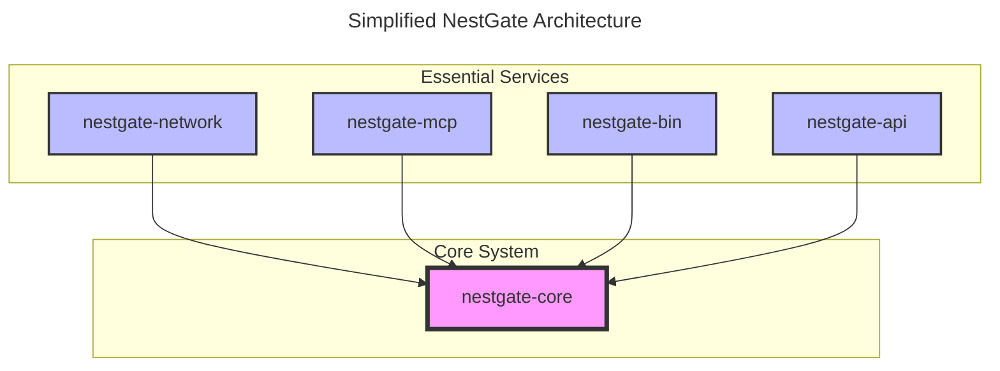
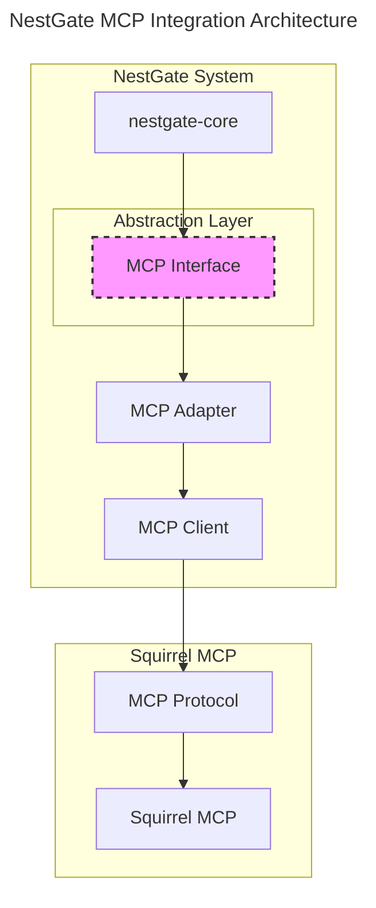

# NestGate System Overview

## Core Components



## System Architecture

```yaml
components:
  nestgate-core:
    purpose: "Core NAS management and system coordination"
    features:
      - Storage management
      - Access control
      - System monitoring
      - Resource management
  
  nestgate-network:
    purpose: "Network protocol and communication"
    features:
      - Protocol handling
      - Network security
      - Connection management
  
  nestgate-mcp:
    purpose: "Machine Context Protocol implementation"
    features:
      - MCP protocol
      - AI/ML workload support
      - Resource orchestration
  
  nestgate-bin:
    purpose: "Command-line interface"
    features:
      - System management
      - Configuration
      - Monitoring tools

  nestgate-api:
    purpose: "REST API for remote management"
    features:
      - RESTful endpoints
      - Authentication
      - Documentation
      - WebSocket support
```

## Core Features

### Storage Management
```yaml
storage:
  features:
    - Volume management
    - Mount control
    - Backup/restore
    - Performance monitoring
    - Snapshot management
    - Quota enforcement
  
  tiers:
    nvme:
      purpose: "Development and AI/ML workloads"
      backup: "Hourly"
      retention: "7 days"
      snapshots: "Every 15 minutes"
    
    primary:
      purpose: "User data and media"
      backup: "Weekly"
      retention: "30 days"
      snapshots: "Daily"
    
    archive:
      purpose: "Long-term storage"
      backup: "Monthly"
      retention: "365 days"
      snapshots: "Weekly"
```

### Development Environment
```yaml
dev_environment:
  core_services:
    - VS Code Server
    - Git services
    - Container runtime (K3s)
    - Build tools
    - Package repositories
  
  features:
    - Integrated development
    - Container orchestration
    - Source control
    - Build automation
    - CI/CD pipeline integration
    - Development environment templating
```

### MCP Integration
```yaml
mcp:
  features:
    - Native protocol implementation
    - AI/ML workload support
    - Resource management
    - State synchronization
  
  capabilities:
    - Model deployment
    - Tensor operations
    - GPU acceleration
    - Cache optimization
    
  integrations:
    - name: Squirrel MCP
      status: active
      features:
        - Storage service provider
        - Development environment integration
        - Command system extension
        - Monitoring data exchange
      documentation: "specs/integration/squirrel_integration.md"
      
  adapter_architecture:
    pattern: "Adapter Pattern"
    layers:
      - name: "Core Abstraction Layer"
        purpose: "Defines interfaces for MCP integration"
        status: "Planning"
      - name: "Squirrel MCP Adapter"
        purpose: "Implements interfaces for Squirrel MCP"
        status: "Planning"
      - name: "Protocol Translation Layer"
        purpose: "Handles message format conversion"
        status: "Not Started"
    design_principles:
      - "Loose coupling between NestGate and MCP"
      - "Interface segregation"
      - "Dependency inversion"
      - "Clear abstraction boundaries"
```

## Implementation Phases

### Phase 1: Core Foundation (Current Focus)
1. Basic storage management
   - Volume operations
   - Mount handling
   - Access control
   - ZFS integration
   - Performance baseline
2. Network layer
   - Basic protocols
   - Security setup
   - Firewall configuration
   - VPN integration
3. CLI tools
   - Essential commands
   - Configuration management
   - Command framework
   - Shell completions

### Phase 2: Development Environment
1. Container support
   - K3s setup
   - Resource management
   - Image management
   - Network isolation
2. Development tools
   - VS Code integration
   - Git services
   - CI/CD pipelines
   - Package repositories
3. Build system
   - Compilation tools
   - Package management
   - Dependency resolution
   - Build caching

### Phase 3: API Development
1. RESTful API
   - CRUD operations
   - Authentication/Authorization
   - Rate limiting
   - Documentation
2. WebSocket support
   - Real-time monitoring
   - Event notifications
   - Custom subscriptions
3. Mobile app support
   - API endpoints
   - Push notifications
   - Security considerations

### Phase 4: MCP Integration 
1. Protocol implementation
   - Core MCP features
   - State management
   - Message passing
   - Service discovery
2. AI/ML support
   - Model handling
   - Resource orchestration
   - Training job management
   - Model deployment
3. Performance optimization
   - Cache management
   - Resource allocation
   - Scaling strategies
   - Monitoring integration

## Modular Development Strategy

### Independent Development Path
```yaml
independent_path:
  principles:
    - "Design components with clear boundaries"
    - "Use interface-based programming"
    - "Implement mockable services"
    - "Avoid direct dependencies on external systems"
  
  approach:
    staging:
      - "Develop core features independently"
      - "Use mock implementations for MCP services"
      - "Define clear abstraction layers"
    
    validation:
      - "Test with standalone components"
      - "Validate interfaces before integration"
      - "Document boundary expectations"
    
    preparation:
      - "Design for future integration"
      - "Identify integration points"
      - "Prepare adapter implementations"
```

### MCP Integration Timeline
```mermaid
---
title: NestGate MCP Integration Timeline
---
gantt
    dateFormat  YYYY-MM-DD
    title NestGate Development & MCP Integration
    
    section Core Development
    Phase 1: Core Foundation        :active, p1, 2024-09-01, 90d
    Phase 2: Development Environment:         p2, after p1, 60d
    Phase 3: API Development        :         p3, after p2, 45d
    
    section MCP Integration
    Interface Definition            :         m1, 2024-10-15, 30d
    Mock Implementation             :         m2, after m1, 30d
    Adapter Development             :         m3, after m2, 45d
    Integration Testing             :         m4, after m3, 30d
    Production Deployment           :         m5, after m4, 15d
```

## Technical Requirements

### Hardware Support
```yaml
minimum_requirements:
  cpu: "6 cores, x86_64"
  ram: "16GB DDR4"
  storage:
    system: "512GB NVMe"
    data: "2x 4TB NAS"
  network: "2.5GbE"
  gpu: "Optional"

recommended:
  cpu: "12 cores, Ryzen/Xeon"
  ram: "64GB DDR4/5"
  storage:
    system: "1TB NVMe"
    cache: "2x 2TB NVMe RAID1"
    data: "4x 8TB NAS"
  network: "10GbE"
  gpu: "RTX 3060 12GB+"
```

### Software Stack
```yaml
core_stack:
  os: "Linux"
  container: "K3s"
  storage: "ZFS"
  network: "TCP/IP, TLS 1.3"
  
development:
  languages:
    - Rust
    - Python (AI/ML)
  tools:
    - VS Code Server
    - Git
    - Docker
    - Kubernetes (K3s)
  
  dependencies:
    core:
      - "tokio = { version = '1.36', features = ['full'] }"
      - "serde = { version = '1.0', features = ['derive'] }"
      - "serde_json = '1.0'"
      - "thiserror = '1.0'"
      - "anyhow = '1.0'"
      - "tracing = '0.1'"
      - "tracing-subscriber = { version = '0.3', features = ['env-filter'] }"
    
    storage:
      - "libzfs = '0.8'"
      - "nix = '0.28'"
      - "tokio-util = '0.7'"
    
    network:
      - "hyper = { version = '0.14', features = ['full'] }"
      - "tokio-tungstenite = '0.20'"
      - "tower = '0.4'"
      
    mcp:
      - "async-trait = '0.1'"
      - "futures = '0.3'"
      - "uuid = { version = '1.6', features = ['v4', 'serde'] }"
```

## Validation Requirements

```yaml
validation:
  performance:
    storage:
      throughput: ">1GB/s"
      iops: ">50K"
      snapshot_creation: "<5s"
      backup_speed: ">500MB/s"
    network:
      latency: "<1ms local"
      bandwidth: ">1Gbps"
      connections: ">1000 concurrent"
    api:
      response_time: "<100ms"
      requests_per_second: ">1000"
  
  security:
    - Access control
    - Network encryption
    - Data protection
    - Vulnerability scanning
    - Penetration testing
    - Audit logging
  
  reliability:
    uptime: "99.9%"
    data_integrity: "verified"
    backup_success: "100%"
    recovery_time: "<15 minutes"
    fault_tolerance: "Single disk failure"
```

## MCP Integration Architecture



### MCP Abstraction Layer
The NestGate system will implement a modular approach to MCP integration, allowing independent development while preparing for future tight integration:

```yaml
mcp_abstraction:
  interface_layer:
    purpose: "Define clear abstractions for MCP functionality"
    components:
      - name: "StorageProvider"
        purpose: "Abstract storage operations"
      - name: "ResourceOrchestrator"
        purpose: "Abstract resource management"
      - name: "StateManager"
        purpose: "Abstract state synchronization"
      - name: "MessageHandler"
        purpose: "Abstract message processing"
  
  implementation_layer:
    purpose: "Provide concrete implementations of interfaces"
    components:
      - name: "MockStorageProvider"
        purpose: "Local testing implementation"
      - name: "SquirrelStorageProvider"
        purpose: "Squirrel MCP implementation"
      - name: "MockResourceOrchestrator"
        purpose: "Local testing implementation"
      - name: "SquirrelResourceOrchestrator"
        purpose: "Squirrel MCP implementation"
```

## Version History

### v0.7.0 (2024-09-25)
- Added detailed MCP integration architecture
- Enhanced storage management features
- Added API component to system architecture
- Added modular development strategy
- Created MCP integration timeline
- Expanded technical requirements
- Enhanced validation requirements
- Added additional software dependencies

### v0.6.0 (2024-03-14)
- Initial specification draft
- Defined core components
- Outlined implementation phases
- Established technical requirements
- Defined validation criteria

## Feedback
Please provide feedback on these specifications to the NestGate team. We're actively refining our approach based on implementation insights.

## References
- [Rust Async Book](https://rust-lang.github.io/async-book/)
- [Tokio Documentation](https://tokio.rs/tokio/tutorial)
- [ZFS Administration](https://openzfs.github.io/openzfs-docs/)
- [Kubernetes Documentation](https://kubernetes.io/docs/home/)
- [Squirrel MCP Documentation](https://squirrel-mcp.org/docs)

## Technical Metadata
- Category: System Specification
- Priority: High
- Last Updated: 2024-09-25
- Dependencies:
  - Core system
  - Development tools
  - AI/ML frameworks
  - ZFS storage
- Validation Requirements:
  - Performance testing
  - Security verification
  - Integration testing
  - Compatibility testing