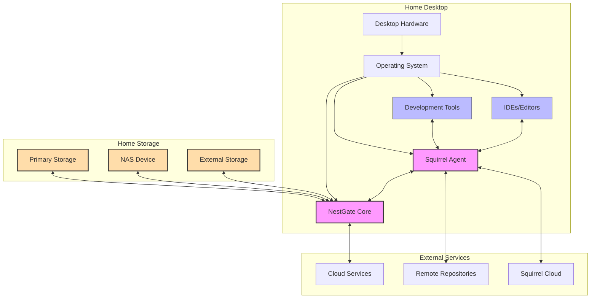

# Home Development Environment Specification

## Overview

This specification outlines the recommended configuration and optimization strategies for deploying NestGate as the storage management solution for home development environments integrating with Squirrel. The focus is on creating a robust, performant, and secure development experience on home desktop systems while maximizing the capabilities of both NestGate and Squirrel.

## Reference Architecture



## Hardware Recommendations

### Minimum Requirements

| Component | Specification |
|-----------|---------------|
| CPU | Quad-core (8 threads) 2.5GHz+ |
| RAM | 16GB DDR4 or better |
| System Drive | 256GB NVMe SSD |
| Development Storage | 1TB SSD/HDD combination |
| Network | Gigabit Ethernet or 5GHz WiFi |
| Additional | USB 3.0+ ports for external storage |

### Recommended Configuration

| Component | Specification |
|-----------|---------------|
| CPU | 8-core (16 threads) 3.5GHz+ |
| RAM | 32GB DDR4-3200 or better |
| System Drive | 512GB NVMe SSD (Gen4 preferred) |
| Development Storage | 2TB NVMe SSD + 4TB HDD |
| Network | 2.5GbE or 10GbE wired, WiFi 6 wireless |
| Additional | Thunderbolt/USB4 for external storage |

## Storage Architecture

### Layout Strategy

NestGate should be configured with a tiered storage layout optimized for development workflows:

1. **Tier 0: Ultra-Fast Access**
   - Location: Primary NVMe SSD
   - Contents: 
     - Active project source code
     - Current build artifacts
     - Compiler/interpreter caches
     - Git working directories
   - Cache Policy: Write-through with persistence
   - Quota Recommendation: 100-200GB depending on projects

2. **Tier 1: Fast Access**
   - Location: Secondary SSD storage
   - Contents:
     - Package repositories and dependencies
     - Container images
     - Recent project archives
     - Test data sets
   - Cache Policy: Background sync with lazy write
   - Quota Recommendation: 200-500GB

3. **Tier 2: Standard Access**
   - Location: HDD or NAS storage
   - Contents:
     - Project archives and backups
     - Reference datasets
     - VM images
     - Documentation archives
   - Cache Policy: On-demand access with prefetch
   - Quota Recommendation: 1TB+

4. **Backup Tier**
   - Location: External or network storage
   - Contents: Automated backups of all critical development assets
   - Schedule: Daily incremental, weekly full
   - Retention: Configurable, minimum 30 days

### Volume Configuration

Create the following NestGate volumes for optimal development organization:

1. **`dev_workspace`**
   - Type: High-performance SSD
   - Purpose: Active development directories
   - Access Pattern: Random read/write, high IOPS
   - Special Features: Enable snapshots at hourly intervals

2. **`dev_dependencies`**
   - Type: SSD with caching
   - Purpose: Package managers, repositories, libraries
   - Access Pattern: Mixed read/write, cache-friendly
   - Special Features: Deduplication to save space

3. **`dev_artifacts`**
   - Type: Tiered (SSD to HDD)
   - Purpose: Build outputs, binaries, compiled assets
   - Access Pattern: Sequential writes, random reads
   - Special Features: Auto-tiering of older artifacts to slower storage

4. **`dev_vms`**
   - Type: High-throughput storage
   - Purpose: Virtual machines and containers
   - Access Pattern: Sequential large blocks
   - Special Features: Thin provisioning

5. **`dev_archives`**
   - Type: Capacity-optimized storage
   - Purpose: Project backups, historical data
   - Access Pattern: Sequential writes, infrequent reads
   - Special Features: Compression and long-term retention

## NestGate Configuration

### Core Service Configuration

```yaml
nestgate:
  core:
    # Optimize threading for development workloads
    threads:
      io_threads: 8
      worker_threads: 16
      background_threads: 4
    
    # Memory allocation for optimal development performance
    memory:
      cache_size: 4GB
      metadata_cache: 1GB
      buffer_pool: 2GB
    
    # I/O tuning for development patterns
    io:
      read_ahead: 16MB
      write_buffer: 64MB
      io_scheduler: "deadline"
      
    # Performance settings
    performance:
      parallel_operations: 32
      background_tasks: true
      operation_timeout: 30s
      optimization_level: "development"
```

### Storage Service Configuration

```yaml
storage:
  volumes:
    auto_snapshot:
      enabled: true
      interval: 1h
      retention: 24
      
    monitoring:
      io_stats: true
      usage_alerts: true
      performance_threshold: 80
    
    tuning:
      dev_workspace:
        io_priority: "high"
        cache_policy: "write_through"
        sync_policy: "always"
      
      dev_dependencies:
        io_priority: "medium"
        cache_policy: "read_ahead"
        deduplication: true
    
      dev_artifacts:
        io_priority: "low"
        auto_tiering: true
        auto_archive: "30d"
```

### Squirrel Integration Configuration

```yaml
integration:
  squirrel:
    # Connection settings
    connection:
      endpoint: "localhost:7890"
      max_connections: 16
      keepalive: 30s
      
    # RBAC configuration for development
    rbac:
      default_role: "developer"
      permission_cache_ttl: 15m
      auto_approve_common_operations: true
      
    # Development-specific options
    development:
      workspace_path: "/dev_workspace"
      dependency_path: "/dev_dependencies"
      artifact_path: "/dev_artifacts"
      
      # Development workflow optimizations
      enable_live_sync: true
      auto_snapshot_on_build: true
      dependency_caching: true
```

## Squirrel Agent Configuration

### Core Configuration

```yaml
squirrel:
  agent:
    mode: "development"
    
    # Resource limits for development
    resources:
      cpu_limit: 75%
      memory_limit: 8GB
      
    # NestGate integration
    nestgate:
      connection:
        url: "nestgate://localhost:6789"
        auth_method: "local"
        
      storage:
        primary_volume: "dev_workspace"
        workspace_mapping:
          - local: "~/projects"
            remote: "/dev_workspace/projects"
          - local: "~/.cache/squirrel"
            remote: "/dev_dependencies/squirrel_cache"
```

### Development Tool Integration

```yaml
dev_tools:
  # IDE integration
  editors:
    vscode:
      extension_enabled: true
      file_watcher: true
      
    jetbrains:
      plugin_enabled: true
      background_sync: true
      
  # Build system integration
  build:
    distributed_builds: true
    cache_location: "/dev_artifacts/build_cache"
    parallel_jobs: "auto"
    
  # Version control integration
  git:
    acceleration_enabled: true
    snapshot_on_commit: true
    large_repo_optimization: true
```

## Performance Optimization

### I/O Optimization

1. **Read Pattern Optimization**
   - Implement predictive loading for development patterns
   - Configure read-ahead for known build sequences
   - Apply adaptive buffer sizing based on operation type

2. **Write Optimization**
   - Use specialized write coalescing for small file changes
   - Implement delayed syncing for non-critical files
   - Apply background defragmentation during idle periods

3. **Cache Strategies**
   - Configure hot-path caching for frequent access patterns
   - Implement package manager-aware caching
   - Use compiler-specific caching strategies

### Network Optimization

1. **Protocol Efficiency**
   - Use differential sync for code changes
   - Apply compression for appropriate content types
   - Implement background batching for non-critical transfers

2. **Reliability Enhancement**
   - Add automatic retry with exponential backoff
   - Implement connection pooling for frequent operations
   - Create resilient operation checkpointing

## Security Configuration

### Authentication and Authorization

```yaml
security:
  # Authentication for home environment
  authentication:
    method: "local_user"
    session_timeout: 8h
    require_mfa: false
    
  # RBAC configuration
  authorization:
    default_role: "home_developer"
    permission_check_level: "standard"
    
    # Pre-configured roles
    roles:
      home_developer:
        description: "Primary development role for home use"
        permissions:
          - "full_access:dev_workspace"
          - "read_write:dev_dependencies"
          - "read_write:dev_artifacts"
          - "read:dev_archives"
```

### Secure Development Practices

1. **Credential Management**
   - Secure local credential storage with encryption
   - Implement automatic credential rotation
   - Create isolation between development projects

2. **Code Scanning Integration**
   - Enable real-time vulnerability scanning
   - Implement dependency vulnerability checking
   - Apply secure coding practice suggestions

## Monitoring and Maintenance

### Health Monitoring

```yaml
monitoring:
  # Performance monitoring
  performance:
    metrics_interval: 30s
    alert_thresholds:
      disk_usage: 90%
      disk_iops: 95%
      cpu_usage: 90%
      
  # Development-specific monitoring
  development:
    build_time_tracking: true
    resource_usage_by_project: true
    operation_latency_tracking: true
```

### Maintenance Tasks

```yaml
maintenance:
  # Scheduled tasks
  scheduled:
    optimization:
      schedule: "0 3 * * *"  # Daily at 3 AM
      tasks:
        - "volume_cleanup"
        - "cache_optimization"
        - "storage_defrag"
        
    backup:
      schedule: "0 1 * * *"  # Daily at 1 AM
      targets:
        - "dev_workspace"
        - "dev_dependencies/critical"
      retention: "14d"
```

## Setup and Migration Guide

1. **Initial Setup**
   - Hardware preparation and verification
   - NestGate installation and basic configuration
   - Volume creation and permission setup
   - Squirrel agent installation and connection

2. **Workspace Migration**
   - Existing project migration strategy
   - Development tool reconfiguration
   - Version control repository migration
   - Build system cache transfer

3. **Validation Tests**
   - Performance benchmark execution
   - Security validation
   - Integration testing with development tools
   - Recovery testing and verification

## Troubleshooting and Support

1. **Common Issues and Resolutions**
   - Performance degradation diagnosis
   - Connectivity troubleshooting
   - Storage capacity management
   - Permission and access issues

2. **Logging and Diagnostics**
   - Log collection strategy
   - Performance tracing techniques
   - Integration validation tools
   - System health check procedures

## References

- [NestGate-Squirrel Integration Specification](../integration/squirrel_integration.md)
- [Squirrel Development Environment Best Practices](../../references/squirrel_development_best_practices.md)
- [NestGate Storage Optimization Guide](../../references/storage_optimization.md)
- [Secure Home Development Environment](../../references/secure_home_development.md)

## Appendix: Sample Development Environment Profiles

### Web Development Profile

```yaml
profile:
  name: "web_development"
  description: "Optimized for web application development"
  
  volumes:
    size_allocations:
      dev_workspace: 100GB
      dev_dependencies: 200GB
      dev_artifacts: 50GB
    
  caching:
    focus: "node_modules, package caches"
    strategies:
      - "npm_cache_optimization"
      - "webpack_build_acceleration"
  
  tools:
    recommended:
      - "Node.js"
      - "VS Code with NestGate extension"
      - "Docker with NestGate volume mounts"
```

### Data Science Profile

```yaml
profile:
  name: "data_science"
  description: "Optimized for data processing and machine learning"
  
  volumes:
    size_allocations:
      dev_workspace: 50GB
      dev_dependencies: 100GB
      dev_artifacts: 50GB
      datasets: 500GB
    
  caching:
    focus: "model caches, dataset indexes"
    strategies:
      - "conda_environment_caching"
      - "dataset_access_optimization"
  
  tools:
    recommended:
      - "Python with NestGate package storage"
      - "Jupyter with NestGate extension"
      - "TensorFlow/PyTorch optimized for NestGate storage"
```

### Game Development Profile

```yaml
profile:
  name: "game_development"
  description: "Optimized for game engine and asset development"
  
  volumes:
    size_allocations:
      dev_workspace: 200GB
      dev_dependencies: 300GB
      dev_artifacts: 500GB
      assets: 1TB
    
  caching:
    focus: "asset compilation, shader caching"
    strategies:
      - "asset_compilation_acceleration"
      - "build_artifact_tiering"
  
  tools:
    recommended:
      - "Unity/Unreal with NestGate plugins"
      - "Asset management tools"
      - "Version control with large file support"
``` 