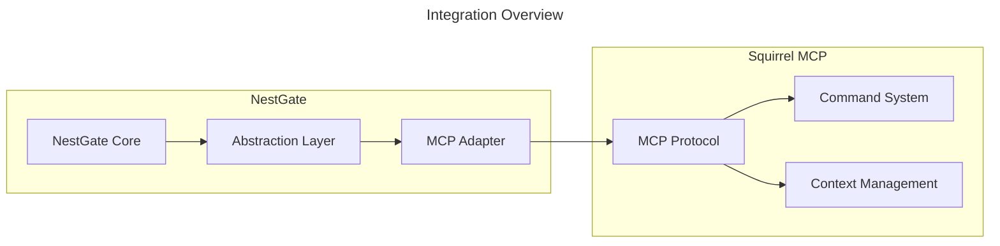
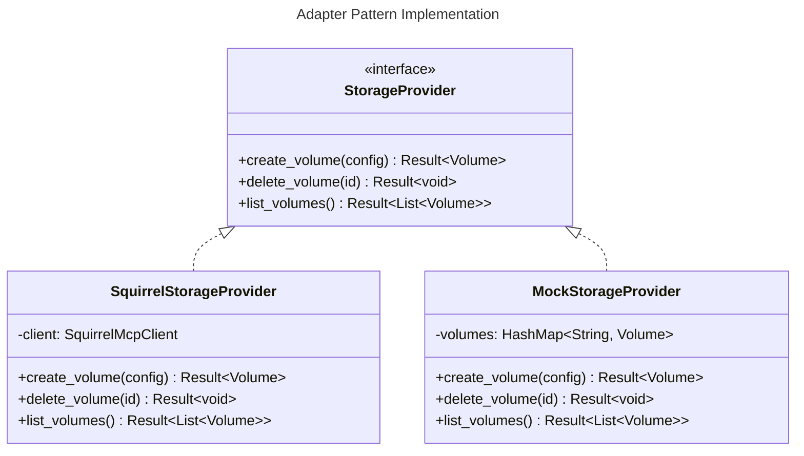

# NestGate-Squirrel MCP Integration

## Overview

This document outlines the architecture and implementation plan for integrating NestGate with Squirrel MCP. The integration follows a loosely coupled adapter pattern approach that allows NestGate to develop independently while preparing for tight MCP integration in the future.



## Design Principles

1. **Loose Coupling**: Minimize direct dependencies between NestGate and Squirrel MCP
2. **Interface Segregation**: Use focused interfaces for specific functionality
3. **Dependency Inversion**: Depend on abstractions, not implementations
4. **Testability**: Enable independent testing through mock implementations
5. **Progressive Integration**: Start with core capabilities and expand as needed

## Integration Architecture

### Abstraction Layer

The abstraction layer defines interfaces for MCP functionality:

```rust
// Example interface definitions (pseudocode)

/// Defines operations for storage providers
pub trait StorageProvider {
    async fn create_volume(&self, config: VolumeConfig) -> Result<Volume>;
    async fn delete_volume(&self, id: &str) -> Result<()>;
    async fn list_volumes(&self) -> Result<Vec<Volume>>;
    async fn get_volume_status(&self, id: &str) -> Result<VolumeStatus>;
}

/// Defines operations for resource orchestration
pub trait ResourceOrchestrator {
    async fn allocate_resources(&self, request: ResourceRequest) -> Result<ResourceAllocation>;
    async fn deallocate_resources(&self, allocation_id: &str) -> Result<()>;
    async fn get_resource_usage(&self) -> Result<ResourceUsage>;
}

/// Defines operations for state management
pub trait StateManager {
    async fn get_state(&self, key: &str) -> Result<Option<State>>;
    async fn set_state(&self, key: &str, state: State) -> Result<()>;
    async fn watch_state(&self, key: &str) -> Result<StateWatcher>;
}

/// Defines operations for message handling
pub trait MessageHandler {
    async fn send_message(&self, message: Message) -> Result<()>;
    async fn receive_messages(&self) -> Result<MessageReceiver>;
}
```

### Adapter Implementations

The adapter layer implements the abstractions for Squirrel MCP:

```rust
// Example adapter implementations (pseudocode)

pub struct SquirrelStorageProvider {
    client: SquirrelMcpClient,
}

impl StorageProvider for SquirrelStorageProvider {
    async fn create_volume(&self, config: VolumeConfig) -> Result<Volume> {
        // Convert NestGate VolumeConfig to Squirrel MCP format
        let mcp_config = convert_to_mcp_volume_config(config);
        
        // Call Squirrel MCP
        let mcp_volume = self.client.create_volume(mcp_config).await?;
        
        // Convert Squirrel MCP result to NestGate format
        Ok(convert_from_mcp_volume(mcp_volume))
    }
    
    // Other implementation methods...
}
```

### Mock Implementations for Testing

Mock implementations allow development without Squirrel MCP:

```rust
// Example mock implementations (pseudocode)

pub struct MockStorageProvider {
    volumes: Arc<RwLock<HashMap<String, Volume>>>,
}

impl StorageProvider for MockStorageProvider {
    async fn create_volume(&self, config: VolumeConfig) -> Result<Volume> {
        let volume = Volume {
            id: Uuid::new_v4().to_string(),
            name: config.name,
            size: config.size,
            created_at: Utc::now(),
            status: VolumeStatus::Creating,
        };
        
        let mut volumes = self.volumes.write().await;
        volumes.insert(volume.id.clone(), volume.clone());
        
        Ok(volume)
    }
    
    // Other implementation methods...
}
```

## Integration Phases

### Phase 1: Interface Definition (Month 1)

1. Define core abstractions for MCP functionality
2. Implement mock adapters for testing
3. Create basic unit tests
4. Document integration points

### Phase 2: Mock Implementation (Month 2-3)

1. Develop full mock implementations
2. Integrate mock implementations with NestGate
3. Create comprehensive test suite
4. Document mock behavior

### Phase 3: Adapter Development (Month 4-6)

1. Implement Squirrel MCP adapters
2. Create protocol translation layer
3. Add error handling and recovery
4. Implement performance optimizations

### Phase 4: Integration Testing (Month 7-8)

1. Test NestGate with Squirrel MCP adapters
2. Measure performance and reliability
3. Implement monitoring and observability
4. Document integration behavior

### Phase 5: Production Deployment (Month 9)

1. Deploy to production environment
2. Monitor performance and reliability
3. Gather feedback for improvements
4. Plan future enhancements

## Core Integration Points

### Storage Management

NestGate will utilize Squirrel MCP for enhanced storage operations:

```yaml
storage_integration:
  operations:
    - create_volume
    - delete_volume
    - resize_volume
    - snapshot_volume
    - clone_volume
    - backup_volume
    - restore_volume
  
  benefits:
    - "Distributed storage management"
    - "Enhanced backup capabilities"
    - "Cross-platform compatibility"
    - "Advanced quota management"
```

### Resource Orchestration

NestGate will leverage Squirrel MCP for resource management:

```yaml
resource_integration:
  operations:
    - allocate_resources
    - deallocate_resources
    - monitor_resource_usage
    - optimize_resource_allocation
    - enforce_resource_limits
  
  benefits:
    - "Dynamic resource scaling"
    - "Intelligent resource allocation"
    - "Resource usage reporting"
    - "Multi-tenant isolation"
```

### State Management

NestGate will use Squirrel MCP for distributed state:

```yaml
state_integration:
  operations:
    - get_state
    - set_state
    - watch_state
    - export_state
    - import_state
  
  benefits:
    - "Distributed state management"
    - "Real-time state synchronization"
    - "State versioning and history"
    - "Conflict resolution"
```

### Message Passing

NestGate will integrate with Squirrel MCP messaging:

```yaml
messaging_integration:
  operations:
    - send_message
    - receive_message
    - subscribe_to_topic
    - publish_to_topic
    - create_message_queue
    - process_message_queue
  
  benefits:
    - "Asynchronous communication"
    - "Event-driven architecture"
    - "Message reliability"
    - "Scalable message processing"
```

## Adapter Pattern Implementation

The implementation follows the adapter pattern to translate between NestGate and Squirrel MCP:



## Error Handling and Recovery

The integration implements robust error handling:

```rust
// Example error handling (pseudocode)

pub enum IntegrationError {
    ConnectionError(String),
    ProtocolError(String),
    ResourceError(String),
    AuthenticationError(String),
    StateError(String),
}

impl From<SquirrelMcpError> for IntegrationError {
    fn from(error: SquirrelMcpError) -> Self {
        match error {
            SquirrelMcpError::Connection(msg) => IntegrationError::ConnectionError(msg),
            SquirrelMcpError::Protocol(msg) => IntegrationError::ProtocolError(msg),
            // Other error mappings...
        }
    }
}

// Recovery strategies
async fn with_retry<F, Fut, T, E>(f: F, retries: usize) -> Result<T, E>
where
    F: Fn() -> Fut,
    Fut: Future<Output = Result<T, E>>,
    E: std::fmt::Debug,
{
    let mut attempts = 0;
    loop {
        match f().await {
            Ok(result) => return Ok(result),
            Err(err) => {
                attempts += 1;
                if attempts > retries {
                    return Err(err);
                }
                let backoff = Duration::from_millis(100 * 2u64.pow(attempts as u32));
                tokio::time::sleep(backoff).await;
            }
        }
    }
}
```

## Configuration

The integration is configurable through YAML:

```yaml
squirrel_mcp:
  connection:
    endpoint: "https://mcp.example.com"
    timeout: 30
    retries: 3
  
  authentication:
    method: "oauth2"
    client_id: "${MCP_CLIENT_ID}"
    client_secret: "${MCP_CLIENT_SECRET}"
  
  features:
    storage: true
    resources: true
    state: true
    messaging: true
  
  advanced:
    connection_pool_size: 10
    max_concurrent_requests: 100
    rate_limit: 1000
```

## Performance Considerations

The integration addresses several performance aspects:

```yaml
performance:
  caching:
    enabled: true
    ttl: 60
    max_size: 1000
  
  batching:
    enabled: true
    max_batch_size: 100
    flush_interval: 5
  
  connection_pooling:
    enabled: true
    min_connections: 5
    max_connections: 20
  
  compression:
    enabled: true
    algorithm: "gzip"
    min_size: 1024
```

## Monitoring and Observability

The integration includes comprehensive monitoring:

```yaml
monitoring:
  metrics:
    - name: "mcp_request_latency"
      type: "histogram"
      description: "Latency of MCP requests"
    
    - name: "mcp_request_count"
      type: "counter"
      description: "Number of MCP requests"
    
    - name: "mcp_error_count"
      type: "counter"
      description: "Number of MCP errors"
  
  tracing:
    enabled: true
    sampling_rate: 0.1
  
  logging:
    level: "info"
    format: "json"
```

## Testing Strategy

The integration includes a comprehensive testing strategy:

```yaml
testing:
  unit_tests:
    - "Test mock adapters against interfaces"
    - "Test error handling and recovery"
    - "Test configuration loading"
  
  integration_tests:
    - "Test with real Squirrel MCP instance"
    - "Test performance under load"
    - "Test error scenarios"
  
  mock_tests:
    - "Test NestGate with mock adapters"
    - "Verify behavior without real MCP"
```

## Security Considerations

The integration addresses security concerns:

```yaml
security:
  authentication:
    - "OAuth2 authentication"
    - "Token refresh"
    - "Credential rotation"
  
  authorization:
    - "Role-based access control"
    - "Fine-grained permissions"
    - "Resource-level access control"
  
  data_protection:
    - "TLS for all connections"
    - "Data encryption at rest"
    - "Input validation"
```

## Technical Metadata
- Category: Integration Specification
- Priority: Medium
- Last Updated: 2024-09-25
- Dependencies:
  - NestGate Core v0.7.0+
  - Squirrel MCP v1.5.0+
- Testing Requirements:
  - Unit tests
  - Integration tests
  - Performance tests