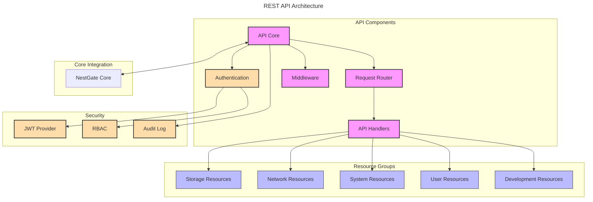

# NestGate REST API

## Overview

The NestGate REST API provides a comprehensive interface for programmatic interaction with NestGate services. This specification defines the API endpoints, request/response formats, authentication, and integration requirements for the REST API.

## API Architecture



## Machine Configuration

```yaml
rest_api:
  components:
    api_core:
      purpose: "Central API request handling and coordination"
      responsibilities:
        - HTTP request processing
        - Response generation
        - Error handling
        - Logging and metrics
      interfaces:
        - http_server
        - authentication
        - request_router
        - middleware_chain
      
    authentication:
      purpose: "API authentication and authorization"
      responsibilities:
        - Token validation
        - User authentication
        - Role-based access control
        - Session management
      methods:
        - jwt_token
        - api_key
        - session_cookie
        - oauth2
      
    request_router:
      purpose: "API endpoint routing"
      responsibilities:
        - Route registration
        - Path parameter handling
        - Handler dispatch
        - API versioning
      features:
        - Path parameter extraction
        - Query parameter handling
        - Content negotiation
        - Method routing
      
    middleware:
      purpose: "Request/response processing and modification"
      responsibilities:
        - Request validation
        - Response formatting
        - Cross-cutting concerns
        - Error handling
      middleware_chain:
        - logging_middleware
        - authentication_middleware
        - compression_middleware
        - cors_middleware
        - rate_limiting_middleware
        - transaction_middleware
  
  api_standard:
    version_control:
      versioning_strategy: "URI path"
      version_format: "v{major}"
      backward_compatibility: true
      supported_versions: ["v1"]
    
    response_format:
      success:
        structure:
          - status: "success"
          - data: object
          - meta: object (optional)
      
      error:
        structure:
          - status: "error"
          - error:
            - code: string
            - message: string
            - details: object (optional)
    
    http_status_codes:
      - 200: "OK"
      - 201: "Created"
      - 204: "No Content"
      - 400: "Bad Request"
      - 401: "Unauthorized"
      - 403: "Forbidden"
      - 404: "Not Found"
      - 409: "Conflict"
      - 422: "Unprocessable Entity"
      - 429: "Too Many Requests"
      - 500: "Internal Server Error"
    
    pagination:
      strategy: "limit-offset"
      default_limit: 20
      max_limit: 100
      parameters:
        - limit: "Number of items per page"
        - offset: "Offset from the first record"
      response_metadata:
        - total_items: integer
        - total_pages: integer
        - current_page: integer
        - item_count: integer
    
    filtering:
      query_parameters: true
      operators:
        - eq: "Equal to"
        - ne: "Not equal to"
        - gt: "Greater than"
        - lt: "Less than"
        - gte: "Greater than or equal to"
        - lte: "Less than or equal to"
        - in: "In a list of values"
        - nin: "Not in a list of values"
        - like: "Pattern matching"
      syntax: "{field}[:{operator}]={value}"
      examples:
        - "name=test"
        - "size:gt=100"
        - "status:in=active,pending"
    
    sorting:
      parameter: "sort"
      format: "field[:asc|desc]"
      multiple_fields: true
      default_direction: "asc"
      examples:
        - "sort=name"
        - "sort=created_at:desc"
        - "sort=status:asc,created_at:desc"
  
  endpoints:
    storage:
      volumes:
        base_path: "/api/v1/storage/volumes"
        operations:
          list:
            method: "GET"
            path: "/"
            description: "List all volumes"
            parameters:
              - name: "limit"
                in: "query"
                required: false
                description: "Maximum number of items to return"
                type: "integer"
              - name: "offset"
                in: "query"
                required: false
                description: "Number of items to skip"
                type: "integer"
              - name: "pool_id"
                in: "query"
                required: false
                description: "Filter by storage pool ID"
                type: "string"
            responses:
              - status: 200
                description: "List of volumes"
                schema: "VolumeListResponse"
          
          create:
            method: "POST"
            path: "/"
            description: "Create a new volume"
            parameters:
              - name: "volume"
                in: "body"
                required: true
                description: "Volume creation parameters"
                schema: "VolumeCreateRequest"
            responses:
              - status: 201
                description: "Volume created successfully"
                schema: "VolumeResponse"
              - status: 400
                description: "Invalid parameters"
                schema: "ErrorResponse"
              - status: 409
                description: "Volume already exists"
                schema: "ErrorResponse"
          
          get:
            method: "GET"
            path: "/{volume_id}"
            description: "Get volume details"
            parameters:
              - name: "volume_id"
                in: "path"
                required: true
                description: "Volume ID"
                type: "string"
            responses:
              - status: 200
                description: "Volume details"
                schema: "VolumeResponse"
              - status: 404
                description: "Volume not found"
                schema: "ErrorResponse"
          
          update:
            method: "PATCH"
            path: "/{volume_id}"
            description: "Update volume properties"
            parameters:
              - name: "volume_id"
                in: "path"
                required: true
                description: "Volume ID"
                type: "string"
              - name: "updates"
                in: "body"
                required: true
                description: "Volume update parameters"
                schema: "VolumeUpdateRequest"
            responses:
              - status: 200
                description: "Volume updated successfully"
                schema: "VolumeResponse"
              - status: 400
                description: "Invalid parameters"
                schema: "ErrorResponse"
              - status: 404
                description: "Volume not found"
                schema: "ErrorResponse"
          
          delete:
            method: "DELETE"
            path: "/{volume_id}"
            description: "Delete a volume"
            parameters:
              - name: "volume_id"
                in: "path"
                required: true
                description: "Volume ID"
                type: "string"
              - name: "force"
                in: "query"
                required: false
                description: "Force deletion even if volume is in use"
                type: "boolean"
            responses:
              - status: 204
                description: "Volume deleted successfully"
              - status: 400
                description: "Volume in use and force not specified"
                schema: "ErrorResponse"
              - status: 404
                description: "Volume not found"
                schema: "ErrorResponse"
      
      pools:
        base_path: "/api/v1/storage/pools"
        operations:
          list:
            method: "GET"
            path: "/"
            description: "List all storage pools"
            parameters:
              - name: "limit"
                in: "query"
                required: false
                description: "Maximum number of items to return"
                type: "integer"
              - name: "offset"
                in: "query"
                required: false
                description: "Number of items to skip"
                type: "integer"
            responses:
              - status: 200
                description: "List of storage pools"
                schema: "PoolListResponse"
          
          create:
            method: "POST"
            path: "/"
            description: "Create a new storage pool"
            parameters:
              - name: "pool"
                in: "body"
                required: true
                description: "Pool creation parameters"
                schema: "PoolCreateRequest"
            responses:
              - status: 201
                description: "Pool created successfully"
                schema: "PoolResponse"
              - status: 400
                description: "Invalid parameters"
                schema: "ErrorResponse"
              - status: 409
                description: "Pool already exists"
                schema: "ErrorResponse"
    
    network:
      base_path: "/api/v1/network"
      operations:
        list_protocols:
          method: "GET"
          path: "/protocols"
          description: "List all network protocols"
          responses:
            - status: 200
              description: "List of network protocols"
              schema: "ProtocolListResponse"
        
        enable_protocol:
          method: "POST"
          path: "/protocols/{protocol_id}/enable"
          description: "Enable a network protocol"
          parameters:
            - name: "protocol_id"
              in: "path"
              required: true
              description: "Protocol ID"
              type: "string"
            - name: "configuration"
              in: "body"
              required: false
              description: "Protocol configuration"
              schema: "ProtocolConfig"
          responses:
            - status: 200
              description: "Protocol enabled successfully"
              schema: "ProtocolResponse"
            - status: 400
              description: "Invalid configuration"
              schema: "ErrorResponse"
            - status: 404
              description: "Protocol not found"
              schema: "ErrorResponse"
    
    system:
      base_path: "/api/v1/system"
      operations:
        status:
          method: "GET"
          path: "/status"
          description: "Get system status"
          responses:
            - status: 200
              description: "System status"
              schema: "SystemStatusResponse"
        
        resources:
          method: "GET"
          path: "/resources"
          description: "Get system resource usage"
          responses:
            - status: 200
              description: "System resource usage"
              schema: "ResourceUsageResponse"
    
    users:
      base_path: "/api/v1/users"
      operations:
        list:
          method: "GET"
          path: "/"
          description: "List all users"
          parameters:
            - name: "limit"
              in: "query"
              required: false
              description: "Maximum number of items to return"
              type: "integer"
            - name: "offset"
              in: "query"
              required: false
              description: "Number of items to skip"
              type: "integer"
          responses:
            - status: 200
              description: "List of users"
              schema: "UserListResponse"
        
        create:
          method: "POST"
          path: "/"
          description: "Create a new user"
          parameters:
            - name: "user"
              in: "body"
              required: true
              description: "User creation parameters"
              schema: "UserCreateRequest"
          responses:
            - status: 201
              description: "User created successfully"
              schema: "UserResponse"
            - status: 400
              description: "Invalid parameters"
              schema: "ErrorResponse"
            - status: 409
              description: "User already exists"
              schema: "ErrorResponse"
  
  schemas:
    volume:
      properties:
        - id: "UUID of the volume"
        - name: "Name of the volume"
        - pool_id: "ID of the storage pool"
        - size: "Size in bytes"
        - available: "Available space in bytes"
        - used: "Used space in bytes"
        - created_at: "Creation timestamp"
        - status: "Volume status (online, offline, degraded)"
        - properties: "Key-value pairs of volume properties"
    
    pool:
      properties:
        - id: "UUID of the pool"
        - name: "Name of the pool"
        - devices: "List of devices in the pool"
        - size: "Total size in bytes"
        - available: "Available space in bytes"
        - used: "Used space in bytes"
        - status: "Pool status (online, offline, degraded)"
        - health: "Pool health status"
        - properties: "Key-value pairs of pool properties"
    
    protocol:
      properties:
        - id: "Protocol identifier"
        - name: "Protocol name"
        - version: "Protocol version"
        - status: "Protocol status (enabled, disabled)"
        - configuration: "Protocol configuration"
    
    user:
      properties:
        - id: "UUID of the user"
        - username: "Username"
        - email: "Email address"
        - roles: "List of roles assigned to the user"
        - created_at: "Creation timestamp"
        - last_login: "Last login timestamp"
        - status: "User status (active, inactive, locked)"
  
  security:
    authentication:
      methods:
        - jwt:
            token_lifetime: 3600
            refresh_enabled: true
            refresh_lifetime: 86400
        
        - api_key:
            header_name: "X-API-Key"
            lifetime: null
        
        - oauth2:
            grant_types:
              - authorization_code
              - client_credentials
              - password
            scopes:
              - read:storage
              - write:storage
              - read:network
              - write:network
              - read:system
              - write:system
              - read:users
              - write:users
    
    authorization:
      rbac:
        roles:
          - admin:
              permissions:
                - "*"
          - storage_admin:
              permissions:
                - "storage:*"
          - network_admin:
              permissions:
                - "network:*"
          - user_admin:
              permissions:
                - "users:*"
          - read_only:
              permissions:
                - "*:read"
        
        permissions:
          format: "{resource}:{action}"
          actions:
            - read
            - write
            - create
            - delete
            - execute
          resources:
            - storage
            - network
            - system
            - users
    
    rate_limiting:
      enabled: true
      strategies:
        - token_bucket:
            rate: 100
            burst: 200
      scopes:
        - per_ip
        - per_api_key
        - per_user
  
  validation:
    performance:
      metrics:
        - response_time
        - throughput
        - error_rate
      targets:
        average_response_time: "<100ms"
        95th_percentile_response_time: "<200ms"
        requests_per_second: ">1000"
    
    reliability:
      requirements:
        - Graceful error handling
        - Comprehensive logging
        - Rate limiting
        - Request validation
        - Response validation
    
    security:
      requirements:
        - TLS 1.2+
        - Proper authentication
        - Role-based authorization
        - Input validation
        - Output sanitization
```

## Technical Context

### Implementation Notes

1. **API Design Principles**
   - Follow RESTful principles
   - Implement consistent resource naming
   - Use appropriate HTTP methods
   - Maintain backward compatibility
   - Design for extensibility

2. **Performance Considerations**
   - Implement connection pooling
   - Use efficient JSON serialization
   - Optimize database queries
   - Implement caching where appropriate
   - Use pagination for large datasets

3. **Error Handling**
   - Provide consistent error formats
   - Include actionable error messages
   - Use appropriate HTTP status codes
   - Include error codes for programmatic handling
   - Log detailed error information

4. **Security Considerations**
   - Implement proper authentication
   - Enforce authorization for all endpoints
   - Validate all input
   - Protect against common vulnerabilities
   - Implement rate limiting

### Integration Requirements

1. **Core System Integration**
   - Use asynchronous processing for long operations
   - Implement proper state management
   - Handle events from core system
   - Expose core functionality through REST

2. **Client Integration**
   - Provide a consistent API for all clients
   - Support standard authentication methods
   - Document all endpoints comprehensively
   - Provide SDKs for common languages
   - Include examples for all operations

3. **Documentation Standards**
   - OpenAPI/Swagger documentation
   - Code examples
   - Response examples
   - Error handling documentation
   - Authentication documentation

## API Examples

### Volume Management

**List Volumes**

```http
GET /api/v1/storage/volumes HTTP/1.1
Host: nestgate.example.com
Authorization: Bearer <token>
```

Response:

```json
{
  "status": "success",
  "data": {
    "items": [
      {
        "id": "550e8400-e29b-41d4-a716-446655440000",
        "name": "data_volume",
        "pool_id": "550e8400-e29b-41d4-a716-446655440001",
        "size": 107374182400,
        "available": 53687091200,
        "used": 53687091200,
        "created_at": "2023-01-15T12:30:45Z",
        "status": "online",
        "properties": {
          "compression": "on",
          "deduplication": "off"
        }
      },
      {
        "id": "550e8400-e29b-41d4-a716-446655440002",
        "name": "backup_volume",
        "pool_id": "550e8400-e29b-41d4-a716-446655440003",
        "size": 214748364800,
        "available": 161061273600,
        "used": 53687091200,
        "created_at": "2023-01-16T08:45:12Z",
        "status": "online",
        "properties": {
          "compression": "off",
          "deduplication": "off"
        }
      }
    ]
  },
  "meta": {
    "total_items": 2,
    "total_pages": 1,
    "current_page": 1,
    "item_count": 2
  }
}
```

**Create Volume**

```http
POST /api/v1/storage/volumes HTTP/1.1
Host: nestgate.example.com
Authorization: Bearer <token>
Content-Type: application/json

{
  "name": "new_volume",
  "pool_id": "550e8400-e29b-41d4-a716-446655440001",
  "size": 107374182400,
  "properties": {
    "compression": "on",
    "deduplication": "off"
  }
}
```

Response:

```json
{
  "status": "success",
  "data": {
    "id": "550e8400-e29b-41d4-a716-446655440004",
    "name": "new_volume",
    "pool_id": "550e8400-e29b-41d4-a716-446655440001",
    "size": 107374182400,
    "available": 107374182400,
    "used": 0,
    "created_at": "2023-02-20T15:12:33Z",
    "status": "online",
    "properties": {
      "compression": "on",
      "deduplication": "off"
    }
  }
}
```

### User Management

**Create User**

```http
POST /api/v1/users HTTP/1.1
Host: nestgate.example.com
Authorization: Bearer <token>
Content-Type: application/json

{
  "username": "john_doe",
  "email": "john.doe@example.com",
  "password": "pa$$w0rd",
  "roles": ["storage_admin"]
}
```

Response:

```json
{
  "status": "success",
  "data": {
    "id": "550e8400-e29b-41d4-a716-446655440005",
    "username": "john_doe",
    "email": "john.doe@example.com",
    "roles": ["storage_admin"],
    "created_at": "2023-02-20T15:20:45Z",
    "last_login": null,
    "status": "active"
  }
}
```

## Implementation Phases

### Phase 1: Core API
1. Storage resource endpoints
2. Basic system status
3. Authentication and authorization
4. Core documentation

### Phase 2: Complete Resource Coverage
1. Network endpoint
2. User management
3. System configuration
4. Advanced querying capabilities

### Phase 3: Advanced Features
1. Advanced monitoring and metrics
2. Event subscription (WebSockets)
3. Batch operations
4. SDK development

## Technical Metadata
- Category: API/REST
- Priority: P1
- Dependencies:
  - Actix Web (for Rust implementation)
  - Serde (serialization)
  - Jsonwebtoken (authentication)
  - NestGate Core integration
- Validation Requirements:
  - API compliance testing
  - Performance benchmarking
  - Security testing
  - Client SDK testing 