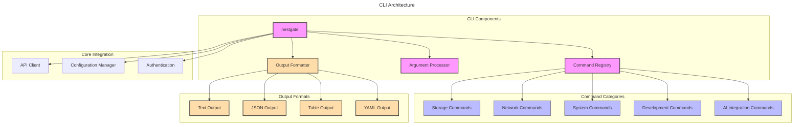

# NestGate CLI Interface

## Overview

The NestGate Command Line Interface (CLI) provides a comprehensive set of tools for interacting with NestGate systems. This specification defines the command structure, argument handling, output formatting, and user experience requirements for the NestGate CLI tools.

## CLI Architecture



## Machine Configuration

```yaml
cli:
  components:
    main_binary:
      name: "nestgate"
      purpose: "Primary CLI entry point"
      responsibilities:
        - Command dispatch
        - Global argument handling
        - Authentication
        - Output formatting
      global_flags:
        - --config: "Configuration file path"
        - --output, -o: "Output format (text, json, yaml, table)"
        - --quiet, -q: "Suppress output"
        - --verbose, -v: "Increase verbosity"
        - --help, -h: "Show help"
        - --version: "Show version"
      
    command_registry:
      purpose: "Command management and discovery"
      responsibilities:
        - Command registration
        - Command grouping
        - Help generation
        - Command validation
      features:
        - Dynamic command discovery
        - Plugin support
        - Command aliasing
        - Tab completion
      
    argument_processor:
      purpose: "Command-line argument handling"
      responsibilities:
        - Argument parsing
        - Validation
        - Default values
        - Environment variable integration
      features:
        - Type validation
        - Required flag checking
        - Value constraints
        - Environment overrides
      
    output_formatter:
      purpose: "Output formatting and presentation"
      responsibilities:
        - Format selection
        - Output pagination
        - Color support
        - Machine-readable output
      supported_formats:
        - text: "Human-readable text output"
        - json: "JSON structured output"
        - yaml: "YAML structured output"
        - table: "Tabular data presentation"
  
  command_groups:
    storage:
      description: "Storage management commands"
      commands:
        - volume:
            subcommands:
              - create: "Create a new volume"
              - delete: "Delete a volume"
              - list: "List volumes"
              - resize: "Resize a volume"
              - snapshot: "Create a volume snapshot"
              - clone: "Clone a volume"
        
        - pool:
            subcommands:
              - create: "Create a new storage pool"
              - delete: "Delete a storage pool"
              - list: "List storage pools"
              - add-device: "Add a device to a pool"
              - remove-device: "Remove a device from a pool"
              - status: "Show pool status"
        
        - share:
            subcommands:
              - create: "Create a new share"
              - delete: "Delete a share"
              - list: "List shares"
              - set-acl: "Set share ACLs"
              - get-acl: "Get share ACLs"
    
    network:
      description: "Network management commands"
      commands:
        - protocol:
            subcommands:
              - enable: "Enable a network protocol"
              - disable: "Disable a network protocol"
              - status: "Show protocol status"
              - configure: "Configure a protocol"
        
        - service:
            subcommands:
              - start: "Start a network service"
              - stop: "Stop a network service"
              - restart: "Restart a network service"
              - status: "Show service status"
    
    system:
      description: "System management commands"
      commands:
        - status:
            description: "Show system status"
            flags:
              - --components: "Show component status"
              - --services: "Show service status"
              - --resources: "Show resource usage"
        
        - config:
            subcommands:
              - get: "Get configuration value"
              - set: "Set configuration value"
              - import: "Import configuration"
              - export: "Export configuration"
        
        - user:
            subcommands:
              - create: "Create a new user"
              - delete: "Delete a user"
              - list: "List users"
              - set-password: "Set user password"
    
    development:
      description: "Development environment commands"
      commands:
        - workspace:
            subcommands:
              - create: "Create a development workspace"
              - delete: "Delete a workspace"
              - list: "List workspaces"
              - mount: "Mount a workspace"
        
        - container:
            subcommands:
              - run: "Run a container"
              - list: "List containers"
              - stop: "Stop a container"
              - logs: "Show container logs"
    
    ai:
      description: "AI integration commands"
      commands:
        - mcp:
            subcommands:
              - status: "Show MCP status"
              - connect: "Connect to MCP service"
              - disconnect: "Disconnect from MCP service"
              - list-capabilities: "List available capabilities"
  
  command_specifications:
    volume_create:
      description: "Create a new volume"
      usage: "nestgate volume create [options] <name>"
      arguments:
        - name:
            description: "Volume name"
            required: true
            position: 0
      flags:
        - --size, -s:
            description: "Volume size (e.g., 10G, 1T)"
            required: true
            type: "string"
            pattern: "^\\d+[KMGT]$"
        - --pool, -p:
            description: "Storage pool name"
            required: true
            type: "string"
        - --type, -t:
            description: "Volume type"
            required: false
            type: "string"
            default: "thin"
            choices: ["thin", "thick"]
        - --compression:
            description: "Enable compression"
            required: false
            type: "boolean"
            default: false
      examples:
        - "nestgate volume create --size 100G --pool main_pool my_volume"
        - "nestgate volume create -s 2T -p ssd_pool --compression data_volume"
    
    pool_create:
      description: "Create a new storage pool"
      usage: "nestgate pool create [options] <name>"
      arguments:
        - name:
            description: "Pool name"
            required: true
            position: 0
      flags:
        - --devices, -d:
            description: "Devices to add to the pool (comma-separated)"
            required: true
            type: "string"
        - --raid, -r:
            description: "RAID level"
            required: false
            type: "string"
            default: "mirror"
            choices: ["mirror", "raidz", "raidz2", "raidz3", "stripe"]
        - --ashift, -a:
            description: "Pool sector size alignment"
            required: false
            type: "integer"
            default: 12
            choices: [9, 10, 11, 12, 13]
      examples:
        - "nestgate pool create --devices /dev/sdb,/dev/sdc --raid mirror data_pool"
        - "nestgate pool create -d /dev/sd{b,c,d,e} -r raidz2 backup_pool"
  
  output_formats:
    text:
      description: "Human-readable text output"
      features:
        - Color support
        - Indentation
        - Progressive disclosure
    
    json:
      description: "JSON structured output"
      features:
        - Full data representation
        - Programmatic consumption
        - Standard format
    
    yaml:
      description: "YAML structured output"
      features:
        - Human-readable structure
        - Full data representation
        - Configuration compatibility
    
    table:
      description: "Tabular data presentation"
      features:
        - Column alignment
        - Header support
        - Sorting
        - Filtering
  
  validation:
    user_experience:
      requirements:
        - Consistent command structure
        - Comprehensive help text
        - Intuitive argument handling
        - Meaningful error messages
        - Progress indicators for long operations
    
    performance:
      requirements:
        - Command response time < 100ms (local)
        - Progressive output for long operations
        - Resource-efficient operation
    
    reliability:
      requirements:
        - Proper error handling
        - Consistent exit codes
        - Command idempotency when appropriate
```

## Technical Context

### Implementation Notes

1. **CLI Design Principles**
   - Follow POSIX CLI conventions
   - Implement consistent command structure
   - Provide comprehensive help
   - Enable scriptability
   - Support both interactive and non-interactive use

2. **Command Structure**
   - Use noun-verb pattern (e.g., `volume create`)
   - Group related commands
   - Support command aliases
   - Implement tab completion
   - Consistent flag naming

3. **Error Handling**
   - Meaningful error messages
   - Appropriate exit codes
   - Debug information with verbose flag
   - Error context when available

4. **Performance Considerations**
   - Minimize startup time
   - Lazy loading of commands
   - Caching strategy for frequent operations
   - Efficient resource utilization

### Integration Requirements

1. **API Integration**
   - Use REST API for all operations
   - Implement proper authentication
   - Handle API versioning
   - Support API discovery

2. **Configuration Integration**
   - Follow XDG configuration standards
   - Support multiple configuration sources
   - Enable per-command configuration
   - Secure credential handling

3. **Automation Support**
   - Machine-readable output formats
   - Non-interactive operation mode
   - Exit codes for scripting
   - Environment variable support

## Command Examples

### Volume Management

```bash
# Create a volume
nestgate volume create --size 100G --pool main_pool my_volume

# List volumes
nestgate volume list

# Get volume information
nestgate volume info my_volume

# Delete a volume
nestgate volume delete my_volume --confirm

# Create a snapshot
nestgate volume snapshot my_volume --name snapshot1
```

### Pool Management

```bash
# Create a pool
nestgate pool create --devices /dev/sdb,/dev/sdc --raid mirror data_pool

# Check pool status
nestgate pool status data_pool

# Add a device to a pool
nestgate pool add-device data_pool --device /dev/sdd

# Scrub a pool
nestgate pool scrub data_pool
```

### Share Management

```bash
# Create an SMB share
nestgate share create --volume data_volume --protocol smb --name "Data Share"

# Set share permissions
nestgate share set-acl "Data Share" --user john --permission rw

# List shares
nestgate share list --protocol smb
```

## Implementation Phases

### Phase 1: Core Commands
1. Basic volume management
2. Pool operations
3. System status
4. Configuration management

### Phase 2: Advanced Operations
1. Network protocol management
2. Advanced storage operations
3. User management
4. Backup operations

### Phase 3: Development Environment
1. Workspace management
2. Container operations
3. Development environment integration
4. AI/ML integration

## Technical Metadata
- Category: CLI/User Interface
- Priority: P1
- Dependencies:
  - Clap (command line argument parsing)
  - Tokio (async runtime)
  - Reqwest (HTTP client)
  - Serde (serialization)
- Validation Requirements:
  - Command compliance testing
  - User experience validation
  - API compatibility testing
  - Performance benchmarking 