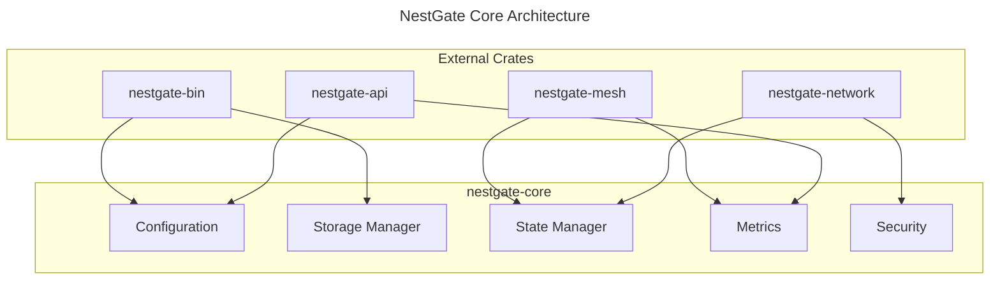

# Core Architecture Implementation

## Crate Structure



## Machine Configuration (70%)

```yaml
core_architecture:
  crate_structure:
    name: nestgate-core
    version: "0.2.0"
    components:
      configuration:
        purpose: "System-wide configuration management"
        features:
          - Dynamic configuration
          - Environment handling
          - Validation system
          - Hot reloading
      
      storage_manager:
        purpose: "Storage operations and management"
        features:
          - ZFS integration
          - Cache management
          - IO scheduling
          - Quota control
      
      state_manager:
        purpose: "System state coordination"
        features:
          - State synchronization
          - Conflict resolution
          - Event propagation
          - State persistence
      
      metrics:
        purpose: "System-wide metrics collection"
        features:
          - Metric aggregation
          - Performance tracking
          - Resource monitoring
          - Alert triggering
      
      security:
        purpose: "Core security primitives"
        features:
          - Encryption
          - Access control
          - Audit logging
          - Key management
    
    interfaces:
      configuration:
        trait: "ConfigProvider"
        methods:
          - "get_config<T: Config>"
          - "update_config<T: Config>"
          - "watch_config<T: Config>"
      
      storage:
        trait: "StorageManager"
        methods:
          - "create_volume"
          - "manage_snapshot"
          - "handle_io"
          - "monitor_usage"
      
      state:
        trait: "StateCoordinator"
        methods:
          - "update_state"
          - "sync_state"
          - "resolve_conflict"
      
      metrics:
        trait: "MetricsProvider"
        methods:
          - "collect_metrics"
          - "register_callback"
          - "health_check"
    
    dependencies:
      runtime:
        - tokio: "1.0"
        - async-trait: "0.1"
      
      storage:
        - zfs: "0.1"
        - io-uring: "0.1"
      
      metrics:
        - metrics: "0.21"
        - prometheus: "0.13"
      
      security:
        - ring: "0.17"
        - argon2: "0.5"

  validation_criteria:
    performance:
      configuration:
        load_time: "<100ms"
        update_time: "<50ms"
      
      storage:
        throughput: "1GB/s"
        latency: "<10ms"
      
      state:
        sync_time: "<1s"
        conflict_resolution: "<100ms"
      
      metrics:
        collection_lag: "<10ms"
        query_time: "<50ms"
    
    reliability:
      uptime: "99.9%"
      data_durability: "99.999999%"
      state_consistency: "eventual"
    
    security:
      encryption: "AES-256-GCM"
      key_rotation: "90d"
      audit_retention: "1y"
```

## Technical Context (30%)

### Implementation Sequence

1. Core Components
   - Configuration system with hot reloading
   - Storage manager with ZFS integration
   - State coordination with conflict resolution
   - Metrics collection with Prometheus

2. Interface Development
   - Define and implement core traits
   - Create public APIs
   - Document interfaces
   - Implement error handling

3. Integration Points
   - API crate integration
   - Network crate integration
   - Mesh crate integration
   - Binary crate integration

### Critical Constraints

1. Performance Requirements
   - Configuration updates must be fast
   - Storage operations need low latency
   - State sync must be efficient
   - Metrics collection must be lightweight

2. Reliability Requirements
   - Handle partial system failures
   - Maintain data consistency
   - Provide fallback mechanisms
   - Support recovery procedures

3. Security Requirements
   - Secure all interfaces
   - Encrypt sensitive data
   - Log security events
   - Implement access control

### Error Handling Strategy

1. Error Types
```rust
pub enum CoreError {
    Config(ConfigError),
    Storage(StorageError),
    State(StateError),
    Metrics(MetricsError),
    Security(SecurityError),
}

impl std::error::Error for CoreError {}
```

2. Error Propagation
   - Use error contexts
   - Provide recovery hints
   - Include error sources
   - Support error chaining

3. Recovery Procedures
   - Automatic retry logic
   - Fallback mechanisms
   - State recovery
   - Error reporting

### Integration Guidelines

1. For API Crate
   - Use configuration interface
   - Implement metrics collection
   - Handle state updates
   - Follow security protocols

2. For Network Crate
   - Use state management
   - Implement security measures
   - Handle metrics collection
   - Follow configuration

3. For Mesh Crate
   - Use state synchronization
   - Implement metrics reporting
   - Handle configuration
   - Follow security protocols

4. For Binary Crate
   - Use configuration system
   - Implement storage operations
   - Handle metrics reporting
   - Follow security measures

---

Last Updated: 2024-03-15
Version: 1.0.0 