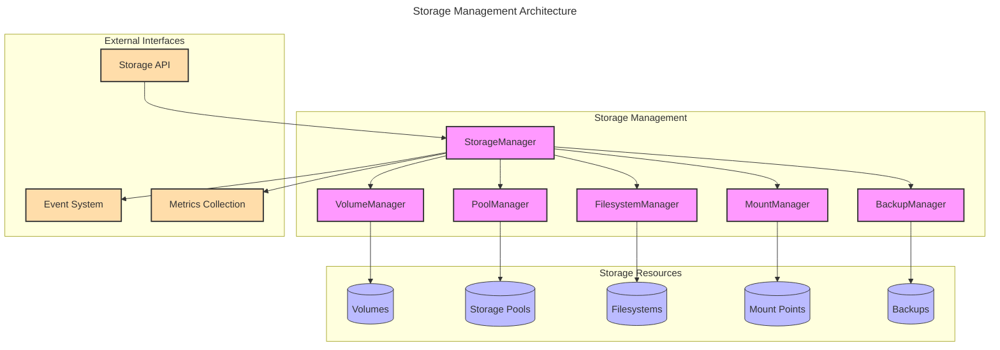

# NestGate Core Storage Management

## Overview

The NestGate Core Storage Management subsystem is responsible for all aspects of storage organization, access, and optimization within the NestGate system. This specification defines the architecture, interfaces, and implementation requirements for the storage management functionality.

## Architecture



## Machine Configuration

```yaml
storage_management:
  components:
    storage_manager:
      purpose: "Central coordination of storage operations"
      responsibilities:
        - High-level storage operations
        - Resource coordination
        - Policy enforcement
        - Event generation
      interfaces:
        - storage_api
        - metrics_provider
        - event_generator
      
    volume_manager:
      purpose: "Logical volume management"
      responsibilities:
        - Volume creation/deletion
        - Volume expansion/shrinking
        - Volume state management
        - Volume property management
      supported_operations:
        - create_volume
        - delete_volume
        - resize_volume
        - snapshot_volume
        - clone_volume
      
    pool_manager:
      purpose: "Physical storage pool management"
      responsibilities:
        - Pool creation/deletion
        - Device management
        - Pool health monitoring
        - Pool performance optimization
      supported_operations:
        - create_pool
        - delete_pool
        - add_device
        - remove_device
        - scrub_pool
        - check_health
      
    filesystem_manager:
      purpose: "Filesystem operations and formatting"
      responsibilities:
        - Filesystem creation/deletion
        - Filesystem properties
        - Quota management
        - Feature enablement
      supported_operations:
        - create_filesystem
        - delete_filesystem
        - set_property
        - enable_feature
        - set_quota
      
    mount_manager:
      purpose: "Mount point and access management"
      responsibilities:
        - Mount/unmount operations
        - Mount property management
        - Access control
        - Share configuration
      supported_operations:
        - mount_filesystem
        - unmount_filesystem
        - set_mount_options
        - create_share
        - remove_share
      
    backup_manager:
      purpose: "Backup and restore operations"
      responsibilities:
        - Backup creation/deletion
        - Restore operations
        - Scheduled backups
        - Retention policy
      supported_operations:
        - create_backup
        - restore_backup
        - schedule_backup
        - set_retention
        - prune_backups
      
  data_models:
    volume:
      properties:
        - name: String
        - id: UUID
        - size: u64
        - available: u64
        - used: u64
        - pool_id: UUID
        - create_time: DateTime
        - state: VolumeState
        - properties: Map<String, String>
      
    pool:
      properties:
        - name: String
        - id: UUID
        - devices: Vec<Device>
        - size: u64
        - available: u64
        - used: u64
        - state: PoolState
        - health: PoolHealth
        - properties: Map<String, String>
      
    filesystem:
      properties:
        - name: String
        - id: UUID
        - volume_id: UUID
        - type: FilesystemType
        - properties: Map<String, String>
        - features: Vec<Feature>
        - quotas: Vec<Quota>
      
    mount:
      properties:
        - id: UUID
        - filesystem_id: UUID
        - path: String
        - options: Vec<String>
        - state: MountState
        - access: AccessControl
      
    backup:
      properties:
        - id: UUID
        - source_id: UUID
        - snapshot_id: UUID
        - create_time: DateTime
        - size: u64
        - state: BackupState
        - retention: RetentionPolicy
      
  validation:
    performance:
      metrics:
        - operation_latency
        - throughput
        - iops
        - queue_depth
      targets:
        volume_creation_time: "<1s"
        snapshot_creation_time: "<200ms"
        backup_throughput: ">500MB/s"
        restore_throughput: ">400MB/s"
    
    reliability:
      requirements:
        - Transactional operations
        - Consistent state after failures
        - Auto-recovery capabilities
        - Event-based monitoring
```

## Technical Context

### Implementation Notes

1. **Storage Backend Support**
   - Primary implementation should use ZFS for production environments
   - Support for alternative backends (btrfs, lvm+ext4) as fallbacks
   - Abstract backend operations behind trait implementations

2. **Concurrency Model**
   - Use asynchronous operations for all I/O bound operations
   - Implement proper locking strategy for shared state
   - Avoid blocking the event loop for long operations

3. **Error Handling**
   - All errors should propagate with appropriate context
   - Implement structured error types for each subsystem
   - Provide recovery mechanisms where possible

4. **Performance Considerations**
   - Cache frequently accessed metadata
   - Use batch operations where appropriate
   - Minimize unnecessary I/O operations

### Integration Points

1. **Core System Integration**
   - Storage subsystem publishes its capabilities to core
   - Storage events are propagated to the event system
   - Resource utilization reported to metrics system

2. **Security Integration**
   - Access control coordinated with security subsystem
   - Support for encrypted volumes
   - Secure credential handling

3. **MCP Integration**
   - Expose storage operations through MCP
   - Provide storage state for MCP context
   - Support AI-assisted storage optimization

## Implementation Phases

### Phase 1: Basic Volume Management
1. Volume creation and deletion
2. Basic pool operations
3. Simple filesystem operations
4. Core mount functionality

### Phase 2: Advanced Features
1. Snapshot and clone capabilities
2. Quota management
3. Advanced mount options
4. Share configuration

### Phase 3: Backup and Recovery
1. Snapshot-based backups
2. Scheduled operations
3. Retention policies
4. Recovery operations

## Technical Metadata
- Category: Core/Storage
- Priority: P1
- Dependencies:
  - ZFS or comparable storage backend
  - Event system
  - Metrics subsystem
- Validation Requirements:
  - Performance testing
  - Error recovery testing
  - Concurrent operation testing 