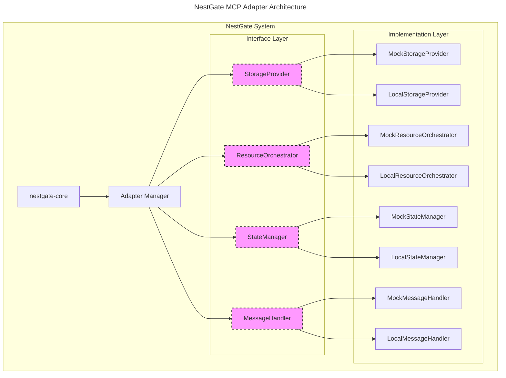

# NestGate MCP Adapter Architecture

## Overview

This document details the architecture for NestGate's Machine Context Protocol (MCP) adapter system. The architecture follows a modular design pattern that enables NestGate to develop independently while maintaining future compatibility with Squirrel MCP.



## Core Design Principles

1. **Interface-Based Design**: All MCP functionality is defined through clear interfaces
2. **Dependency Injection**: Components are loosely coupled through dependency injection
3. **Implementation Swapping**: Different implementations can be swapped without changing client code
4. **Progressive Enhancement**: Start with local implementations, gradually adopt MCP features
5. **Testability**: Mock implementations facilitate testing without external dependencies

## Interface Layer

The interface layer defines the contracts for MCP functionality:

### Storage Provider Interface

```rust
/// Defines operations for storage providers
#[async_trait]
pub trait StorageProvider: Send + Sync {
    /// Create a new storage volume
    async fn create_volume(&self, config: VolumeConfig) -> Result<Volume, StorageError>;
    
    /// Delete an existing storage volume
    async fn delete_volume(&self, id: &str) -> Result<(), StorageError>;
    
    /// List all available volumes
    async fn list_volumes(&self) -> Result<Vec<Volume>, StorageError>;
    
    /// Get detailed status of a specific volume
    async fn get_volume_status(&self, id: &str) -> Result<VolumeStatus, StorageError>;
    
    /// Resize an existing volume
    async fn resize_volume(&self, id: &str, new_size: u64) -> Result<Volume, StorageError>;
    
    /// Create a snapshot of a volume
    async fn create_snapshot(&self, volume_id: &str, name: &str) -> Result<Snapshot, StorageError>;
    
    /// Restore a volume from a snapshot
    async fn restore_snapshot(&self, snapshot_id: &str) -> Result<Volume, StorageError>;
}
```

### Resource Orchestrator Interface

```rust
/// Defines operations for resource orchestration
#[async_trait]
pub trait ResourceOrchestrator: Send + Sync {
    /// Allocate resources for a specific purpose
    async fn allocate_resources(&self, request: ResourceRequest) -> Result<ResourceAllocation, ResourceError>;
    
    /// Deallocate previously allocated resources
    async fn deallocate_resources(&self, allocation_id: &str) -> Result<(), ResourceError>;
    
    /// Get current resource usage information
    async fn get_resource_usage(&self) -> Result<ResourceUsage, ResourceError>;
    
    /// Update resource allocation parameters
    async fn update_allocation(&self, allocation_id: &str, request: ResourceRequest) -> Result<ResourceAllocation, ResourceError>;
    
    /// Reserve resources for future allocation
    async fn reserve_resources(&self, request: ResourceReservation) -> Result<ReservationToken, ResourceError>;
}
```

### State Manager Interface

```rust
/// Defines operations for state management
#[async_trait]
pub trait StateManager: Send + Sync {
    /// Get a state value by key
    async fn get_state(&self, key: &str) -> Result<Option<State>, StateError>;
    
    /// Set a state value
    async fn set_state(&self, key: &str, state: State) -> Result<(), StateError>;
    
    /// Watch for changes to a state key
    async fn watch_state(&self, key: &str) -> Result<StateWatcher, StateError>;
    
    /// Get multiple state values by pattern
    async fn get_state_by_pattern(&self, pattern: &str) -> Result<HashMap<String, State>, StateError>;
    
    /// Delete a state value
    async fn delete_state(&self, key: &str) -> Result<(), StateError>;
}
```

### Message Handler Interface

```rust
/// Defines operations for message handling
#[async_trait]
pub trait MessageHandler: Send + Sync {
    /// Send a message
    async fn send_message(&self, message: Message) -> Result<MessageId, MessageError>;
    
    /// Receive messages
    async fn receive_messages(&self) -> Result<MessageReceiver, MessageError>;
    
    /// Subscribe to a topic
    async fn subscribe(&self, topic: &str) -> Result<Subscription, MessageError>;
    
    /// Publish a message to a topic
    async fn publish(&self, topic: &str, message: Message) -> Result<MessageId, MessageError>;
    
    /// Acknowledge receipt of a message
    async fn acknowledge(&self, message_id: &MessageId) -> Result<(), MessageError>;
}
```

## Implementation Layer

The implementation layer provides concrete implementations of the interfaces:

### Local Implementations

Initially, NestGate will develop local implementations for each interface:

```rust
/// Local storage provider implementation
pub struct LocalStorageProvider {
    /// Local storage manager
    storage_manager: Arc<StorageManager>,
    
    /// Configuration
    config: LocalStorageConfig,
    
    /// Metrics collector
    metrics: Option<Arc<MetricsCollector>>,
}

impl LocalStorageProvider {
    /// Create a new local storage provider
    pub fn new(config: LocalStorageConfig) -> Self {
        Self {
            storage_manager: Arc::new(StorageManager::new(config.storage_path.clone())),
            config,
            metrics: None,
        }
    }
    
    /// Configure metrics collection
    pub fn with_metrics(mut self, metrics: Arc<MetricsCollector>) -> Self {
        self.metrics = Some(metrics);
        self
    }
}

#[async_trait]
impl StorageProvider for LocalStorageProvider {
    async fn create_volume(&self, config: VolumeConfig) -> Result<Volume, StorageError> {
        // Implementation for local volume creation
        let start = Instant::now();
        
        // Create the volume using the storage manager
        let result = self.storage_manager.create_volume(&config).await;
        
        // Record metrics if configured
        if let Some(metrics) = &self.metrics {
            metrics.record_operation_duration("storage.create_volume", start.elapsed());
        }
        
        result
    }
    
    // Other method implementations...
}
```

### Mock Implementations

For testing, NestGate will implement mock versions of each provider:

```rust
/// Mock storage provider for testing
pub struct MockStorageProvider {
    /// Mock storage data
    volumes: Arc<RwLock<HashMap<String, Volume>>>,
    
    /// Mock snapshots
    snapshots: Arc<RwLock<HashMap<String, Snapshot>>>,
    
    /// Configurable behavior
    behavior: Arc<RwLock<MockBehavior>>,
}

impl MockStorageProvider {
    /// Create a new mock storage provider
    pub fn new() -> Self {
        Self {
            volumes: Arc::new(RwLock::new(HashMap::new())),
            snapshots: Arc::new(RwLock::new(HashMap::new())),
            behavior: Arc::new(RwLock::new(MockBehavior::default())),
        }
    }
    
    /// Configure the mock behavior
    pub async fn configure_behavior(&self, behavior: MockBehavior) {
        let mut b = self.behavior.write().await;
        *b = behavior;
    }
}

#[async_trait]
impl StorageProvider for MockStorageProvider {
    async fn create_volume(&self, config: VolumeConfig) -> Result<Volume, StorageError> {
        // Check configured behavior
        {
            let behavior = self.behavior.read().await;
            if let Some(delay) = behavior.create_volume_delay {
                tokio::time::sleep(delay).await;
            }
            
            if behavior.create_volume_fails {
                return Err(StorageError::OperationFailed("Configured to fail".into()));
            }
        }
        
        // Create mock volume
        let volume = Volume {
            id: Uuid::new_v4().to_string(),
            name: config.name,
            size: config.size,
            created_at: Utc::now(),
            status: VolumeStatus::Available,
        };
        
        // Store in mock storage
        {
            let mut volumes = self.volumes.write().await;
            volumes.insert(volume.id.clone(), volume.clone());
        }
        
        Ok(volume)
    }
    
    // Other method implementations...
}
```

### Future Squirrel MCP Implementations

While not immediately implemented, NestGate will prepare for future Squirrel MCP integration:

```rust
/// Squirrel MCP storage provider implementation (future)
pub struct SquirrelStorageProvider {
    /// MCP client
    client: Arc<SquirrelMcpClient>,
    
    /// Configuration
    config: SquirrelMcpConfig,
    
    /// Protocol translator
    translator: Arc<ProtocolTranslator>,
    
    /// Metrics collector
    metrics: Option<Arc<MetricsCollector>>,
}

impl SquirrelStorageProvider {
    /// Create a new Squirrel MCP storage provider
    pub fn new(client: Arc<SquirrelMcpClient>, config: SquirrelMcpConfig) -> Self {
        Self {
            client,
            config,
            translator: Arc::new(ProtocolTranslator::new()),
            metrics: None,
        }
    }
    
    /// Configure metrics collection
    pub fn with_metrics(mut self, metrics: Arc<MetricsCollector>) -> Self {
        self.metrics = Some(metrics);
        self
    }
}

#[async_trait]
impl StorageProvider for SquirrelStorageProvider {
    async fn create_volume(&self, config: VolumeConfig) -> Result<Volume, StorageError> {
        // Convert to MCP format
        let mcp_config = self.translator.volume_config_to_mcp(config)?;
        
        // Record start time for metrics
        let start = Instant::now();
        
        // Call Squirrel MCP
        let result = self.client.storage().create_volume(mcp_config).await
            .map_err(|e| StorageError::ProviderError(format!("MCP error: {}", e)))?;
        
        // Record metrics if configured
        if let Some(metrics) = &self.metrics {
            metrics.record_operation_duration("mcp.storage.create_volume", start.elapsed());
        }
        
        // Convert from MCP format
        let volume = self.translator.volume_from_mcp(result)?;
        
        Ok(volume)
    }
    
    // Other method implementations...
}
```

## Adapter Manager

The Adapter Manager is responsible for providing the appropriate implementation based on configuration:

```rust
/// Provider type
pub enum ProviderType {
    /// Local implementation
    Local,
    
    /// Mock implementation for testing
    Mock,
    
    /// Squirrel MCP implementation
    SquirrelMcp,
}

/// Adapter manager configuration
pub struct AdapterManagerConfig {
    /// Storage provider type
    pub storage_provider: ProviderType,
    
    /// Resource orchestrator type
    pub resource_orchestrator: ProviderType,
    
    /// State manager type
    pub state_manager: ProviderType,
    
    /// Message handler type
    pub message_handler: ProviderType,
    
    /// Squirrel MCP configuration (if used)
    pub squirrel_mcp_config: Option<SquirrelMcpConfig>,
}

/// Manager for MCP adapters
pub struct AdapterManager {
    /// Configuration
    config: AdapterManagerConfig,
    
    /// Storage provider instance
    storage_provider: Arc<dyn StorageProvider>,
    
    /// Resource orchestrator instance
    resource_orchestrator: Arc<dyn ResourceOrchestrator>,
    
    /// State manager instance
    state_manager: Arc<dyn StateManager>,
    
    /// Message handler instance
    message_handler: Arc<dyn MessageHandler>,
    
    /// Metrics collector
    metrics: Option<Arc<MetricsCollector>>,
}

impl AdapterManager {
    /// Create a new adapter manager
    pub async fn new(config: AdapterManagerConfig) -> Result<Self, AdapterError> {
        // Create metrics collector
        let metrics = Arc::new(MetricsCollector::new());
        
        // Create instances based on configuration
        let storage_provider = Self::create_storage_provider(&config, metrics.clone()).await?;
        let resource_orchestrator = Self::create_resource_orchestrator(&config, metrics.clone()).await?;
        let state_manager = Self::create_state_manager(&config, metrics.clone()).await?;
        let message_handler = Self::create_message_handler(&config, metrics.clone()).await?;
        
        Ok(Self {
            config,
            storage_provider,
            resource_orchestrator,
            state_manager,
            message_handler,
            metrics: Some(metrics),
        })
    }
    
    /// Get the storage provider
    pub fn storage_provider(&self) -> Arc<dyn StorageProvider> {
        self.storage_provider.clone()
    }
    
    /// Get the resource orchestrator
    pub fn resource_orchestrator(&self) -> Arc<dyn ResourceOrchestrator> {
        self.resource_orchestrator.clone()
    }
    
    /// Get the state manager
    pub fn state_manager(&self) -> Arc<dyn StateManager> {
        self.state_manager.clone()
    }
    
    /// Get the message handler
    pub fn message_handler(&self) -> Arc<dyn MessageHandler> {
        self.message_handler.clone()
    }
    
    /// Create a storage provider instance based on configuration
    async fn create_storage_provider(
        config: &AdapterManagerConfig,
        metrics: Arc<MetricsCollector>,
    ) -> Result<Arc<dyn StorageProvider>, AdapterError> {
        match config.storage_provider {
            ProviderType::Local => {
                let local_config = LocalStorageConfig {
                    storage_path: PathBuf::from("/var/lib/nestgate/storage"),
                };
                Ok(Arc::new(LocalStorageProvider::new(local_config).with_metrics(metrics)))
            },
            ProviderType::Mock => {
                Ok(Arc::new(MockStorageProvider::new()))
            },
            ProviderType::SquirrelMcp => {
                let mcp_config = config.squirrel_mcp_config.clone()
                    .ok_or_else(|| AdapterError::ConfigurationError("Missing Squirrel MCP configuration".into()))?;
                
                let client = SquirrelMcpClient::new(mcp_config.clone()).await
                    .map_err(|e| AdapterError::ConnectionError(format!("Failed to connect to Squirrel MCP: {}", e)))?;
                
                Ok(Arc::new(SquirrelStorageProvider::new(Arc::new(client), mcp_config).with_metrics(metrics)))
            },
        }
    }
    
    // Similar methods for other provider types...
}
```

## Metrics Collection

The adapter architecture includes built-in metrics collection:

```rust
/// Metrics collector for adapter operations
pub struct MetricsCollector {
    /// Operation durations
    durations: DashMap<String, Histogram>,
    
    /// Operation counts
    counts: DashMap<String, Counter>,
    
    /// Error counts
    errors: DashMap<String, Counter>,
}

impl MetricsCollector {
    /// Create a new metrics collector
    pub fn new() -> Self {
        Self {
            durations: DashMap::new(),
            counts: DashMap::new(),
            errors: DashMap::new(),
        }
    }
    
    /// Record the duration of an operation
    pub fn record_operation_duration(&self, operation: &str, duration: Duration) {
        // Get or create histogram
        let histogram = self.durations.entry(operation.to_string())
            .or_insert_with(|| Histogram::new());
        
        // Record duration
        histogram.record(duration.as_millis() as u64);
        
        // Increment count
        self.increment_counter(operation);
    }
    
    /// Increment operation counter
    pub fn increment_counter(&self, operation: &str) {
        let counter = self.counts.entry(operation.to_string())
            .or_insert_with(|| Counter::new());
        
        counter.increment();
    }
    
    /// Record an error
    pub fn record_error(&self, operation: &str, error: &str) {
        let counter = self.errors.entry(format!("{}.{}", operation, error))
            .or_insert_with(|| Counter::new());
        
        counter.increment();
    }
    
    /// Get metrics as a structured report
    pub fn get_metrics_report(&self) -> MetricsReport {
        // Collect metrics into report
        let mut report = MetricsReport {
            timestamp: Utc::now(),
            operation_durations: HashMap::new(),
            operation_counts: HashMap::new(),
            error_counts: HashMap::new(),
        };
        
        // Add duration metrics
        for entry in self.durations.iter() {
            let operation = entry.key();
            let histogram = entry.value();
            
            report.operation_durations.insert(operation.clone(), HistogramMetrics {
                min: histogram.min(),
                max: histogram.max(),
                mean: histogram.mean(),
                p50: histogram.percentile(50.0),
                p90: histogram.percentile(90.0),
                p99: histogram.percentile(99.0),
            });
        }
        
        // Add count metrics
        for entry in self.counts.iter() {
            let operation = entry.key();
            let counter = entry.value();
            
            report.operation_counts.insert(operation.clone(), counter.value());
        }
        
        // Add error metrics
        for entry in self.errors.iter() {
            let error_key = entry.key();
            let counter = entry.value();
            
            report.error_counts.insert(error_key.clone(), counter.value());
        }
        
        report
    }
}
```

## Error Handling

The adapter architecture includes a comprehensive error handling system:

```rust
/// Storage provider errors
#[derive(Debug, thiserror::Error)]
pub enum StorageError {
    #[error("Operation failed: {0}")]
    OperationFailed(String),
    
    #[error("Resource not found: {0}")]
    NotFound(String),
    
    #[error("Access denied: {0}")]
    AccessDenied(String),
    
    #[error("Resource already exists: {0}")]
    AlreadyExists(String),
    
    #[error("Resource limit exceeded: {0}")]
    LimitExceeded(String),
    
    #[error("Provider error: {0}")]
    ProviderError(String),
    
    #[error("I/O error: {0}")]
    IoError(#[from] std::io::Error),
    
    #[error("Serialization error: {0}")]
    SerializationError(String),
    
    #[error("Internal error: {0}")]
    InternalError(String),
}

// Similar error enums for other provider types...

/// Adapter manager errors
#[derive(Debug, thiserror::Error)]
pub enum AdapterError {
    #[error("Configuration error: {0}")]
    ConfigurationError(String),
    
    #[error("Connection error: {0}")]
    ConnectionError(String),
    
    #[error("Provider initialization error: {0}")]
    ProviderInitializationError(String),
    
    #[error("I/O error: {0}")]
    IoError(#[from] std::io::Error),
    
    #[error("Internal error: {0}")]
    InternalError(String),
}
```

## Graceful Provider Switching

The architecture supports runtime switching between providers:

```rust
impl AdapterManager {
    /// Switch to a different storage provider implementation
    pub async fn switch_storage_provider(&mut self, provider_type: ProviderType) -> Result<(), AdapterError> {
        // Create new provider
        let new_provider = Self::create_storage_provider(
            &AdapterManagerConfig {
                storage_provider: provider_type,
                resource_orchestrator: self.config.resource_orchestrator,
                state_manager: self.config.state_manager,
                message_handler: self.config.message_handler,
                squirrel_mcp_config: self.config.squirrel_mcp_config.clone(),
            },
            self.metrics.clone().unwrap_or_else(|| Arc::new(MetricsCollector::new())),
        ).await?;
        
        // Update config
        self.config.storage_provider = provider_type;
        
        // Switch provider
        self.storage_provider = new_provider;
        
        Ok(())
    }
    
    // Similar methods for other provider types...
}
```

## Testing Support

The architecture includes comprehensive support for testing:

```rust
#[cfg(test)]
mod tests {
    use super::*;
    
    #[tokio::test]
    async fn test_mock_storage_provider() {
        // Create mock provider
        let provider = MockStorageProvider::new();
        
        // Configure behavior
        provider.configure_behavior(MockBehavior {
            create_volume_delay: Some(Duration::from_millis(100)),
            create_volume_fails: false,
            ..MockBehavior::default()
        }).await;
        
        // Test volume creation
        let config = VolumeConfig {
            name: "test-volume".to_string(),
            size: 1024 * 1024 * 1024, // 1 GB
        };
        
        let volume = provider.create_volume(config).await.expect("Failed to create volume");
        
        // Verify volume
        assert_eq!(volume.name, "test-volume");
        assert_eq!(volume.size, 1024 * 1024 * 1024);
        assert_eq!(volume.status, VolumeStatus::Available);
        
        // Test volume retrieval
        let volumes = provider.list_volumes().await.expect("Failed to list volumes");
        assert_eq!(volumes.len(), 1);
        assert_eq!(volumes[0].id, volume.id);
    }
    
    #[tokio::test]
    async fn test_adapter_manager() {
        // Create manager with mock providers
        let manager = AdapterManager::new(AdapterManagerConfig {
            storage_provider: ProviderType::Mock,
            resource_orchestrator: ProviderType::Mock,
            state_manager: ProviderType::Mock,
            message_handler: ProviderType::Mock,
            squirrel_mcp_config: None,
        }).await.expect("Failed to create adapter manager");
        
        // Get storage provider
        let provider = manager.storage_provider();
        
        // Test volume creation
        let config = VolumeConfig {
            name: "test-volume".to_string(),
            size: 1024 * 1024 * 1024, // 1 GB
        };
        
        let volume = provider.create_volume(config).await.expect("Failed to create volume");
        
        // Verify volume
        assert_eq!(volume.name, "test-volume");
        assert_eq!(volume.size, 1024 * 1024 * 1024);
    }
}
```

## Integration with NestGate Core

The adapter architecture integrates with NestGate core through a simple dependency injection mechanism:

```rust
/// NestGate core integration
pub struct NestGateCore {
    /// Adapter manager
    adapter_manager: Arc<AdapterManager>,
    
    /// Other core components
    // ...
}

impl NestGateCore {
    /// Create a new NestGate core
    pub async fn new(config: NestGateConfig) -> Result<Self, CoreError> {
        // Create adapter manager
        let adapter_manager = AdapterManager::new(AdapterManagerConfig {
            storage_provider: config.adapter_config.storage_provider,
            resource_orchestrator: config.adapter_config.resource_orchestrator,
            state_manager: config.adapter_config.state_manager,
            message_handler: config.adapter_config.message_handler,
            squirrel_mcp_config: config.adapter_config.squirrel_mcp_config.clone(),
        }).await.map_err(|e| CoreError::InitializationError(format!("Failed to create adapter manager: {}", e)))?;
        
        Ok(Self {
            adapter_manager: Arc::new(adapter_manager),
            // Initialize other components...
        })
    }
    
    /// Get storage provider
    pub fn storage(&self) -> Arc<dyn StorageProvider> {
        self.adapter_manager.storage_provider()
    }
    
    /// Get resource orchestrator
    pub fn resources(&self) -> Arc<dyn ResourceOrchestrator> {
        self.adapter_manager.resource_orchestrator()
    }
    
    /// Get state manager
    pub fn state(&self) -> Arc<dyn StateManager> {
        self.adapter_manager.state_manager()
    }
    
    /// Get message handler
    pub fn messaging(&self) -> Arc<dyn MessageHandler> {
        self.adapter_manager.message_handler()
    }
}
```

## Development Path

This architecture enables a clear development path with three phases:

1. **Local Implementation Phase**
   - Implement local providers for all interfaces
   - Develop core NestGate functionality using these providers
   - Establish metrics and monitoring
   - Create comprehensive tests

2. **Mock Implementation Phase**
   - Develop mock implementations for testing
   - Refine interfaces based on implementation experience
   - Enhance error handling and recovery
   - Test boundary conditions and failure scenarios

3. **MCP Implementation Phase**
   - Implement Squirrel MCP providers
   - Develop protocol translation layer
   - Create integration tests with Squirrel MCP
   - Implement gradual migration strategy

## Migration Strategy

The architecture supports a gradual migration to Squirrel MCP:

```rust
/// Migration configuration
pub struct MigrationConfig {
    /// Target provider type
    pub target_provider: ProviderType,
    
    /// Migrate storage provider
    pub migrate_storage: bool,
    
    /// Migrate resource orchestrator
    pub migrate_resources: bool,
    
    /// Migrate state manager
    pub migrate_state: bool,
    
    /// Migrate message handler
    pub migrate_messaging: bool,
    
    /// Verification strategy
    pub verification: VerificationStrategy,
}

/// Verification strategy
pub enum VerificationStrategy {
    /// No verification
    None,
    
    /// Verify operations without making changes
    DryRun,
    
    /// Verify operations and report discrepancies
    ReportDiscrepancies,
    
    /// Verify operations and reconcile discrepancies
    Reconcile,
}

impl AdapterManager {
    /// Migrate to a different provider implementation
    pub async fn migrate(&mut self, config: MigrationConfig) -> Result<MigrationReport, AdapterError> {
        let mut report = MigrationReport {
            started_at: Utc::now(),
            completed_at: None,
            storage_migrated: false,
            resources_migrated: false,
            state_migrated: false,
            messaging_migrated: false,
            discrepancies: Vec::new(),
        };
        
        // Migrate storage if requested
        if config.migrate_storage {
            self.switch_storage_provider(config.target_provider).await?;
            report.storage_migrated = true;
        }
        
        // Migrate resources if requested
        if config.migrate_resources {
            self.switch_resource_orchestrator(config.target_provider).await?;
            report.resources_migrated = true;
        }
        
        // Migrate state if requested
        if config.migrate_state {
            self.switch_state_manager(config.target_provider).await?;
            report.state_migrated = true;
        }
        
        // Migrate messaging if requested
        if config.migrate_messaging {
            self.switch_message_handler(config.target_provider).await?;
            report.messaging_migrated = true;
        }
        
        // Record completion time
        report.completed_at = Some(Utc::now());
        
        Ok(report)
    }
}
```

## Technical Metadata
- Category: Architecture Specification
- Priority: Medium
- Last Updated: 2024-09-26
- Dependencies:
  - NestGate Core v0.1.0+
  - Async Rust ecosystem
  - Metrics collection system 