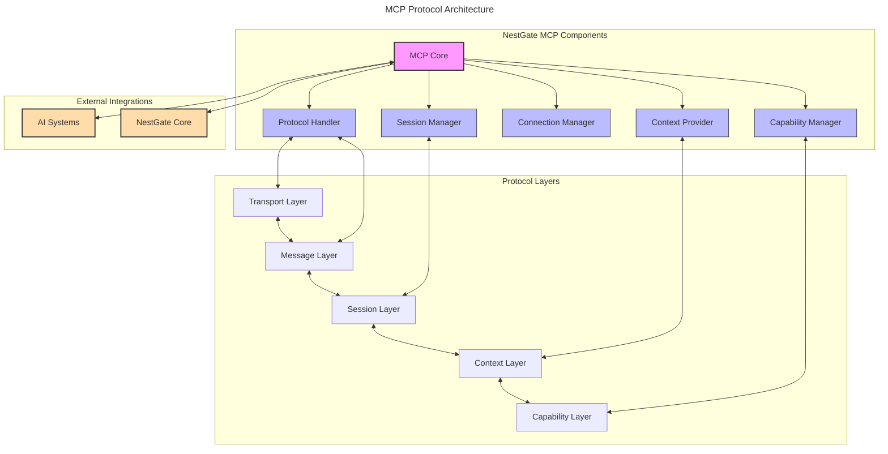
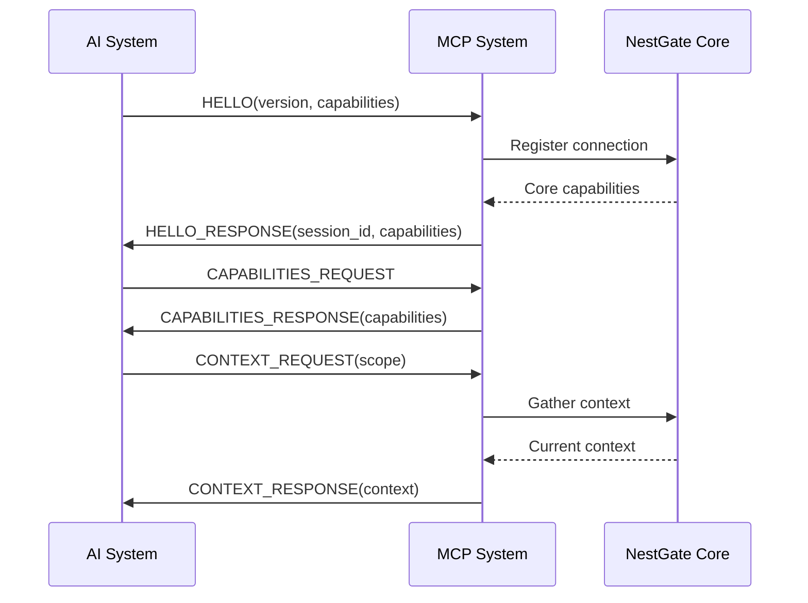
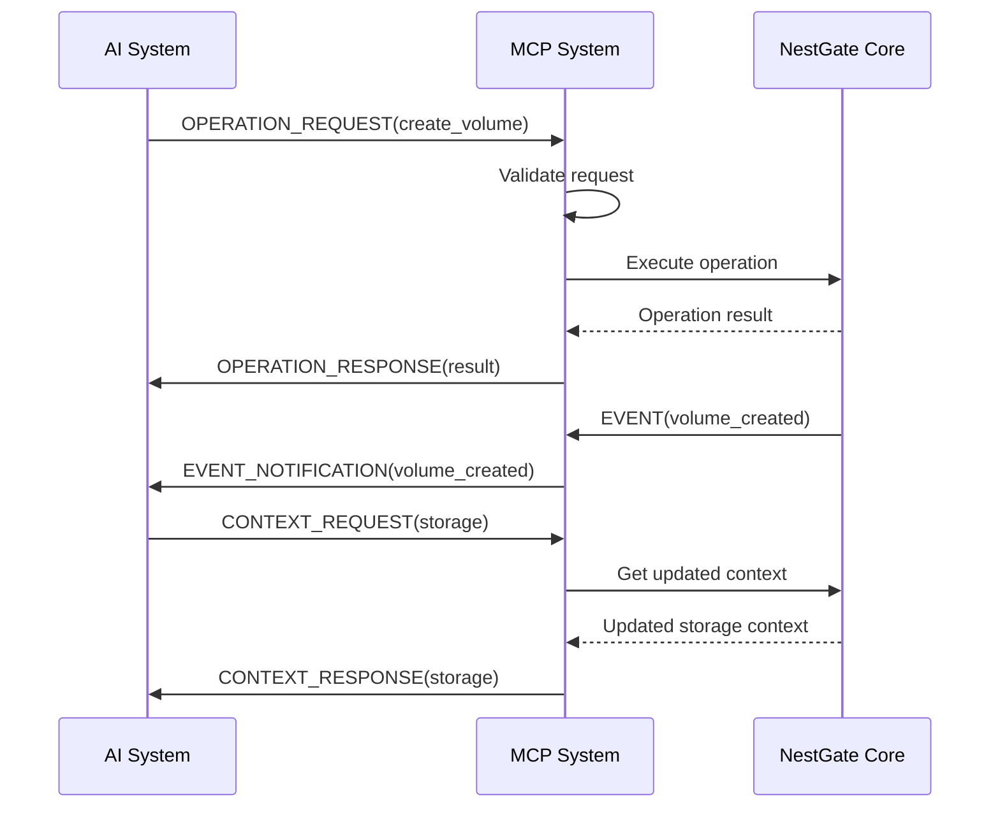

# Machine Context Protocol Implementation

## Overview

The Machine Context Protocol (MCP) is a bidirectional communication protocol designed to enable context-aware operations between NestGate and integrated AI systems. This specification defines the protocol structure, message formats, and implementation requirements for the NestGate MCP subsystem.

## Protocol Architecture



## Machine Configuration

```yaml
mcp_protocol:
  components:
    mcp_core:
      purpose: "Central MCP coordination and management"
      responsibilities:
        - Protocol version negotiation
        - Component coordination
        - System integration
        - Error handling
      interfaces:
        - ai_system_interface
        - nestgate_core_interface
    
    protocol_handler:
      purpose: "Low-level protocol operations"
      responsibilities:
        - Message serialization/deserialization
        - Protocol validation
        - Transport management
        - Error detection
      supported_formats:
        - MCP Binary Format (primary)
        - JSON (compatibility)
        - MessagePack (optional)
      
    session_manager:
      purpose: "Session lifecycle management"
      responsibilities:
        - Session creation/deletion
        - Authentication
        - Session state tracking
        - Idle management
      security:
        - mTLS authentication
        - Session token validation
        - Permission verification
      
    connection_manager:
      purpose: "Connection management and monitoring"
      responsibilities:
        - Connection establishment
        - Heartbeat monitoring
        - Connection recovery
        - Resource management
      metrics:
        - active_connections
        - connection_errors
        - latency
        - throughput
      
    context_provider:
      purpose: "Machine context handling"
      responsibilities:
        - Context collection
        - Context synchronization
        - Resource state tracking
        - Context updates
      context_types:
        - system_context
        - storage_context
        - network_context
        - resource_context
        - user_context
      
    capability_manager:
      purpose: "System capability management"
      responsibilities:
        - Capability registration
        - Capability discovery
        - Feature negotiation
        - Version compatibility
      capability_categories:
        - storage_capabilities
        - network_capabilities
        - computation_capabilities
        - ai_capabilities
  
  messages:
    message_format:
      header:
        - version: u8
        - message_type: u8
        - message_id: u32
        - session_id: u64
        - payload_length: u32
        - flags: u16
      
      types:
        - HELLO: 0x01
        - CAPABILITIES: 0x02
        - CONTEXT_REQUEST: 0x03
        - CONTEXT_UPDATE: 0x04
        - OPERATION_REQUEST: 0x05
        - OPERATION_RESPONSE: 0x06
        - EVENT: 0x07
        - ERROR: 0xFF
      
      serialization:
        primary: "Binary with LTV encoding"
        alternative: "JSON with schema validation"
    
    operation_format:
      header:
        - operation_id: u32
        - operation_type: u16
        - resource_id: UUID
        - flags: u16
      
      parameters:
        format: "Typed key-value pairs"
        validation: "Schema-based validation"
      
      responses:
        success:
          - status_code: u16
          - operation_id: u32
          - result_data: Bytes
        
        error:
          - status_code: u16
          - operation_id: u32
          - error_code: u16
          - error_message: String
  
  context:
    storage_context:
      - volume_states: Map<UUID, VolumeState>
      - pool_states: Map<UUID, PoolState>
      - operation_states: Map<UUID, OperationState>
      - usage_metrics: StorageMetrics
    
    system_context:
      - system_load: SystemLoad
      - memory_state: MemoryState
      - process_states: Map<PID, ProcessState>
      - resource_availability: ResourceMetrics
    
    network_context:
      - connection_states: Map<UUID, ConnectionState>
      - throughput_metrics: NetworkMetrics
      - active_transfers: Map<UUID, TransferState>
  
  capabilities:
    storage_capabilities:
      operations:
        - create_volume
        - delete_volume
        - snapshot_volume
        - clone_volume
        - resize_volume
      
      features:
        - deduplication
        - compression
        - encryption
        - tiering
    
    network_capabilities:
      protocols:
        - smb
        - nfs
        - iscsi
        - s3
      
      features:
        - encryption
        - authentication
        - qos
    
    ai_capabilities:
      models:
        - resource_optimization
        - anomaly_detection
        - predictive_analysis
      
      features:
        - workload_prediction
        - resource_recommendation
        - failure_prediction
  
  validation:
    performance:
      metrics:
        - message_latency
        - context_sync_time
        - operation_throughput
      
      targets:
        message_roundtrip: "<10ms"
        context_sync: "<50ms"
        operations_per_second: ">1000"
    
    reliability:
      requirements:
        - Connection recovery
        - Session persistence
        - Operation idempotency
        - Error recovery
    
    security:
      requirements:
        - Message authentication
        - Transport encryption
        - Authorization validation
        - Audit logging
```

## Technical Context

### Implementation Notes

1. **Protocol Design Principles**
   - Minimize latency for context updates
   - Ensure backward compatibility
   - Support graceful degradation
   - Enable extensibility for new features

2. **Message Processing**
   - Use asynchronous processing for all operations
   - Implement proper error handling and recovery
   - Support for batched operations
   - Prioritization of critical messages

3. **Resource Considerations**
   - Efficient context representation
   - Memory-optimized data structures
   - Incremental context updates
   - Lazy loading of large context elements

4. **Security Implementation**
   - Use TLS 1.3 for transport security
   - Implement capability-based authorization
   - Validate all incoming messages
   - Rate limiting for resource protection

### Integration Requirements

1. **AI System Integration**
   - Support for Squirrel MCP protocol
   - Context synchronization
   - Operation translation
   - Capability advertisement

2. **NestGate Core Integration**
   - Resource state monitoring
   - Operation execution
   - Event propagation
   - Metrics collection

3. **Language-Specific Considerations**
   - Rust implementation should use async/await
   - Leverage type safety for message validation
   - Use trait-based abstraction for components
   - Implement proper error handling

## Protocol Sequence Examples

### Session Establishment



### Operation Execution



## Implementation Phases

### Phase 1: Core Protocol
1. Basic message handling
2. Session management
3. Simple context synchronization
4. Fundamental operations

### Phase 2: Enhanced Context
1. Comprehensive context models
2. Incremental updates
3. Context subscriptions
4. Advanced operation support

### Phase 3: AI Integration
1. Predictive features
2. Resource optimization
3. Anomaly detection
4. Learning-based improvements

## Technical Metadata
- Category: MCP/Protocol
- Priority: P1
- Dependencies:
  - Transport layer (TCP/TLS)
  - Serialization framework
  - Event system
  - Core system integration
- Validation Requirements:
  - Protocol conformance testing
  - Performance benchmarking
  - Security validation
  - Interoperability testing