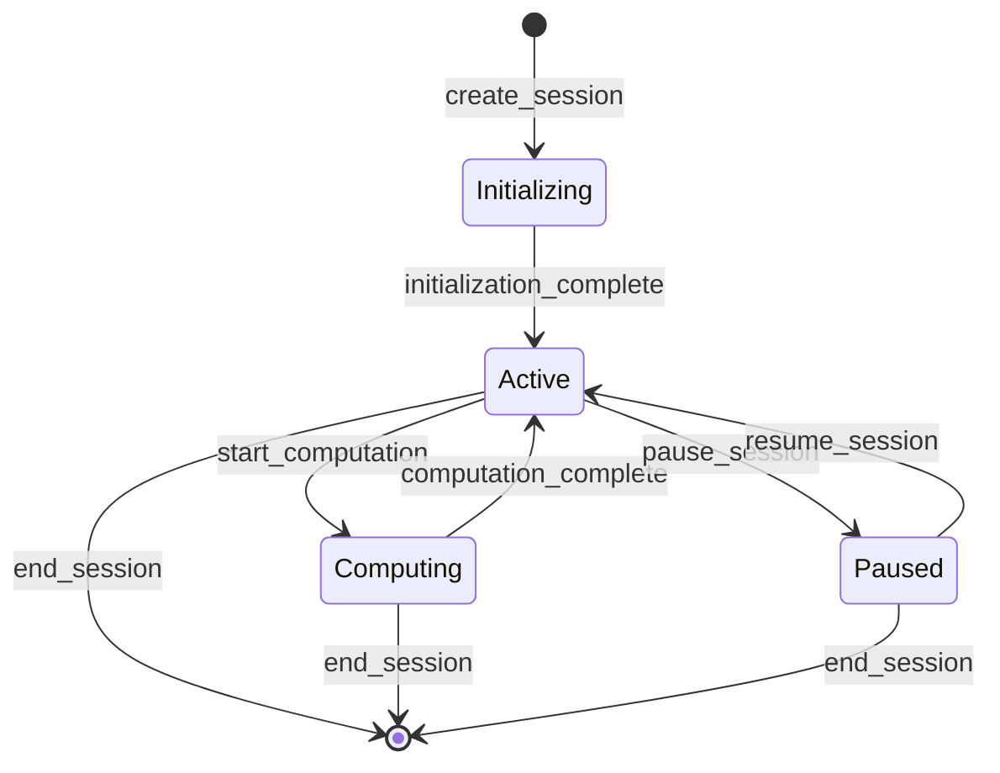
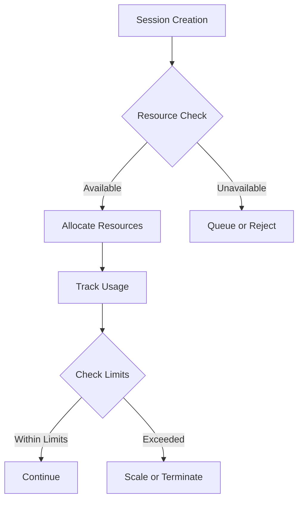

# Session Management Specification

## Overview

The session management component handles MCP session lifecycle, state tracking, and resource allocation.

## Specification

```yaml
metadata:
  title: "MCP Session Management"
  description: "Session management specification for MCP"
  version: "1.0.0"
  category: "component/session"
  status: "draft"

machine_configuration:
  components:
    session_manager:
      description: "Manages session lifecycle and state"
      interfaces:
        - name: "SessionManager"
          methods:
            - name: "create_session"
              signature: "async fn create_session(&self, config: SessionConfig) -> Result<SessionId>"
              description: "Creates a new session"
            - name: "get_session"
              signature: "async fn get_session(&self, id: SessionId) -> Result<Session>"
              description: "Retrieves session information"
            - name: "end_session"
              signature: "async fn end_session(&self, id: SessionId) -> Result<()>"
              description: "Terminates a session"
            - name: "list_sessions"
              signature: "async fn list_sessions(&self) -> Result<Vec<SessionInfo>>"
              description: "Lists active sessions"
    
    state_manager:
      description: "Manages session state"
      interfaces:
        - name: "StateManager"
          methods:
            - name: "get_state"
              signature: "async fn get_state(&self, id: SessionId) -> Result<SessionState>"
              description: "Gets current session state"
            - name: "update_state"
              signature: "async fn update_state(&self, id: SessionId, state: SessionState) -> Result<()>"
              description: "Updates session state"
            - name: "watch_state"
              signature: "async fn watch_state(&self, id: SessionId) -> Result<StateStream>"
              description: "Watches for state changes"
    
    resource_tracker:
      description: "Tracks session resource usage"
      interfaces:
        - name: "ResourceTracker"
          methods:
            - name: "track_resources"
              signature: "async fn track_resources(&self, id: SessionId) -> Result<ResourceUsage>"
              description: "Tracks resource usage"
            - name: "set_limits"
              signature: "async fn set_limits(&self, id: SessionId, limits: ResourceLimits) -> Result<()>"
              description: "Sets resource limits"
            - name: "check_quota"
              signature: "async fn check_quota(&self, id: SessionId) -> Result<QuotaStatus>"
              description: "Checks resource quota"

  session_types:
    standard:
      description: "Standard compute session"
      features:
        - basic_compute
        - model_inference
        - state_persistence
      limits:
        duration: "24h"
        idle_timeout: "1h"
    
    gpu_accelerated:
      description: "GPU-accelerated session"
      features:
        - gpu_compute
        - model_training
        - distributed_inference
      limits:
        duration: "12h"
        idle_timeout: "30m"
    
    distributed:
      description: "Distributed compute session"
      features:
        - multi_node
        - load_balancing
        - fault_tolerance
      limits:
        duration: "48h"
        idle_timeout: "2h"

  state_management:
    persistence:
      type: "distributed"
      backend: "redis"
      replication: 3
    
    consistency:
      model: "eventual"
      sync_interval: "1s"
    
    recovery:
      strategy: "snapshot"
      interval: "5m"
      retention: "24h"

  monitoring:
    metrics:
      - active_sessions
      - session_duration
      - resource_usage
      - state_changes
    
    alerts:
      - session_timeout
      - resource_exhaustion
      - state_corruption
      - sync_failure

technical_context:
  overview: |
    The session management component provides reliable session handling for MCP
    operations. It ensures proper resource allocation, state management, and
    monitoring of session activities.

  constraints:
    - Sessions must be isolated
    - State must be consistent
    - Resources must be tracked
    - Recovery must be reliable

  dependencies:
    - redis: "State storage"
    - tokio: "Async runtime"
    - metrics: "Monitoring"
    - tracing: "Observability"

  notes:
    - "Session isolation is critical"
    - "State consistency affects reliability"
    - "Resource tracking prevents overuse"
    - "Recovery handles node failures"
```

## Session Lifecycle



## Resource Management



## Best Practices

1. **Session Management**
   - Implement proper cleanup
   - Handle timeouts gracefully
   - Track session history
   - Monitor resource usage

2. **State Management**
   - Use distributed state
   - Implement recovery
   - Handle consistency
   - Track state changes

3. **Resource Control**
   - Enforce quotas
   - Monitor usage
   - Handle exhaustion
   - Implement fairness

4. **Error Handling**
   - Handle timeouts
   - Recover from failures
   - Log state changes
   - Monitor errors 