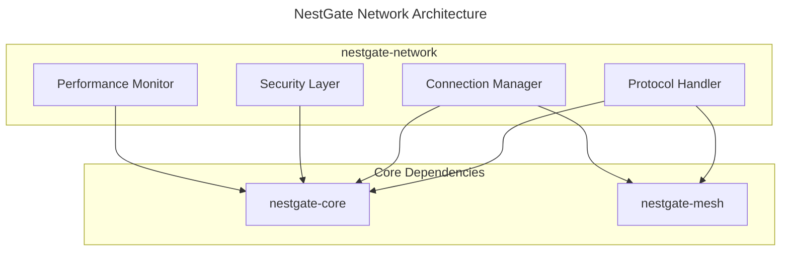

# Network Architecture Implementation

## Crate Structure



## Machine Configuration (70%)

```yaml
network_architecture:
  crate_structure:
    name: nestgate-network
    version: "0.2.0"
    components:
      protocol_handler:
        purpose: "Network protocol implementation"
        features:
          - Protocol parsing
          - Message handling
          - State management
          - Error recovery
      
      connection_manager:
        purpose: "Connection handling and management"
        features:
          - Connection pooling
          - Load balancing
          - Circuit breaking
          - Health checking
      
      security_layer:
        purpose: "Network security implementation"
        features:
          - TLS handling
          - Authentication
          - Authorization
          - Encryption
      
      performance_monitor:
        purpose: "Network performance tracking"
        features:
          - Latency monitoring
          - Throughput tracking
          - Resource usage
          - Alert generation
    
    interfaces:
      protocol:
        trait: "ProtocolHandler"
        methods:
          - "handle_message"
          - "parse_protocol"
          - "validate_message"
      
      connection:
        trait: "ConnectionManager"
        methods:
          - "create_connection"
          - "manage_pool"
          - "handle_failure"
      
      security:
        trait: "SecurityProvider"
        methods:
          - "secure_connection"
          - "verify_peer"
          - "handle_encryption"
      
      monitoring:
        trait: "NetworkMonitor"
        methods:
          - "track_latency"
          - "measure_throughput"
          - "report_metrics"
    
    dependencies:
      runtime:
        - tokio: "1.0"
        - async-trait: "0.1"
      
      network:
        - tokio-rustls: "0.24"
        - hyper: "0.14"
      
      monitoring:
        - metrics: "0.21"
        - tracing: "0.1"
      
      security:
        - rustls: "0.21"
        - ring: "0.17"

  validation_criteria:
    performance:
      protocol:
        parsing_time: "<1ms"
        handling_time: "<10ms"
      
      connection:
        setup_time: "<100ms"
        pool_efficiency: ">90%"
      
      security:
        handshake_time: "<200ms"
        encryption_overhead: "<1ms"
      
      monitoring:
        collection_lag: "<10ms"
        reporting_delay: "<100ms"
    
    reliability:
      uptime: "99.9%"
      connection_stability: "99.99%"
      error_recovery: "<1s"
    
    security:
      protocol: "TLS 1.3"
      authentication: "mTLS"
      encryption: "AES-256-GCM"
```

## Technical Context (30%)

### Implementation Sequence

1. Protocol Layer
   - Implement protocol handlers
   - Add message parsing
   - Implement state management
   - Add error recovery

2. Connection Management
   - Implement connection pooling
   - Add load balancing
   - Implement circuit breaking
   - Add health checks

3. Security Integration
   - Implement TLS handling
   - Add authentication
   - Implement encryption
   - Add security monitoring

### Critical Constraints

1. Performance Requirements
   - Fast protocol parsing
   - Efficient connection handling
   - Low security overhead
   - Lightweight monitoring

2. Reliability Requirements
   - Handle network failures
   - Manage connection pools
   - Implement retries
   - Monitor health

3. Security Requirements
   - Secure all connections
   - Verify all peers
   - Encrypt sensitive data
   - Monitor security events

### Error Handling Strategy

1. Error Types
```rust
pub enum NetworkError {
    Protocol(ProtocolError),
    Connection(ConnectionError),
    Security(SecurityError),
    Monitoring(MonitoringError),
}

impl std::error::Error for NetworkError {}
```

2. Error Recovery
   - Implement retry logic
   - Handle connection failures
   - Manage state recovery
   - Report errors

3. Monitoring Integration
   - Track error rates
   - Monitor recovery
   - Alert on issues
   - Log failures

### Integration Guidelines

1. With Core Crate
   - Use configuration system
   - Report metrics
   - Handle state updates
   - Follow security protocols

2. With Mesh Crate
   - Coordinate connections
   - Share state
   - Handle mesh protocols
   - Monitor mesh health

3. With API Crate
   - Expose network metrics
   - Handle API requests
   - Manage connections
   - Report status

---

Last Updated: 2024-03-15
Version: 1.0.0 