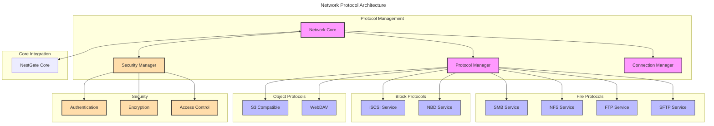

# Network Protocol Support

## Overview

The NestGate Network Protocol subsystem implements and manages various network protocols for file sharing, block storage, and object storage services. This specification defines the supported protocols, their implementation requirements, security considerations, and integration with the broader NestGate system.

## Protocol Architecture



## Machine Configuration

```yaml
network_protocols:
  components:
    network_core:
      purpose: "Central network services coordination"
      responsibilities:
        - Protocol lifecycle management
        - Protocol configuration
        - Network resource management
        - Protocol event handling
      interfaces:
        - protocol_manager
        - security_manager
        - connection_manager
      
    protocol_manager:
      purpose: "Protocol implementation management"
      responsibilities:
        - Protocol registration
        - Protocol instantiation
        - Protocol configuration
        - Protocol status monitoring
      supported_protocol_types:
        - file_sharing
        - block_storage
        - object_storage
      
    security_manager:
      purpose: "Network security management"
      responsibilities:
        - Authentication integration
        - Authorization enforcement
        - Encryption management
        - Security audit
      security_features:
        - tls_support
        - kerberos_integration
        - certificate_management
        - cryptographic_operations
      
    connection_manager:
      purpose: "Network connection handling"
      responsibilities:
        - Connection establishment
        - Connection monitoring
        - Resource management
        - Traffic prioritization
      metrics:
        - active_connections
        - connection_errors
        - bandwidth_usage
        - protocol_latency
  
  protocols:
    file_sharing:
      smb:
        versions:
          - "2.1"
          - "3.0"
          - "3.1.1"
        features:
          - encryption
          - signing
          - multichannel
          - continuous_availability
          - leasing
          - directory_caching
        configuration:
          min_protocol: "SMB2"
          max_protocol: "SMB3"
          signing_required: true
          encryption_required: true
        implementation:
          server_component: "Samba"
          custom_extensions: true
          performance_tuning: true
      
      nfs:
        versions:
          - "3"
          - "4.1"
          - "4.2"
        features:
          - pnfs
          - acl_support
          - krb5_security
          - nfsv4_pseudo_fs
          - delegations
        configuration:
          min_version: "3"
          preferred_version: "4.2"
          security: "sys,krb5,krb5i,krb5p"
        implementation:
          server_component: "NFS-Ganesha"
          custom_extensions: true
          performance_tuning: true
      
      ftp:
        features:
          - ftps
          - passive_mode
          - active_mode
          - resume_support
        configuration:
          allow_anonymous: false
          passive_port_range: "50000-51000"
          tls_required: true
      
      sftp:
        features:
          - compression
          - resume_support
          - directory_hashing
        configuration:
          max_connections: 20
          compression: true
    
    block_storage:
      iscsi:
        features:
          - multipath
          - chap_auth
          - mutual_chap
          - persistent_reservations
        configuration:
          discovery_auth: false
          target_auth: true
          default_portal_group: 1
        implementation:
          target_framework: "LIO"
      
      nbd:
        features:
          - tls_support
          - multi_connection
          - flush_support
        configuration:
          allow_list: true
          default_port: 10809
    
    object_storage:
      s3:
        features:
          - bucket_operations
          - object_operations
          - multipart_upload
          - presigned_urls
          - bucket_policies
        compatibility:
          amazon_s3: true
          min_api_version: "2006-03-01"
        implementation:
          framework: "MinIO compatible"
      
      webdav:
        features:
          - class1
          - class2
          - locks
          - acl
        configuration:
          authentication: "digest"
          allow_lock: true
  
  security:
    authentication:
      methods:
        - local_users
        - ldap
        - active_directory
        - kerberos
        - oauth2
      implementation:
        default_method: "local_users"
        fallback_enabled: true
        multi_factor: optional
    
    encryption:
      tls:
        min_version: "1.2"
        preferred_version: "1.3"
        cipher_suites:
          - "TLS_AES_256_GCM_SHA384"
          - "TLS_CHACHA20_POLY1305_SHA256"
          - "TLS_AES_128_GCM_SHA256"
        certificate_management:
          auto_renewal: true
          acme_support: true
      
      protocol_specific:
        smb_encryption: true
        nfs_krb_encryption: true
        iscsi_chap: true
    
    authorization:
      file_permissions:
        acl_support: true
        posix_permissions: true
        nfs4_acl: true
      
      share_permissions:
        read_only: true
        read_write: true
        custom_permissions: true
  
  validation:
    performance:
      metrics:
        - throughput
        - latency
        - connections_per_second
        - concurrent_connections
      targets:
        smb_throughput: ">100MB/s per client"
        nfs_throughput: ">120MB/s per client"
        s3_throughput: ">80MB/s per client"
        max_concurrent_connections: 500
    
    reliability:
      requirements:
        - Auto-recovery after failures
        - Session persistence where supported
        - Graceful degradation
        - Operation retries
    
    security:
      requirements:
        - Protocol-level authentication
        - Transport encryption
        - Data integrity verification
        - Access control enforcement
```

## Technical Context

### Implementation Notes

1. **Protocol Implementation Strategy**
   - Use established protocol implementations where possible
   - Extend with custom functionality where needed
   - Implement unified configuration interfaces
   - Maintain protocol-specific optimizations

2. **Performance Considerations**
   - Implement multi-threaded protocol handlers
   - Use asynchronous I/O for network operations
   - Optimize buffer management
   - Implement caching strategies for each protocol

3. **Security Implementation**
   - Use Defense-in-Depth approach
   - Implement protocol-specific security measures
   - Centralize authentication and authorization
   - Regular security audits and updates

4. **Scalability Approach**
   - Design for horizontal scalability
   - Implement connection pooling
   - Optimize resource utilization
   - Monitor protocol performance metrics

### Integration Requirements

1. **Storage Integration**
   - Coordinate with storage manager for data access
   - Implement protocol-specific optimizations for storage types
   - Maintain consistency across protocols
   - Handle storage events appropriately

2. **Authentication Integration**
   - Integrate with central authentication system
   - Map protocol-specific authentication to system authentication
   - Handle credential management securely
   - Support multiple authentication methods

3. **Event System Integration**
   - Generate protocol-specific events
   - Monitor protocol health
   - Integrate with system monitoring
   - Support event-driven actions

## Protocol Implementation Details

### SMB Implementation

```rust
/// SMB protocol implementation
pub struct SmbService {
    /// Configuration for the SMB service
    config: SmbConfig,
    
    /// Samba service manager
    samba_manager: SambaManager,
    
    /// Share management
    share_manager: ShareManager,
    
    /// Security provider
    security: Arc<SecurityManager>,
}

impl ProtocolService for SmbService {
    fn start(&self) -> Result<()> {
        // Implementation details
    }
    
    fn stop(&self) -> Result<()> {
        // Implementation details
    }
    
    fn configure(&mut self, config: ProtocolConfig) -> Result<()> {
        // Implementation details
    }
    
    fn status(&self) -> ServiceStatus {
        // Implementation details
        ServiceStatus::default()
    }
}
```

### NFS Implementation

```rust
/// NFS protocol implementation
pub struct NfsService {
    /// Configuration for the NFS service
    config: NfsConfig,
    
    /// NFS-Ganesha service manager
    ganesha_manager: GaneshaManager,
    
    /// Export management
    export_manager: ExportManager,
    
    /// Security provider
    security: Arc<SecurityManager>,
}

impl ProtocolService for NfsService {
    fn start(&self) -> Result<()> {
        // Implementation details
    }
    
    fn stop(&self) -> Result<()> {
        // Implementation details
    }
    
    fn configure(&mut self, config: ProtocolConfig) -> Result<()> {
        // Implementation details
    }
    
    fn status(&self) -> ServiceStatus {
        // Implementation details
        ServiceStatus::default()
    }
}
```

## Protocol Security Mapping

| Protocol | Authentication | Encryption | Integrity Protection |
|----------|----------------|------------|----------------------|
| SMB      | NTLM, Kerberos | AES-128/256 | SMB Signing         |
| NFS      | sys, krb5      | krb5p      | krb5i                |
| iSCSI    | CHAP, Mutual CHAP | IPsec   | Data Digest          |
| FTP      | Basic          | FTPS (TLS) | TLS                  |
| SFTP     | SSH Keys, Password | AES-CTR | HMAC                |
| S3       | HMAC, IAM      | TLS        | Content MD5          |
| WebDAV   | Basic, Digest  | TLS        | TLS                  |

## Implementation Phases

### Phase 1: Core File Protocols
1. SMB implementation (v3.1.1)
2. NFS implementation (v4.2)
3. Basic security integration
4. Performance baseline

### Phase 2: Extended Protocol Support
1. iSCSI implementation
2. S3-compatible API
3. FTP and SFTP services
4. Enhanced security features

### Phase 3: Advanced Features
1. Protocol optimizations
2. Comprehensive monitoring
3. Load balancing
4. High availability features

## Technical Metadata
- Category: Network/Protocols
- Priority: P1
- Dependencies:
  - Samba
  - NFS-Ganesha
  - LIO Target
  - Network stack
  - Security framework
- Validation Requirements:
  - Protocol compliance testing
  - Performance benchmarking
  - Security validation
  - Interoperability testing
``` 