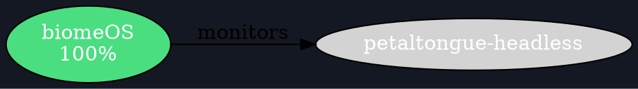

# petalTongue Headless Mode

**Pure Rust UI - Zero GUI Dependencies**

## Overview

`petal-tongue-headless` is a standalone binary that demonstrates petalTongue's self-sovereignty. It runs anywhere Rust runs, with zero native dependencies.

## Philosophy

> **External systems (egui) are enhancements, not dependencies.**

This binary proves that petalTongue can:
- Run on headless servers
- Work in containers and CI/CD
- Export to multiple formats
- Operate over SSH
- Function completely air-gapped

## Usage

### Basic Commands

```bash
# Auto-detect best mode (terminal if available)
petal-tongue-headless

# Terminal UI (ASCII art)
petal-tongue-headless --mode terminal

# Export to SVG
petal-tongue-headless --mode svg --output topology.svg

# Export to JSON
petal-tongue-headless --mode json --output topology.json

# Export to DOT (graphviz)
petal-tongue-headless --mode dot --output topology.dot

# Export to PNG
petal-tongue-headless --mode png --output topology.png
```

### Over SSH

```bash
# Run terminal UI over SSH
ssh server petal-tongue-headless --mode terminal

# Export and download SVG
ssh server petal-tongue-headless --mode svg > topology.svg

# Watch topology in real-time
watch -n 1 ssh server petal-tongue-headless --mode terminal
```

### In CI/CD

```bash
# Generate topology report in pipeline
petal-tongue-headless --mode svg --output docs/topology.svg
petal-tongue-headless --mode json --output reports/topology.json

# Commit to repo for documentation
git add docs/topology.svg reports/topology.json
git commit -m "Update topology visualization"
```

## Output Formats

### Terminal (TUI)

ASCII art visualization with color-coded health indicators.

**Use Cases:**
- SSH sessions
- tmux/screen monitoring
- Serial console
- Real-time status checks

**Example Output:**
```
                           🌸 petalTongue Topology
════════════════════════════════════════════════════════════════════════════════

  PRIMALS:
────────────────────────────────────────────────────────────────────────────────
  🟢 petalTongue Headless                                    Health: 100%
  🟢 biomeOS                                                 Health: 100%
  🟡 Songbird                                                Health: 75%

  CONNECTIONS:
────────────────────────────────────────────────────────────────────────────────
  biomeOS ──→ petalTongue Headless
  Songbird ──→ petalTongue Headless

════════════════════════════════════════════════════════════════════════════════
  3 primals, 2 connections | 2026-01-06 19:23:32 UTC
```

### SVG

Scalable vector graphics, viewable in any browser.

**Use Cases:**
- Documentation embedding
- GitHub README visuals
- Reports and dashboards
- Responsive web pages

**Features:**
- Dark mode optimized
- Health color coding
- Scalable to any size
- Browser-friendly

### JSON

Structured data for programmatic access.

**Use Cases:**
- API integration
- Data analysis
- Automated monitoring
- Custom tooling

**Example Output:**
```json
{
  "metadata": {
    "primal_count": 3,
    "connection_count": 2,
    "generated_at": "2026-01-06T19:23:35Z"
  },
  "topology": {
    "primals": [
      {
        "id": "biomeos-1",
        "name": "biomeOS",
        "health": 100,
        "health_status": "Healthy",
        "position": {"x": 113.6, "y": 165.2}
      }
    ],
    "connections": [
      {
        "from": "biomeos-1",
        "to": "petaltongue-headless",
        "type": "monitors"
      }
    ]
  }
}
```

### DOT (Graphviz)

Graph description language for advanced visualization.

**Use Cases:**
- Graphviz rendering
- Advanced layouts
- Custom styling
- Publication-quality diagrams

**Example Output:**


**Render with Graphviz:**
```bash
# Generate DOT file
petal-tongue-headless --mode dot --output topology.dot

# Render to PNG
dot -Tpng topology.dot -o topology.png

# Render to SVG
dot -Tsvg topology.dot -o topology.svg

# Render to PDF
dot -Tpdf topology.dot -o topology.pdf
```

### PNG

Pixel-perfect rendering for reports.

**Use Cases:**
- PDF reports
- Presentations
- Static documentation
- Email attachments

**Options:**
```bash
# Custom dimensions
petal-tongue-headless --mode png --output report.png --width 3840 --height 2160

# Standard HD
petal-tongue-headless --mode png --output report.png --width 1920 --height 1080

# Mobile-friendly
petal-tongue-headless --mode png --output mobile.png --width 800 --height 600
```

## Environment Variables

### Operational

```bash
# Force headless mode
export HEADLESS=true
export PETALTONGUE_HEADLESS=1

# Use tutorial data
export SHOWCASE_MODE=true

# Logging level
export RUST_LOG=info
export RUST_LOG=debug
export RUST_LOG=trace
```

### Discovery (Future)

```bash
# biomeOS endpoint
export BIOMEOS_URL=http://localhost:3000

# Discovery timeout
export PETALTONGUE_DISCOVERY_TIMEOUT=5

# Custom cache directory
export PETALTONGUE_CACHE_DIR=/var/cache/petaltongue
```

## Dependencies

### Pure Rust (Zero Native)

All UI rendering is pure Rust:
- **crossterm**: Terminal UI (cross-platform)
- **tiny-skia**: 2D rendering (no native libs)
- **svg**: SVG generation (pure Rust)
- **png**: Image encoding (pure Rust)

**No System Dependencies:**
- ❌ No X11/Wayland/Windows GUI
- ❌ No OpenGL/Vulkan/DirectX
- ❌ No platform-specific code
- ✅ Cross-compiles to any Rust target

## Architecture

### Binary Structure

```
petal-tongue-headless/
├── Cargo.toml          (Zero GUI dependencies)
└── src/
    └── main.rs         (CLI + rendering)
```

### Dependency Graph

```
petal-tongue-headless
├── petal-tongue-core      (Graph engine)
├── petal-tongue-ui-core   (Pure Rust UI)
├── petal-tongue-graph     (Layout algorithms)
└── petal-tongue-discovery (Optional: runtime discovery)
```

**Total:** ~5 internal crates, all pure Rust.

### Comparison with Full UI

| Feature | Headless | Full UI |
|---------|----------|---------|
| **GUI** | ❌ None | ✅ egui |
| **Native deps** | ❌ Zero | ⚠️ egui/eframe |
| **Outputs** | 5 formats | 1 (GUI) |
| **Platforms** | Any Rust | Desktop only |
| **SSH-friendly** | ✅ Yes | ❌ No |
| **Air-gapped** | ✅ Yes | ⚠️ Depends |
| **CI/CD** | ✅ Perfect | ❌ Difficult |
| **Binary size** | Small | Large |

## Build Instructions

### Release Build

```bash
cd /path/to/petalTongue
cargo build --release -p petal-tongue-headless
```

**Binary location:** `target/release/petal-tongue-headless`

### Optimized Build

```bash
# Strip symbols for smaller binary
cargo build --release -p petal-tongue-headless
strip target/release/petal-tongue-headless
```

### Cross-Compilation

```bash
# Linux (from macOS)
cargo build --release -p petal-tongue-headless --target x86_64-unknown-linux-gnu

# Windows (from Linux)
cargo build --release -p petal-tongue-headless --target x86_64-pc-windows-gnu

# ARM (for Raspberry Pi)
cargo build --release -p petal-tongue-headless --target aarch64-unknown-linux-gnu
```

## Use Cases

### 1. Server Monitoring

```bash
# Install on server
scp target/release/petal-tongue-headless server:/usr/local/bin/

# Create systemd service
cat > /etc/systemd/system/petaltongue-export.service << EOF
[Unit]
Description=petalTongue Topology Export
After=network.target

[Service]
Type=oneshot
ExecStart=/usr/local/bin/petal-tongue-headless --mode svg --output /var/www/html/topology.svg
User=www-data

[Install]
WantedBy=multi-user.target
EOF

# Run every 5 minutes
cat > /etc/systemd/system/petaltongue-export.timer << EOF
[Unit]
Description=petalTongue Export Timer

[Timer]
OnBootSec=1min
OnUnitActiveSec=5min

[Install]
WantedBy=timers.target
EOF

systemctl enable --now petaltongue-export.timer
```

### 2. CI/CD Integration

```yaml
# .github/workflows/topology.yml
name: Update Topology
on:
  schedule:
    - cron: '0 */6 * * *'  # Every 6 hours
  workflow_dispatch:

jobs:
  update:
    runs-on: ubuntu-latest
    steps:
      - uses: actions/checkout@v3
      
      - name: Install Rust
        uses: actions-rs/toolchain@v1
        with:
          toolchain: stable
      
      - name: Build headless
        run: cargo build --release -p petal-tongue-headless
      
      - name: Generate topology
        run: |
          ./target/release/petal-tongue-headless --mode svg --output docs/topology.svg
          ./target/release/petal-tongue-headless --mode json --output docs/topology.json
      
      - name: Commit changes
        run: |
          git config user.name "GitHub Actions"
          git config user.email "actions@github.com"
          git add docs/
          git commit -m "Update topology [skip ci]" || exit 0
          git push
```

### 3. Docker Container

```dockerfile
# Dockerfile.headless
FROM rust:1.80-slim as builder

WORKDIR /build
COPY . .

RUN cargo build --release -p petal-tongue-headless

FROM debian:bookworm-slim

COPY --from=builder /build/target/release/petal-tongue-headless /usr/local/bin/

ENTRYPOINT ["petal-tongue-headless"]
CMD ["--mode", "terminal"]
```

```bash
# Build image
docker build -f Dockerfile.headless -t petaltongue-headless .

# Run terminal UI
docker run --rm -it petaltongue-headless

# Export SVG
docker run --rm -v $(pwd):/output petaltongue-headless --mode svg --output /output/topology.svg
```

### 4. Status Dashboard

```bash
#!/bin/bash
# dashboard.sh - Real-time topology dashboard

while true; do
  clear
  ./target/release/petal-tongue-headless --mode terminal
  sleep 5
done
```

## Testing

### Functional Tests

```bash
# Test all output modes
petal-tongue-headless --mode terminal
petal-tongue-headless --mode svg --output test.svg
petal-tongue-headless --mode json --output test.json
petal-tongue-headless --mode dot --output test.dot
petal-tongue-headless --mode png --output test.png

# Verify outputs
ls -lh test.*
file test.*
```

### Integration Tests

```bash
# Test over SSH
ssh localhost petal-tongue-headless --mode terminal

# Test in container
docker run --rm -it petaltongue-headless

# Test with discovery (requires biomeOS)
BIOMEOS_URL=http://localhost:3000 petal-tongue-headless --mode terminal
```

## Troubleshooting

### Binary Not Found

```bash
# Ensure binary is built
cargo build --release -p petal-tongue-headless

# Check location
ls -la target/release/petal-tongue-headless

# Add to PATH
export PATH=$PATH:$(pwd)/target/release
```

### Terminal Output Garbled

```bash
# Force UTF-8 encoding
export LC_ALL=en_US.UTF-8
export LANG=en_US.UTF-8

# Use plain ASCII mode (future feature)
petal-tongue-headless --mode terminal --ascii-only
```

### File Export Fails

```bash
# Check permissions
touch /path/to/output.svg
rm /path/to/output.svg

# Use absolute path
petal-tongue-headless --mode svg --output $(pwd)/topology.svg

# Check disk space
df -h
```

## Future Enhancements

### Planned Features

- [ ] WebAssembly target (run in browser)
- [ ] HTTP server mode (serve live topology)
- [ ] Metrics endpoint (Prometheus)
- [ ] Multi-format output (generate all at once)
- [ ] Watch mode (auto-regenerate on changes)
- [ ] Configuration file support
- [ ] Custom themes/styles
- [ ] Animation export (GIF/video)

### Compatibility

- [ ] Windows native binaries
- [ ] macOS universal binaries
- [ ] ARM64 optimizations
- [ ] WASI support

## License

Same as petalTongue main project.

## See Also

- [Pure Rust UI Evolution](../../PURE_RUST_UI_EVOLUTION.md)
- [UI Sovereignty Session Report](../../UI_SOVEREIGNTY_SESSION_REPORT_JAN_6_2026.md)
- [Pure Rust Audio System](PURE_RUST_AUDIO_SYSTEM.md)

